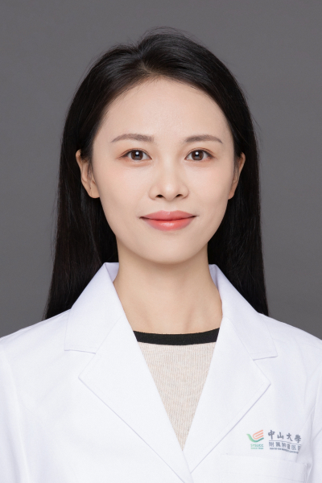

<!-- AUTO-GENERATED-BY: work/generate_obsidian_profiles.py -->

<!-- TEMPLATE: D:\workspace\信息收集整理\医生画像仓库\模板\医生画像模板.md -->

# 杨静

## 基础信息

| 字段 | 内容 |
|---|---|
| 姓名 | 杨静 |
| 医院 | 中山大学肿瘤防治中心 |
| 科室 | 生物治疗中心 |
| 职称/身份 | 科秘书 职称：副主任医师 |
| 来源链接 | [官网原文](https://www.sysucc.org.cn/node/11362) |
| 采集日期 | 2026-08-10 |

## 简介/擅长

骨与软组织肉瘤内科治疗。

## 教育与进修经历

- 一、教育及工作经历 1. 2012.09-2020.06 四川大学华西临床医学院临床医学（8年制 ）博士 2. 2020.08-2022.07 中山大学肿瘤防治中心 生物治疗中心 博士后 3. 2022.08-2024.12 中山大学肿瘤防治中心 生物治疗中心 住院医师 4. 2025.01-2026.02 中山大学肿瘤防治中心 生物治疗中心 主治医师 二、学术兼职 广东省抗癌协会生物治疗专委会学术秘书 广东省抗癌协会肉瘤专业委员会委员 广东省精准医学应用学会肉瘤分会委员 广东省精准医学应用学会精准免疫治疗分会委…

## 可包装亮点

- 科秘书 职称：副主任医师 杨静 职务：科秘书 职称：副主任医师 专长 骨与软组织肉瘤内科治疗。
- 一、教育及工作经历 1. 2012.09-2020.06 四川大学华西临床医学院临床医学（8年制 ）博士 2. 2020.08-2022.07 中山大学肿瘤防治中心 生物治疗中心 博士后 3. 2022.08-2024.12 中山大学肿瘤防治中心 生物治疗中心 住院医师 4. 2025.01-2026.02 中山大学肿瘤防治中心 生物治疗中心 主治医师 二…

## 重点疾病/人群标签

- 慢性病：
- 肿瘤：肿瘤、癌、瘤、免疫
- 生殖疾病：
- 免疫/风湿：肿瘤、癌、瘤、免疫
- 术后恢复/康复：
- 疑难重症：

## 证据摘录

> 只摘录官网公开信息中的短句或关键字段，不复制大段原文。

- 官网身份字段：科秘书 职称：副主任医师
- 官网简介/擅长：骨与软组织肉瘤内科治疗。
- 官网亮眼经历线索：科秘书 职称：副主任医师 杨静 职务：科秘书 职称：副主任医师 专长 骨与软组织肉瘤内科治疗。 一、教育及工作经历 1. 2012.09-2020.06 四川大学华西临床医学院临床医学（8年制 ）博士 2. 2020.08-2022.07 中山大学肿瘤防治中心 生物治疗中心 博士后 3. 2022.08-2024.12 中山大学肿瘤防治中心 生物治疗中心 住院医师 4. 2025.01-2026.02 中山大学肿瘤防治中心 生物治疗中…
- 异常提示：亮眼经历含导航文本，已清洗
- 来源链接：https://www.sysucc.org.cn/node/11362

## BD 画像摘要

杨静医生可作为肿瘤、免疫/风湿/感染方向的基础画像候选。后续 BD 使用应继续以官网来源和人工复核为准，不添加疗效承诺或无来源包装。

## 合规边界

- 仅使用医院官网、官方公众号、官方小程序等公开渠道。
- 不采集私人电话、私人微信、家庭住址、患者隐私或非公开排班信息。
- 不写“保证治愈”“疗效第一”“包治疑难杂症”等无法由官网证明的表述。
