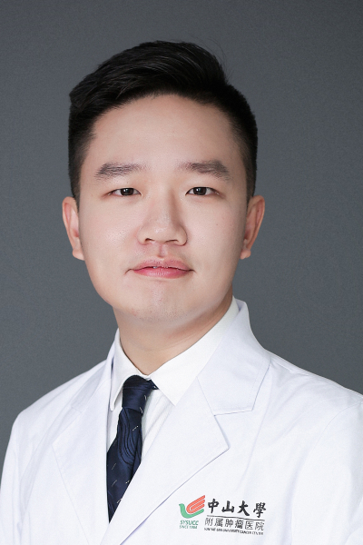

<!-- AUTO-GENERATED-BY: work/generate_obsidian_profiles.py -->

<!-- TEMPLATE: D:\workspace\信息收集整理\医生画像仓库\模板\医生画像模板.md -->

# 林乐涛

## 基础信息

| 字段 | 内容 |
|---|---|
| 姓名 | 林乐涛 |
| 医院 | 中山大学肿瘤防治中心 |
| 科室 | 微创介入治疗科 |
| 职称/身份 | 副主任医师 |
| 来源链接 | [官网原文](https://www.sysucc.org.cn/node/9135) |
| 采集日期 | 2026-08-10 |

## 简介/擅长

中晚期肝癌的介入综合治疗；软组织肉瘤、肺癌、卵巢癌的消融、粒子植入、栓塞等局部介入治疗。

## 教育与进修经历

- 一、基本情况 副主任医师，医学博士，毕业于北京大学临床医学八年制，主攻中晚期肝癌的介入综合治疗；

## 可包装亮点

- 副主任医师 林乐涛 职称：副主任医师 专长 中晚期肝癌的介入综合治疗；
- 一、基本情况 副主任医师，医学博士，毕业于北京大学临床医学八年制，主攻中晚期肝癌的介入综合治疗；
- 二、学术兼职 广东省医学会介入医学分会青年委员会 委员 广东省抗癌协会肉瘤专业委员会 委员 广东省器官医学与技术学会肿瘤介入专业委员会 委员 更新时间：2025.02.08

## 重点疾病/人群标签

- 慢性病：
- 肿瘤：肿瘤、癌、瘤、肺癌、肝癌、卵巢
- 生殖疾病：肿瘤、癌、瘤、肺癌、肝癌、卵巢
- 免疫/风湿：
- 术后恢复/康复：
- 疑难重症：

## 证据摘录

> 只摘录官网公开信息中的短句或关键字段，不复制大段原文。

- 官网身份字段：副主任医师
- 官网简介/擅长：中晚期肝癌的介入综合治疗；软组织肉瘤、肺癌、卵巢癌的消融、粒子植入、栓塞等局部介入治疗。
- 官网亮眼经历线索：副主任医师 林乐涛 职称：副主任医师 专长 中晚期肝癌的介入综合治疗； 一、基本情况 副主任医师，医学博士，毕业于北京大学临床医学八年制，主攻中晚期肝癌的介入综合治疗； 二、学术兼职 广东省医学会介入医学分会青年委员会 委员 广东省抗癌协会肉瘤专业委员会 委员 广东省器官医学与技术学会肿瘤介入专业委员会 委员 更新时间：2025.02.08
- 异常提示：亮眼经历含导航文本，已清洗
- 来源链接：https://www.sysucc.org.cn/node/9135

## BD 画像摘要

林乐涛医生可作为肿瘤、生殖疾病方向的基础画像候选。后续 BD 使用应继续以官网来源和人工复核为准，不添加疗效承诺或无来源包装。

## 合规边界

- 仅使用医院官网、官方公众号、官方小程序等公开渠道。
- 不采集私人电话、私人微信、家庭住址、患者隐私或非公开排班信息。
- 不写“保证治愈”“疗效第一”“包治疑难杂症”等无法由官网证明的表述。
