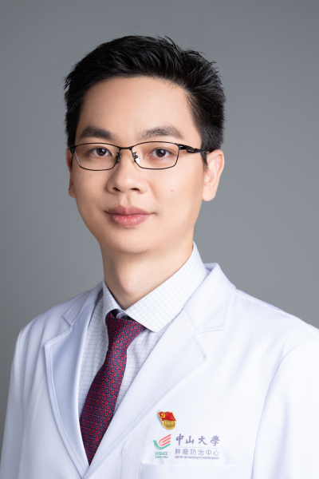

<!-- AUTO-GENERATED-BY: work/generate_obsidian_profiles.py -->

# 林俊忠

## 基础信息

| 字段 | 内容 |
|---|---|
| 医院 | 中山大学肿瘤防治中心 |
| 姓名 | 林俊忠 |
| 科室 | 结直肠科 |
| 职称/身份 | 主任医师、主诊教授、医学博士 |
| 重点优先级 | 高 |
| 来源类型 | 医院官网 |
| 来源链接 | [官网原文](https://www.sysucc.org.cn/node/3683) |
| 采集日期 | 2026-08-10 |
| 复核状态 | 待人工复核 |
| 异常提示 |  |

## 简介/擅长

结直肠癌的多学科综合治疗，尤其擅长结直肠癌的腹腔镜/机器人/保肛微创手术。 二、学习及工作经历 2000.09—2007.06 中山大学肿瘤医院 临床医学 七年制 2011.08—2014.06 中山大学肿瘤医院 肿瘤外科 博士研究生 2015.09—2016.09 美国德州大学MD Anderson癌症中心 访问学者 2007.08至今 中山大学肿瘤医院工作 2018.01—2018.06 普宁市人民医院副院长（挂职） 三、详细介绍 2007年毕业于中山大学中山医学院临床七年制，2015.09-2016.09于美国德州大学MD Anderson癌症中心访问学习，2018.01-2018.06于普宁市人民医院挂职副院长。 长期工作于临床一线，致力于结直肠癌的多学科综合治疗，尤其擅长结直肠癌微创手术，包括腹腔镜、机器人辅助手术和经肛内镜显微切除术，曾获医院临床技能比赛冠军、华南腹腔镜手术比赛冠军、全国MDT比赛冠军。 带领科研团队专注于结直肠癌的临床与转化研究，以通讯/第一作者在Cancer Cell、 Nature Cell Biology（封面文章）、Gut、Molecular Cancer、Cancer Resea...

## 详情正文摘录

临床专家 面包屑 首页 / 临床科室 / 外科系列 / 结直肠科 / 临床专家 林俊忠 职称：主任医师、主诊教授、医学博士 专长 结直肠癌的多学科综合治疗，尤其擅长结直肠癌的腹腔镜/机器人/保肛微创手术。 一、基本情况 职称： 主任医师，主诊教授，医学博士 专长： 结直肠癌的多学科综合治疗，尤其擅长结直肠癌的腹腔镜/机器人/保肛微创手术。 二、学习及工作经历 2000.09—2007.06 中山大学肿瘤医院 临床医学 七年制 2011.08—2014.06 中山大学肿瘤医院 肿瘤外科 博士研究生 2015.09—2016.09 美国德州大学MD Anderson癌症中心 访问学者 2007.08至今 中山大学肿瘤医院工作 2018.01—2018.06 普宁市人民医院副院长（挂职） 三、详细介绍 2007年毕业于中山大学中山医学院临床七年制，2015.09-2016.09于美国德州大学MD Anderson癌症中心访问学习，2018.01-2018.06于普宁市人民医院挂职副院长。 长期工作于临床一线，致力于结直肠癌的多学科综合治疗，尤其擅长结直肠癌微创手术，包括腹腔镜、机器人辅助手术和经肛内镜显微切除术，曾获医院临床技能比赛冠军、华南腹腔镜手术比赛冠军、全国MDT比赛冠军。 带领科研团队专注于结直肠癌的临床与转化研究，以通讯/第一作者在Cancer Cell、 Nature Cell Biology（封面文章）、Gut、Molecular Cancer、Cancer Research、Autophagy等国际顶尖杂志上发表文章超过50篇，总影响因子超过300分，尤其在直肠癌器官功能保全和肠癌抗血管生成药物的耐药方面取得突破性进展，主持或参与多个国家或省部级课题，参编多部指南、共识和专业著作。 学术任职：中华结直肠癌MDT联盟执行主席兼秘书长，全国抗癌协会大肠癌腹腔镜技术推广专委会副主任委员，全国抗癌协会大肠癌专委会委员，广东省精准医学应用学会胃肠肿瘤分会主任委员，广东省抗癌协会大肠癌青委会主任委员，广东省抗癌协会遗传性肿瘤专委会副主任委员，广东省基层医药学会结直肠专…

## 重点关注范围

- 肿瘤
- 疑难重症

## 重点疾病标签

- 肿瘤
- 癌
- 肠癌
- 多学科
- MDT

## 亮眼经历线索

- 主任医师、主诊教授、医学博士 结直肠癌的多学科综合治疗，尤其擅长结直肠癌的腹腔镜/机器人/保肛微创手术。
- 二、学习及工作经历 2000.09—2007.06 中山大学肿瘤医院 临床医学 七年制 2011.08—2014.06 中山大学肿瘤医院 肿瘤外科 博士研究生 2015.09—2016.09 美国德州大学MD Anderson癌症中心 访问学者 2007.08至今 中山大学肿瘤医院工作 2018.01—2018.06 普宁市人民医院副院长（挂职） 三、详细…
- 长期工作于临床一线，致力于结直肠癌的多学科综合治疗，尤其擅长结直肠癌微创手术，包括腹腔镜、机器人辅助手术和经肛内镜显微切除术，曾获医院临床技能比赛冠军、华南腹腔镜手术比赛冠军...

## 异常提示

## 合规边界

- 本画像仅整理统一总底表中的医院官网公开字段。
- 不包含患者评价、排名、第三方来源内容或疗效承诺。
- 官网未展示的信息保持空白，后续如需补充须回到底表官方来源字段。
