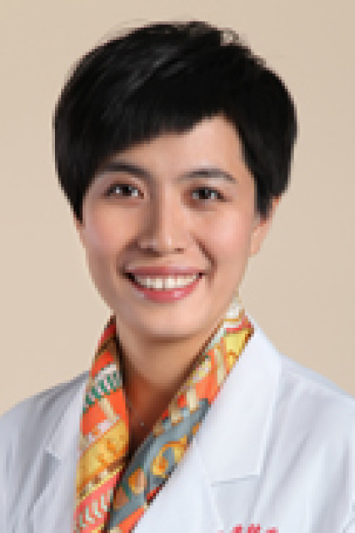

<!-- AUTO-GENERATED-BY: work/generate_obsidian_profiles.py -->

# 林僖

## 基础信息

| 字段 | 内容 |
|---|---|
| 医院 | 中山大学肿瘤防治中心 |
| 姓名 | 林僖 |
| 科室 | 超声科 |
| 职称/身份 | 超声心电科副主任 职称：主任医师、博士生导师 |
| 重点优先级 | 高 |
| 来源类型 | 医院官网 |
| 来源链接 | [官网原文](https://www.sysucc.org.cn/node/3895) |
| 采集日期 | 2026-08-10 |
| 复核状态 | 待人工复核 |
| 异常提示 |  |

## 简介/擅长

擅长肝胆、泌尿系、乳腺、甲状腺等浅表器官及妇科肿瘤的超声诊断及介入诊断。对乳腺、甲状腺等浅表器官肿瘤的早期诊断有丰富的经验。 2002年本科毕业于中山大学医学院医学影像学专业，2011年获得中山大学肿瘤学博士学位，2018年1月晋升主任医师。曾于2010年至2011年前往西澳乳腺筛查和诊断中心为期一年的进修学习。专业方向为乳腺疾病超声诊断及乳腺癌筛查。 研究方向： 目前主要从事乳腺肿瘤的早期超声诊断及相关临床和基础研究工作。 学术兼职： 中国超声医学工程学会浅表器官与外周血管专业委员会 青年委员、秘书； 中国抗癌协会肿瘤影像专业委员会乳腺学组 副组长； 中国抗癌协会肿瘤影像专业委员会超声学组 委员； 广东省医师协会超声医师分会第三届委员会 委员； 广东省胸部肿瘤防治研究会乳腺癌专业委员会 委员； 主持科研基金： （1）国家自然科学基金青年科学基金：miR-571下调促进乳腺癌细胞增殖的机制 23万 （2）广东省自然科学基金自由申请项目：miR-571在乳腺癌细胞增殖中的作用及机制研究 5万 （3）广东省自然科学基金自由申请项目：超声微泡靶向介导CXCR4-siRNA治疗乳腺癌实验研究 4万 （4）广东省中医药局自由申请...

## 详情正文摘录

临床专家 面包屑 首页 / 临床科室 / 平台科室 / 超声科 / 临床专家 林僖 职务：超声心电科副主任 职称：主任医师、博士生导师 专长 擅长肝胆、泌尿系、乳腺、甲状腺等浅表器官及妇科肿瘤的超声诊断及介入诊断。对乳腺、甲状腺等浅表器官肿瘤的早期诊断有丰富的经验。 职称： 主任医师、博士生导师 职务： 超声心电科 副主任 专长 ： 擅长肝胆、泌尿系、乳腺、甲状腺等浅表器官及妇科肿瘤的超声诊断及介入诊断。对乳腺、甲状腺等浅表器官肿瘤的早期诊断有丰富的经验。 2002年本科毕业于中山大学医学院医学影像学专业，2011年获得中山大学肿瘤学博士学位，2018年1月晋升主任医师。曾于2010年至2011年前往西澳乳腺筛查和诊断中心为期一年的进修学习。专业方向为乳腺疾病超声诊断及乳腺癌筛查。 研究方向： 目前主要从事乳腺肿瘤的早期超声诊断及相关临床和基础研究工作。 学术兼职： 中国超声医学工程学会浅表器官与外周血管专业委员会 青年委员、秘书； 中国抗癌协会肿瘤影像专业委员会乳腺学组 副组长； 中国抗癌协会肿瘤影像专业委员会超声学组 委员； 广东省医师协会超声医师分会第三届委员会 委员； 广东省胸部肿瘤防治研究会乳腺癌专业委员会 委员； 主持科研基金： （1）国家自然科学基金青年科学基金：miR-571下调促进乳腺癌细胞增殖的机制 23万 （2）广东省自然科学基金自由申请项目：miR-571在乳腺癌细胞增殖中的作用及机制研究 5万 （3）广东省自然科学基金自由申请项目：超声微泡靶向介导CXCR4-siRNA治疗乳腺癌实验研究 4万 （4）广东省中医药局自由申请项目：初诊乳腺癌中医辨证分型与超声影像相关关系探讨 0.5万 加载更多 职称： 主任医师、博士生导师 职务： 超声心电科 副主任 专长 ： 擅长肝胆、泌尿系、乳腺、甲状腺等浅表器官及妇科肿瘤的超声诊断及介入诊断。对乳腺、甲状腺等浅表器官肿瘤的早期诊断有丰富的经验。 2002年本科毕业于中山大学医学院医学影像学专业，2011年获得中山大学肿瘤学博士学位，2018年1月晋升主任医师。曾于2010年至2011年前往西澳乳腺筛查和诊…

## 重点关注范围

- 肿瘤

## 重点疾病标签

- 肿瘤
- 癌
- 靶向
- 乳腺癌

## 亮眼经历线索

- 超声心电科副主任 职称：主任医师、博士生导师 2002年本科毕业于中山大学医学院医学影像学专业，2011年获得中山大学肿瘤学博士学位，2018年1月晋升主任医师。
- 曾于2010年至2011年前往西澳乳腺筛查和诊断中心为期一年的进修学习。
- 学术兼职： 中国超声医学工程学会浅表器官与外周血管专业委员会 青年委员、秘书；

## 异常提示

## 合规边界

- 本画像仅整理统一总底表中的医院官网公开字段。
- 不包含患者评价、排名、第三方来源内容或疗效承诺。
- 官网未展示的信息保持空白，后续如需补充须回到底表官方来源字段。
