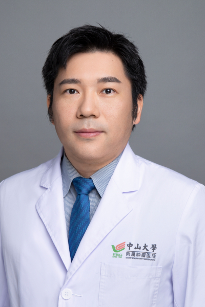

<!-- AUTO-GENERATED-BY: work/generate_obsidian_profiles.py -->

<!-- TEMPLATE: D:\workspace\信息收集整理\医生画像仓库\模板\医生画像模板.md -->

# 林富华

## 基础信息

| 字段 | 内容 |
|---|---|
| 姓名 | 林富华 |
| 医院 | 中山大学肿瘤防治中心 |
| 科室 | 神经外科 |
| 职称/身份 | 副主任医师，医学博士 |
| 来源链接 | [官网原文](https://www.sysucc.org.cn/node/6479) |
| 采集日期 | 2026-08-10 |

## 简介/擅长

中枢神经系统原发或继发肿瘤的外科治疗，特别关注垂体腺瘤的诊治。 学习及工作经历： 2006年6月毕业于中山大学医学院本-硕连读七年制班，获得临床医学硕士学位。于2008年8月获得国家留学基金委及德意志学术交流中心（DAAD）提供的博士生奖学金，于2009年10月至2012年12月在德国的埃尔朗根-纽伦堡大学留学，并获得德国的医学博士学位。自2013年1月起在中山大学肿瘤防治中心神经外科工作至今。兼职广东省神经科学学会委员。

## 教育与进修经历

- 学习及工作经历： 2006年6月毕业于中山大学医学院本-硕连读七年制班，获得临床医学硕士学位。
- 于2008年8月获得国家留学基金委及德意志学术交流中心（DAAD）提供的博士生奖学金，于2009年10月至2012年12月在德国的埃尔朗根-纽伦堡大学留学，并获得德国的医学博士学位。

## 科研项目与成果

- 于2008年8月获得国家留学基金委及德意志学术交流中心（DAAD）提供的博士生奖学金，于2009年10月至2012年12月在德国的埃尔朗根-纽伦堡大学留学，并获得德国的医学博士学位。

## 可包装亮点

- 副主任医师，医学博士 于2008年8月获得国家留学基金委及德意志学术交流中心（DAAD）提供的博士生奖学金，于2009年10月至2012年12月在德国的埃尔朗根-纽伦堡大学留学，并获得德国的医学博士学位。
- 兼职广东省神经科学学会委员。
- 林富华 职称：副主任医师，医学博士 专长 中枢神经系统原发或继发肿瘤的外科治疗，特别关注垂体腺瘤的诊治。

## 重点疾病/人群标签

- 慢性病：
- 肿瘤：肿瘤、瘤
- 生殖疾病：
- 免疫/风湿：
- 术后恢复/康复：
- 疑难重症：

## 证据摘录

> 只摘录官网公开信息中的短句或关键字段，不复制大段原文。

- 官网身份字段：副主任医师，医学博士
- 官网简介/擅长：中枢神经系统原发或继发肿瘤的外科治疗，特别关注垂体腺瘤的诊治。 学习及工作经历： 2006年6月毕业于中山大学医学院本-硕连读七年制班，获得临床医学硕士学位。于2008年8月获得国家留学基金委及德意志学术交流中心（DAAD）提供的博士生奖学金，于2009年10月至2012年12月在德国的埃尔朗根-纽伦堡大学留学，并获得德国的医学博士学位。自2013年1月起在中山大学肿瘤防治中心神经外科工作至今。兼职广东省神经科学学会委员。
- 官网亮眼经历线索：副主任医师，医学博士 于2008年8月获得国家留学基金委及德意志学术交流中心（DAAD）提供的博士生奖学金，于2009年10月至2012年12月在德国的埃尔朗根-纽伦堡大学留学，并获得德国的医学博士学位。 兼职广东省神经科学学会委员。 林富华 职称：副主任医师，医学博士 专长 中枢神经系统原发或继发肿瘤的外科治疗，特别关注垂体腺瘤的诊治。
- 异常提示：亮眼经历含导航文本，已清洗
- 来源链接：https://www.sysucc.org.cn/node/6479

## BD 画像摘要

林富华医生可作为肿瘤方向的基础画像候选。后续 BD 使用应继续以官网来源和人工复核为准，不添加疗效承诺或无来源包装。

## 合规边界

- 仅使用医院官网、官方公众号、官方小程序等公开渠道。
- 不采集私人电话、私人微信、家庭住址、患者隐私或非公开排班信息。
- 不写“保证治愈”“疗效第一”“包治疑难杂症”等无法由官网证明的表述。
