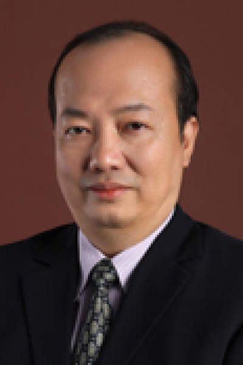

<!-- AUTO-GENERATED-BY: work/generate_obsidian_profiles.py -->

# 林桐榆

## 基础信息

| 字段 | 内容 |
|---|---|
| 医院 | 中山大学肿瘤防治中心 |
| 姓名 | 林桐榆 |
| 科室 | 内科 |
| 职称/身份 | 教授、主任医师、博士生导师、淋巴瘤首席专家 |
| 重点优先级 | 高 |
| 来源类型 | 医院官网 |
| 来源链接 | [官网原文](https://www.sysucc.org.cn/node/1487) |
| 采集日期 | 2026-08-10 |
| 复核状态 | 待人工复核 |
| 异常提示 |  |

## 简介/擅长

对肿瘤的内科治疗包括化疗、内分泌治疗和生物治疗等方面有较丰富的经验 教授、主任医师、博士生导师、淋巴瘤首席专家。 1987年中山医科大学医疗系毕业后留校于本院从事肿瘤内科临床工作，1997年获肿瘤学博士学位，2000-2002年在美国MD Anderson肿瘤中心工作学习。 对肿瘤的内科治疗包括化疗、内分泌治疗和生物治疗等方面有较丰富的经验。林教授除对淋巴瘤的诊断和治疗有较前沿的研究外，对乳腺癌、大肠癌、鼻咽癌和睾丸癌的诊断和治疗也有较深的造诣；在肿瘤靶向治疗方面也有很好的经验和一定的创新。他参与了多种肿瘤诊断和治疗指南的制订。 加载更多 教授、主任医师、博士生导师。1987年中山医科大学医疗系毕业后留校于本院从事肿瘤内科临床工作，1997年获肿瘤学博士学位，2000-2002年在美国MD Anderson肿瘤中心工作学习。对肿瘤的内科治疗包括化疗、内分泌治疗和生物治疗等方面有较丰富的经验。林教授除对淋巴瘤的诊断和治疗有较前沿的研究外，对乳腺癌、大肠癌、鼻咽癌和睾丸癌的诊断和治疗也有较深的造诣；在肿瘤靶向治疗方面也有很好的经验和一定的创新。他参与了多种肿瘤诊断和治疗指南的制订。 现任中山大学肿瘤防治中心淋巴瘤首席专家。...

## 详情正文摘录

临床专家 面包屑 首页 / 临床科室 / 内科系列 / 内科 / 临床专家 林桐榆 职称：教授、主任医师、博士生导师、淋巴瘤首席专家 专长 对肿瘤的内科治疗包括化疗、内分泌治疗和生物治疗等方面有较丰富的经验 教授、主任医师、博士生导师、淋巴瘤首席专家。 1987年中山医科大学医疗系毕业后留校于本院从事肿瘤内科临床工作，1997年获肿瘤学博士学位，2000-2002年在美国MD Anderson肿瘤中心工作学习。 对肿瘤的内科治疗包括化疗、内分泌治疗和生物治疗等方面有较丰富的经验。林教授除对淋巴瘤的诊断和治疗有较前沿的研究外，对乳腺癌、大肠癌、鼻咽癌和睾丸癌的诊断和治疗也有较深的造诣；在肿瘤靶向治疗方面也有很好的经验和一定的创新。他参与了多种肿瘤诊断和治疗指南的制订。 加载更多 教授、主任医师、博士生导师。1987年中山医科大学医疗系毕业后留校于本院从事肿瘤内科临床工作，1997年获肿瘤学博士学位，2000-2002年在美国MD Anderson肿瘤中心工作学习。对肿瘤的内科治疗包括化疗、内分泌治疗和生物治疗等方面有较丰富的经验。林教授除对淋巴瘤的诊断和治疗有较前沿的研究外，对乳腺癌、大肠癌、鼻咽癌和睾丸癌的诊断和治疗也有较深的造诣；在肿瘤靶向治疗方面也有很好的经验和一定的创新。他参与了多种肿瘤诊断和治疗指南的制订。 现任中山大学肿瘤防治中心淋巴瘤首席专家。兼任中华医学会肿瘤分会副主任委员、中国抗癌协会化疗专业委员会常委、CSCO执行委员会常委、中国老年肿瘤专业委员会副主任委员、中国南方肿瘤临床协作组织(CSWOG)主委、广东省抗癌协会肿瘤化疗专业委员会主任委员、广东省抗癌协会淋巴瘤专业委员会主任委员、广东省医学会肿瘤分会副主任委员、中国抗癌协会淋巴瘤专业委员会委员。为国家自然基金评审专家、国家新药评审专家、国家医疗事故鉴定委员会委员，也是美国临床肿瘤协会(ASCO)、美国癌症研究协会(AACR)、美国血液肿瘤协会(ASH)和欧洲肿瘤学会(ESMO)会员，任多家中外期刊的副主编和编委。 更新时间：2016.1.25

## 重点关注范围

- 肿瘤

## 重点疾病标签

- 肿瘤
- 癌
- 淋巴瘤
- 化疗
- 靶向
- 鼻咽癌
- 肠癌
- 乳腺癌

## 亮眼经历线索

- 教授、主任医师、博士生导师、淋巴瘤首席专家 对肿瘤的内科治疗包括化疗、内分泌治疗和生物治疗等方面有较丰富的经验 教授、主任医师、博士生导师、淋巴瘤首席专家。
- 1987年中山医科大学医疗系毕业后留校于本院从事肿瘤内科临床工作，1997年获肿瘤学博士学位，2000-2002年在美国MD Anderson肿瘤中心工作学习。
- 他参与了多种肿瘤诊断和治疗指南的制订。

## 异常提示

## 合规边界

- 本画像仅整理统一总底表中的医院官网公开字段。
- 不包含患者评价、排名、第三方来源内容或疗效承诺。
- 官网未展示的信息保持空白，后续如需补充须回到底表官方来源字段。
