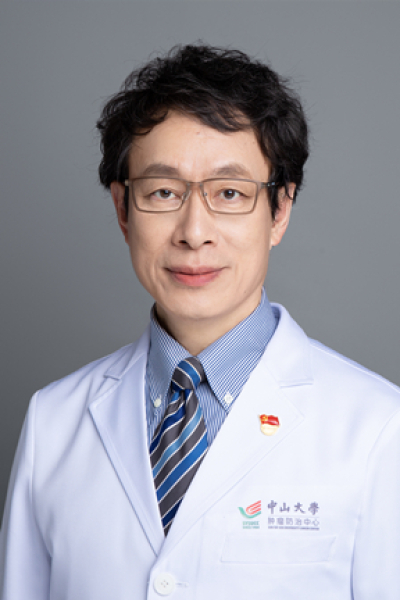

<!-- AUTO-GENERATED-BY: work/generate_obsidian_profiles.py -->

<!-- TEMPLATE: D:\workspace\信息收集整理\医生画像仓库\模板\医生画像模板.md -->

# 林焕新

## 基础信息

| 字段 | 内容 |
|---|---|
| 姓名 | 林焕新 |
| 医院 | 中山大学肿瘤防治中心 |
| 科室 | 放疗科 |
| 职称/身份 | 乳腺癌放疗大PI 职称：主任医师、博士生导师 |
| 来源链接 | [官网原文](https://www.sysucc.org.cn/node/1657) |
| 采集日期 | 2026-08-10 |

## 简介/擅长

乳腺癌的放射治疗和乳腺癌临床转化研究 科研论著： 以第一负责人主持国家自然基金面上项目2项、广东省科技计划项目2项、广东省自然科学基金项目1项和中山大学肿瘤防治中心留学回国启动基金项目1项，以通讯作者或第一作者发表高水平论文20余篇。主编《鼻咽癌诊断治疗》一书，并参编《实用临床放射肿瘤学》、《常见恶性肿瘤放射治疗手册》、《癌症预防手册》等专著。 专家

## 论文与学术产出

- 主编《鼻咽癌诊断治疗》一书，并参编《实用临床放射肿瘤学》、《常见恶性肿瘤放射治疗手册》、《癌症预防手册》等专著。

## 可包装亮点

- 乳腺癌放疗大PI 职称：主任医师、博士生导师 乳腺癌的放射治疗和乳腺癌临床转化研究 科研论著： 以第一负责人主持国家自然基金面上项目2项、广东省科技计划项目2项、广东省自然科学基金项目1项和中山大学肿瘤防治中心留学回国启动基金项目1项，以通讯作者或第一作者发表高水平论文20余篇。
- 林焕新 职务：乳腺癌放疗大PI 职称：主任医师、博士生导师 专长 乳腺癌放疗 一、基本情况 职称：主任医师、博士生导师 职务：乳腺癌放疗大PI 专家门诊时间： 专家门诊 周一上午，专家门诊 周三上午；

## 重点疾病/人群标签

- 慢性病：
- 肿瘤：肿瘤、癌、放疗、鼻咽癌、乳腺癌
- 生殖疾病：
- 免疫/风湿：
- 术后恢复/康复：
- 疑难重症：

## 证据摘录

> 只摘录官网公开信息中的短句或关键字段，不复制大段原文。

- 官网身份字段：乳腺癌放疗大PI 职称：主任医师、博士生导师
- 官网简介/擅长：乳腺癌的放射治疗和乳腺癌临床转化研究 科研论著： 以第一负责人主持国家自然基金面上项目2项、广东省科技计划项目2项、广东省自然科学基金项目1项和中山大学肿瘤防治中心留学回国启动基金项目1项，以通讯作者或第一作者发表高水平论文20余篇。主编《鼻咽癌诊断治疗》一书，并参编《实用临床放射肿瘤学》、《常见恶性肿瘤放射治疗手册》、《癌症预防手册》等专著。 专家
- 官网亮眼经历线索：乳腺癌放疗大PI 职称：主任医师、博士生导师 乳腺癌的放射治疗和乳腺癌临床转化研究 科研论著： 以第一负责人主持国家自然基金面上项目2项、广东省科技计划项目2项、广东省自然科学基金项目1项和中山大学肿瘤防治中心留学回国启动基金项目1项，以通讯作者或第一作者发表高水平论文20余篇。 林焕新 职务：乳腺癌放疗大PI 职称：主任医师、博士生导师 专长 乳腺癌放疗 一、基本情况 职称：主任医师、博士生导师 职务：乳腺癌放疗大PI 专家门诊时间…
- 异常提示：亮眼经历含导航文本，已清洗
- 来源链接：https://www.sysucc.org.cn/node/1657

## BD 画像摘要

林焕新医生可作为肿瘤方向的基础画像候选。后续 BD 使用应继续以官网来源和人工复核为准，不添加疗效承诺或无来源包装。

## 合规边界

- 仅使用医院官网、官方公众号、官方小程序等公开渠道。
- 不采集私人电话、私人微信、家庭住址、患者隐私或非公开排班信息。
- 不写“保证治愈”“疗效第一”“包治疑难杂症”等无法由官网证明的表述。
