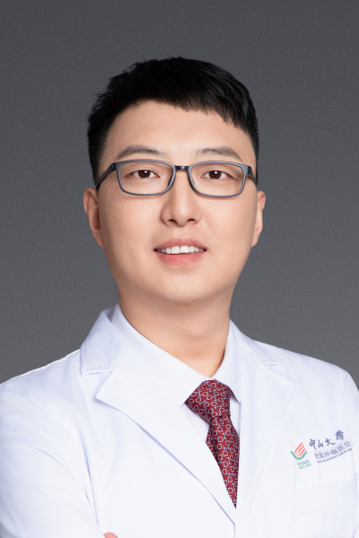

<!-- AUTO-GENERATED-BY: work/generate_obsidian_profiles.py -->

<!-- TEMPLATE: D:\workspace\信息收集整理\医生画像仓库\模板\医生画像模板.md -->

# 梁垚

## 基础信息

| 字段 | 内容 |
|---|---|
| 姓名 | 梁垚 |
| 医院 | 中山大学肿瘤防治中心 |
| 科室 | 胃外科 |
| 职称/身份 | 教学秘书 职称：主任医师、主诊教授、外科学博士、硕士生导师 |
| 来源链接 | [官网原文](https://www.sysucc.org.cn/node/3663) |
| 采集日期 | 2026-08-10 |

## 简介/擅长

胃部肿瘤、恶性黑色素瘤及软组织肉瘤的综合治疗，尤其是微创技术。

## 教育与进修经历

- 牵头开设本科《腹腔镜基础技能培训》公选课，主讲《肿瘤学见习》《肿瘤学理论》等课程，累计指导研究生12名、住院医师数十名，带教见习生超2000人次。
- 五、获奖及荣誉 广东省学位与研究生教育优秀教学成果奖 第一完成人 中山大学研究生教学成果奖 第一完成人 中山大学教师教学竞赛 医科组 一等奖 中山大学教师教学竞赛 教学创新赛道 一等奖 中山大学临床教师教学 技能大赛 一等奖 “叶任高-李幼姬”临床医学专业优秀中青年教师杰出贡献奖 中国抗癌协会“肿瘤科普青年精英奖”“金牌战队奖” 华南消化疾病健康科普视频大赛二等奖。

## 科研项目与成果

- 二、教育及工作经历 2005.09-2013.06 湘雅医学院临床医学八年制，外科学博士 2013.08-2016.12 胃外科住院医师 2017.01-2019.12 胃外科主治医师 2020.01-2025.12 胃外科副主任医师 2026.01-至今 胃外科主任医师 三、科研与学术成果 主持国家自然科学基金、广东省自然科学基金面上项目、希思科横向科研基金等科研项目，以第一/最后通讯作者发表学术论文30余篇，涵盖Nutrients、European Journal of Surgical Oncology、A…
- 四、教学研究与成果 深耕肿瘤学教改与人才培养，主持教育部产学合作项目、广东省教学改革研究等7项课题，发表教改论文8篇，参编教材 2 部。
- 五、获奖及荣誉 广东省学位与研究生教育优秀教学成果奖 第一完成人 中山大学研究生教学成果奖 第一完成人 中山大学教师教学竞赛 医科组 一等奖 中山大学教师教学竞赛 教学创新赛道 一等奖 中山大学临床教师教学 技能大赛 一等奖 “叶任高-李幼姬”临床医学专业优秀中青年教师杰出贡献奖 中国抗癌协会“肿瘤科普青年精英奖”“金牌战队奖” 华南消化疾病健康科普视频大赛二等奖。

## 论文与学术产出

- 二、教育及工作经历 2005.09-2013.06 湘雅医学院临床医学八年制，外科学博士 2013.08-2016.12 胃外科住院医师 2017.01-2019.12 胃外科主治医师 2020.01-2025.12 胃外科副主任医师 2026.01-至今 胃外科主任医师 三、科研与学术成果 主持国家自然科学基金、广东省自然科学基金面上项目、希思科横向科研基金等科研项目，以第一/最后通讯作者发表学术论文30余篇，涵盖Nutrients、European Journal of Surgical Oncology、A…
- 四、教学研究与成果 深耕肿瘤学教改与人才培养，主持教育部产学合作项目、广东省教学改革研究等7项课题，发表教改论文8篇，参编教材 2 部。

## 可包装亮点

- 教学秘书 职称：主任医师、主诊教授、外科学博士、硕士生导师 梁垚 职务：教学秘书 职称：主任医师、主诊教授、外科学博士、硕士生导师 专长 胃部肿瘤、恶性黑色素瘤及软组织肉瘤的综合治疗，尤其是微创技术。
- 一、基本情况 胃外科主任医师、主诊教授、外科学博士、硕士生导师。
- 大PI组曾连续6年获医院手术贡献奖；

## 重点疾病/人群标签

- 慢性病：
- 肿瘤：肿瘤、癌、瘤、胃癌、MDT
- 生殖疾病：
- 免疫/风湿：
- 术后恢复/康复：
- 疑难重症：肿瘤、癌、瘤、胃癌、MDT

## 证据摘录

> 只摘录官网公开信息中的短句或关键字段，不复制大段原文。

- 官网身份字段：教学秘书 职称：主任医师、主诊教授、外科学博士、硕士生导师
- 官网简介/擅长：胃部肿瘤、恶性黑色素瘤及软组织肉瘤的综合治疗，尤其是微创技术。
- 官网亮眼经历线索：教学秘书 职称：主任医师、主诊教授、外科学博士、硕士生导师 梁垚 职务：教学秘书 职称：主任医师、主诊教授、外科学博士、硕士生导师 专长 胃部肿瘤、恶性黑色素瘤及软组织肉瘤的综合治疗，尤其是微创技术。 一、基本情况 胃外科主任医师、主诊教授、外科学博士、硕士生导师。 大PI组曾连续6年获医院手术贡献奖；
- 异常提示：亮眼经历含导航文本，已清洗
- 来源链接：https://www.sysucc.org.cn/node/3663

## BD 画像摘要

梁垚医生可作为肿瘤、疑难重症方向的基础画像候选。后续 BD 使用应继续以官网来源和人工复核为准，不添加疗效承诺或无来源包装。

## 合规边界

- 仅使用医院官网、官方公众号、官方小程序等公开渠道。
- 不采集私人电话、私人微信、家庭住址、患者隐私或非公开排班信息。
- 不写“保证治愈”“疗效第一”“包治疑难杂症”等无法由官网证明的表述。
