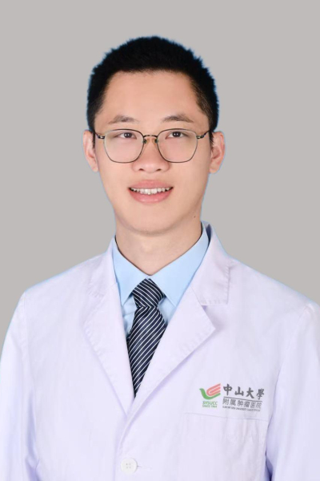

<!-- AUTO-GENERATED-BY: work/generate_obsidian_profiles.py -->

<!-- TEMPLATE: D:\workspace\信息收集整理\医生画像仓库\模板\医生画像模板.md -->

# 梁格豪

## 基础信息

| 字段 | 内容 |
|---|---|
| 姓名 | 梁格豪 |
| 医院 | 中山大学肿瘤防治中心 |
| 科室 | 乳腺科 |
| 职称/身份 | 副主任医师 |
| 来源链接 | [官网原文](https://www.sysucc.org.cn/node/9759) |
| 采集日期 | 2026-08-10 |

## 简介/擅长

擅长乳腺良恶性肿物的诊断、乳腺癌综合治疗、乳腺癌肿瘤整形。

## 教育与进修经历

- 一、基本情况 出诊时间：星期五中午 12:00 - 2:00 二、教育及工作经历 2010-09 至 2015-06, 中山大学, 临床医学, 学士 2015-09 至 2020-06, 中山大学, 外科学（硕博连读）, 博士 2020-08 至 2023-08, 中山大学肿瘤防治中心，博士后 2020-08 至 2025-04, 中山大学肿瘤防治中心，住院医师 三、主持科研项目 国家自然科学基金青年项目1项 四、代表性论著 发表SCI论文10余篇 更新时间：2025.4.21

## 科研项目与成果

- 一、基本情况 出诊时间：星期五中午 12:00 - 2:00 二、教育及工作经历 2010-09 至 2015-06, 中山大学, 临床医学, 学士 2015-09 至 2020-06, 中山大学, 外科学（硕博连读）, 博士 2020-08 至 2023-08, 中山大学肿瘤防治中心，博士后 2020-08 至 2025-04, 中山大学肿瘤防治中心，住院医师 三、主持科研项目 国家自然科学基金青年项目1项 四、代表性论著 发表SCI论文10余篇 更新时间：2025.4.21

## 论文与学术产出

- 一、基本情况 出诊时间：星期五中午 12:00 - 2:00 二、教育及工作经历 2010-09 至 2015-06, 中山大学, 临床医学, 学士 2015-09 至 2020-06, 中山大学, 外科学（硕博连读）, 博士 2020-08 至 2023-08, 中山大学肿瘤防治中心，博士后 2020-08 至 2025-04, 中山大学肿瘤防治中心，住院医师 三、主持科研项目 国家自然科学基金青年项目1项 四、代表性论著 发表SCI论文10余篇 更新时间：2025.4.21

## 可包装亮点

- 副主任医师 梁格豪 职称：副主任医师 专长 擅长乳腺良恶性肿物的诊断、乳腺癌综合治疗、乳腺癌肿瘤整形。
- 一、基本情况 出诊时间：星期五中午 12:00 - 2:00 二、教育及工作经历 2010-09 至 2015-06, 中山大学, 临床医学, 学士 2015-09 至 2020-06, 中山大学, 外科学（硕博连读）, 博士 2020-08 至 2023-08, 中山大学肿瘤防治中心，博士后 2020-08 至 2025-04, 中山大学肿瘤防治中心，住…

## 重点疾病/人群标签

- 慢性病：
- 肿瘤：肿瘤、乳腺癌
- 生殖疾病：
- 免疫/风湿：
- 术后恢复/康复：
- 疑难重症：

## 证据摘录

> 只摘录官网公开信息中的短句或关键字段，不复制大段原文。

- 官网身份字段：副主任医师
- 官网简介/擅长：擅长乳腺良恶性肿物的诊断、乳腺癌综合治疗、乳腺癌肿瘤整形。
- 官网亮眼经历线索：副主任医师 梁格豪 职称：副主任医师 专长 擅长乳腺良恶性肿物的诊断、乳腺癌综合治疗、乳腺癌肿瘤整形。 一、基本情况 出诊时间：星期五中午 12:00 - 2:00 二、教育及工作经历 2010-09 至 2015-06, 中山大学, 临床医学, 学士 2015-09 至 2020-06, 中山大学, 外科学（硕博连读）, 博士 2020-08 至 2023-08, 中山大学肿瘤防治中心，博士后 2020-08 至 2025-04,…
- 异常提示：亮眼经历含导航文本，已清洗
- 来源链接：https://www.sysucc.org.cn/node/9759

## BD 画像摘要

梁格豪医生可作为肿瘤方向的基础画像候选。后续 BD 使用应继续以官网来源和人工复核为准，不添加疗效承诺或无来源包装。

## 合规边界

- 仅使用医院官网、官方公众号、官方小程序等公开渠道。
- 不采集私人电话、私人微信、家庭住址、患者隐私或非公开排班信息。
- 不写“保证治愈”“疗效第一”“包治疑难杂症”等无法由官网证明的表述。
