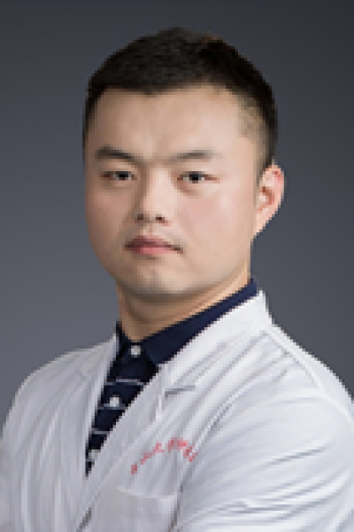

<!-- AUTO-GENERATED-BY: work/generate_obsidian_profiles.py -->

# 梁虎

## 基础信息

| 字段 | 内容 |
|---|---|
| 医院 | 中山大学肿瘤防治中心 |
| 姓名 | 梁虎 |
| 科室 | 鼻咽科 |
| 职称/身份 | 副主任医师 |
| 重点优先级 | 高 |
| 来源类型 | 医院官网 |
| 来源链接 | [官网原文](https://www.sysucc.org.cn/node/1649) |
| 采集日期 | 2026-08-10 |
| 复核状态 | 待人工复核 |
| 异常提示 |  |

## 简介/擅长

鼻咽癌放疗、化疗、免疫及靶向等个体化综合治疗 基本情况 职称：副主任医师 专业特长：鼻咽癌放疗、化疗、免疫及靶向等个体化综合治疗 工作经历 2023-至今 中山大学，肿瘤防治中心 副主任医师 2022-2022 中山大学，肿瘤防治中心 主治医师 2019-2021 中山大学，肿瘤防治中心 医师、博士后 学术兼职 中国抗癌协会会员 中国医师协会肿瘤放射治疗分会会员 美国临床肿瘤学会（ ASCO）会员 欧洲肿瘤内科学会（ ESMO）会员 主要研究方向是 鼻咽癌放疗、化疗、免疫及靶向等个体化综合治疗。参与多项局部晚期、晚期复发转移性鼻咽癌治疗相关的临床研究项目；主持 国家自然科学基金青年科学 基金及中国博士后科学基金，参与多项国家级项目研究，发表 JAMA Oncology、Clin Cancer Res、Eur J Cancer等多篇国际权威期刊论著，Radiother Oncol、Oral Oncol等国际权威期刊特邀审稿人。2022年美国临床肿瘤学会Conque Cancer Merit Award奖获得者。 2021年中山大学广东省柯麟医教基金会“叶任高-李幼姬”夫妇临床医学专业“优秀教师奖”获得者。 加载更多 基本...

## 详情正文摘录

临床专家 面包屑 首页 / 临床科室 / 放疗系列 / 鼻咽科 / 临床专家 梁虎 职称：副主任医师 专长 鼻咽癌放疗、化疗、免疫及靶向等个体化综合治疗 基本情况 职称：副主任医师 专业特长：鼻咽癌放疗、化疗、免疫及靶向等个体化综合治疗 工作经历 2023-至今 中山大学，肿瘤防治中心 副主任医师 2022-2022 中山大学，肿瘤防治中心 主治医师 2019-2021 中山大学，肿瘤防治中心 医师、博士后 学术兼职 中国抗癌协会会员 中国医师协会肿瘤放射治疗分会会员 美国临床肿瘤学会（ ASCO）会员 欧洲肿瘤内科学会（ ESMO）会员 主要研究方向是 鼻咽癌放疗、化疗、免疫及靶向等个体化综合治疗。参与多项局部晚期、晚期复发转移性鼻咽癌治疗相关的临床研究项目；主持 国家自然科学基金青年科学 基金及中国博士后科学基金，参与多项国家级项目研究，发表 JAMA Oncology、Clin Cancer Res、Eur J Cancer等多篇国际权威期刊论著，Radiother Oncol、Oral Oncol等国际权威期刊特邀审稿人。2022年美国临床肿瘤学会Conque Cancer Merit Award奖获得者。 2021年中山大学广东省柯麟医教基金会“叶任高-李幼姬”夫妇临床医学专业“优秀教师奖”获得者。 加载更多 基本情况 职称：副主任医师 专业特长：鼻咽癌放疗、化疗、免疫及靶向等个体化综合治疗 工作经历 2023-至今 中山大学，肿瘤防治中心 副主任医师 2022-2022 中山大学，肿瘤防治中心 主治医师 2019-2021 中山大学，肿瘤防治中心 医师、博士后 学术兼职 中国抗癌协会会员 中国医师协会肿瘤放射治疗分会会员 美国临床肿瘤学会（ ASCO）会员 欧洲肿瘤内科学会（ ESMO）会员 主要研究方向是 鼻咽癌放疗、化疗、免疫及靶向等个体化综合治疗。参与多项局部晚期、晚期复发转移性鼻咽癌治疗相关的临床研究项目；主持 国家自然科学基金青年科学 基金及中国博士后科学基金，参与多项国家级项目研究，发表 JAMA Oncology、Clin Cancer Re…

## 重点关注范围

- 肿瘤
- 免疫/风湿/感染

## 重点疾病标签

- 肿瘤
- 癌
- 放疗
- 化疗
- 靶向
- 鼻咽癌
- 免疫

## 亮眼经历线索

- 副主任医师 鼻咽癌放疗、化疗、免疫及靶向等个体化综合治疗 基本情况 职称：副主任医师 专业特长：鼻咽癌放疗、化疗、免疫及靶向等个体化综合治疗 工作经历 2023-至今 中山大学，肿瘤防治中心 副主任医师 2022-2022 中山大学，肿瘤防治中心 主治医师 2019-2021 中山大学，肿瘤防治中心 医师、博士后 学术兼职 中国抗癌协会会员 中国医师协会肿…
- 主持 国家自然科学基金青年科学 基金及中国博士后科学基金，参与多项国家级项目研究，发表 JAMA Oncology、Clin Cancer Res、Eur J Cancer等多篇国际权威期刊论著，Radiother Oncol、Oral Oncol等国际权威期刊特邀审稿人。
- 2022年美国临床肿瘤学会Conque Ca...

## 异常提示

## 合规边界

- 本画像仅整理统一总底表中的医院官网公开字段。
- 不包含患者评价、排名、第三方来源内容或疗效承诺。
- 官网未展示的信息保持空白，后续如需补充须回到底表官方来源字段。
