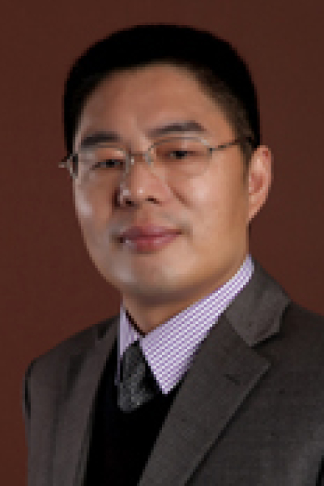

<!-- AUTO-GENERATED-BY: work/generate_obsidian_profiles.py -->

# 樊卫

## 基础信息

| 字段 | 内容 |
|---|---|
| 医院 | 中山大学肿瘤防治中心 |
| 姓名 | 樊卫 |
| 科室 | 核医学科 |
| 职称/身份 | 核医学科主任 职称：主任医师、博士生导师 |
| 重点优先级 | 高 |
| 来源类型 | 医院官网 |
| 来源链接 | [官网原文](https://www.sysucc.org.cn/node/3890) |
| 采集日期 | 2026-08-10 |
| 复核状态 | 待人工复核 |
| 异常提示 |  |

## 简介/擅长

⑴肿瘤的核素靶向治疗（放射免疫、放射受体和基因放射治疗）及核素剂量学研究；⑵肿瘤PET/CT及SPECT/CT诊断。 加载更多 医学博士，主任医师，中山大学肿瘤学专业博士生导师，中山大学附属肿瘤医院核医学科主任。任中华医学会核医学与分子影像分会肿瘤核医学组副组长、中华医学会肿瘤学分会淋巴瘤组委员、广东省医学会核医学分会副主任委员、广东省医学会放射防护医学分会常委、 中国抗癌协会肿瘤影像专业委员会委员、中国核学会第五届同位素理事会理事、广东省生物工程学会医学物理专业委员会学分会常委和广东省医院管理委员会影像技术专业委员会委员等职，同时兼任中华核医学与分子影像杂志编委等。 本人一直从事肿瘤的临床核素分子影像学诊断和核素靶向内照射治疗工作，擅长肿瘤的PET/CT和SPECT诊断和甲状腺癌、淋巴瘤、前列腺癌和骨转移瘤及血管瘤的核素内照射治疗；承担和参与十余项国家自然科学基金和省自然科学基金等科研项目。主要研究方向：⑴肿瘤的核素靶向治疗（放射免疫、放射受体和基因放射治疗）及核素剂量学研究；⑵肿瘤PET/CT及SPECT/CT诊断。发表论文五十余篇，内容包括以下方面：⑴153Sm-EDTMP和89Sr治疗骨转移瘤的系列研究等；⑵S...

## 详情正文摘录

临床专家 面包屑 首页 / 临床科室 / 平台科室 / 核医学科 / 临床专家 樊卫 职务：核医学科主任 职称：主任医师、博士生导师 专长 PET/CT.ECT诊断和核素内放射治疗 医学博士，主任医师，中山大学肿瘤学专业博士生导师，中山大学附属肿瘤医院核医学科主任。任中华医学会核医学与分子影像分会肿瘤核医学组副组长、中华医学会肿瘤学分会淋巴瘤组委员、广东省医学会核医学分会副主任委员、广东省医学会放射防护医学分会常委、 中国抗癌协会肿瘤影像专业委员会委员、中国核学会第五届同位素理事会理事、广东省生物工程学会医学物理专业委员会学分会常委和广东省医院管理委员会影像技术专业委员会委员等职，同时兼任中华核医学与分子影像杂志编委等。 本人一直从事肿瘤的临床核素分子影像学诊断和核素靶向内照射治疗工作，擅长肿瘤的PET/CT和SPECT诊断和甲状腺癌、淋巴瘤、前列腺癌和骨转移瘤及血管瘤的核素内照射治疗；承担和参与十余项国家自然科学基金和省自然科学基金等科研项目。主要研究方向：⑴肿瘤的核素靶向治疗（放射免疫、放射受体和基因放射治疗）及核素剂量学研究；⑵肿瘤PET/CT及SPECT/CT诊断。 加载更多 医学博士，主任医师，中山大学肿瘤学专业博士生导师，中山大学附属肿瘤医院核医学科主任。任中华医学会核医学与分子影像分会肿瘤核医学组副组长、中华医学会肿瘤学分会淋巴瘤组委员、广东省医学会核医学分会副主任委员、广东省医学会放射防护医学分会常委、 中国抗癌协会肿瘤影像专业委员会委员、中国核学会第五届同位素理事会理事、广东省生物工程学会医学物理专业委员会学分会常委和广东省医院管理委员会影像技术专业委员会委员等职，同时兼任中华核医学与分子影像杂志编委等。 本人一直从事肿瘤的临床核素分子影像学诊断和核素靶向内照射治疗工作，擅长肿瘤的PET/CT和SPECT诊断和甲状腺癌、淋巴瘤、前列腺癌和骨转移瘤及血管瘤的核素内照射治疗；承担和参与十余项国家自然科学基金和省自然科学基金等科研项目。主要研究方向：⑴肿瘤的核素靶向治疗（放射免疫、放射受体和基因放射治疗）及核素剂量学研究；⑵肿瘤PET/CT及SPECT/C…

## 重点关注范围

- 慢性病
- 肿瘤
- 免疫/风湿/感染
- 术后恢复/康复

## 重点疾病标签

- 代谢
- 肿瘤
- 癌
- 瘤
- 淋巴瘤
- 放疗
- 化疗
- 靶向
- 鼻咽癌
- 胃癌
- 肠癌
- 乳腺癌
- 免疫
- 免疫功能
- 术后
- 疼痛
- 创面

## 亮眼经历线索

- 核医学科主任 职称：主任医师、博士生导师 加载更多 医学博士，主任医师，中山大学肿瘤学专业博士生导师，中山大学附属肿瘤医院核医学科主任。
- 任中华医学会核医学与分子影像分会肿瘤核医学组副组长、中华医学会肿瘤学分会淋巴瘤组委员、广东省医学会核医学分会副主任委员、广东省医学会放射防护医学分会常委、 中国抗癌协会肿瘤影像专业委员会委员、中国核学会第五届同位素理事会理事、广东省生物工程学会医学物理专业委员会学分会常委和广东省医院管理委员会影像技术专业委员会委员等职，同时兼任中华核医学与分子影像杂志编委…
- 承担和参与十余项国家自然科学基金和省自然科学基金等科研项目。

## 异常提示

## 合规边界

- 本画像仅整理统一总底表中的医院官网公开字段。
- 不包含患者评价、排名、第三方来源内容或疗效承诺。
- 官网未展示的信息保持空白，后续如需补充须回到底表官方来源字段。
