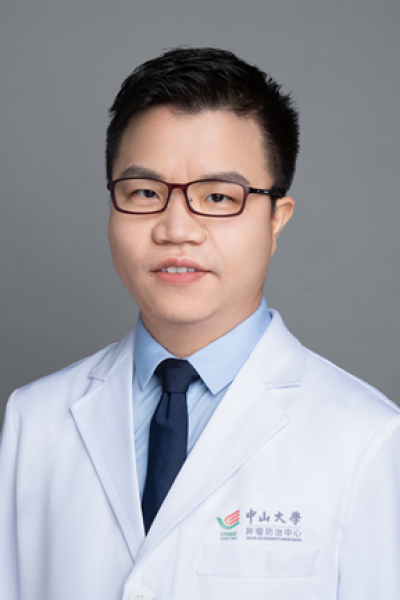

<!-- AUTO-GENERATED-BY: work/generate_obsidian_profiles.py -->

# 潘求忠

## 基础信息

| 字段 | 内容 |
|---|---|
| 医院 | 中山大学肿瘤防治中心 |
| 姓名 | 潘求忠 |
| 科室 | 生物治疗中心 |
| 职称/身份 | 科秘书 职称：副主任医师、硕士生导师 |
| 重点优先级 | 高 |
| 来源类型 | 医院官网 |
| 来源链接 | [官网原文](https://www.sysucc.org.cn/node/3790) |
| 采集日期 | 2026-08-10 |
| 复核状态 | 待人工复核 |
| 异常提示 |  |

## 简介/擅长

肉瘤与黑色素瘤的内科治疗，实体瘤的免疫细胞治疗。 2015年8月博士毕业后进入中山大学肿瘤防治中心生物治疗中心/黑色素瘤与肉瘤内科工作。主要研究方向为肿瘤免疫治疗的基础与临床研究。主持国家自然科学基金1项、广东省自然科学基金1项，参加多项国家级、省级基金项目，以第一作者及参与作者发表论文20余篇。 教育经历： 2010/09-2015/06，中山大学，肿瘤防治中心，博士 2005/09-2010/06，南昌大学，第一临床医学院，学士 工作经历： 2021/01-至今，中山大学，肿瘤防治中心，副主任医师 2019/01-2020/12，中山大学，肿瘤防治中心，主治医师 2015/08-2018/12，中山大学，肿瘤防治中心，医师 加载更多 职务： 科秘书 职称： 副主任医师、硕士生导师 擅长： 肉瘤与黑色素瘤的内科治疗，实体瘤的免疫细胞治疗。 2015年8月博士毕业后进入中山大学肿瘤防治中心生物治疗中心/黑色素瘤与肉瘤内科工作。主要研究方向为肿瘤免疫治疗的基础与临床研究。主持国家自然科学基金1项、广东省自然科学基金1项，参加多项国家级、省级基金项目，以第一作者及参与作者发表论文20余篇。 教育经历： 2010/09-20...

## 详情正文摘录

职务：科秘书 职称：副主任医师、硕士生导师 专长 肉瘤与黑色素瘤的内科治疗，实体瘤的免疫细胞治疗 职务： 科秘书 职称： 副主任医师、硕士生导师 擅长： 肉瘤与黑色素瘤的内科治疗，实体瘤的免疫细胞治疗。 2015年8月博士毕业后进入中山大学肿瘤防治中心生物治疗中心/黑色素瘤与肉瘤内科工作。主要研究方向为肿瘤免疫治疗的基础与临床研究。主持国家自然科学基金1项、广东省自然科学基金1项，参加多项国家级、省级基金项目，以第一作者及参与作者发表论文20余篇。 教育经历： 2010/09-2015/06，中山大学，肿瘤防治中心，博士 2005/09-2010/06，南昌大学，第一临床医学院，学士 工作经历： 2021/01-至今，中山大学，肿瘤防治中心，副主任医师 2019/01-2020/12，中山大学，肿瘤防治中心，主治医师 2015/08-2018/12，中山大学，肿瘤防治中心，医师 加载更多 职务： 科秘书 职称： 副主任医师、硕士生导师 擅长： 肉瘤与黑色素瘤的内科治疗，实体瘤的免疫细胞治疗。 2015年8月博士毕业后进入中山大学肿瘤防治中心生物治疗中心/黑色素瘤与肉瘤内科工作。主要研究方向为肿瘤免疫治疗的基础与临床研究。主持国家自然科学基金1项、广东省自然科学基金1项，参加多项国家级、省级基金项目，以第一作者及参与作者发表论文20余篇。 教育经历： 2010/09-2015/06，中山大学，肿瘤防治中心，博士 2005/09-2010/06，南昌大学，第一临床医学院，学士 工作经历： 2021/01-至今，中山大学，肿瘤防治中心，副主任医师 2019/01-2020/12，中山大学，肿瘤防治中心，主治医师 2015/08-2018/12，中山大学，肿瘤防治中心，医师 近三年发表论文： 1.Zhou ZQ#, Zhao JJ#, Pan QZ#, Chen CL, Liu Y, Tang Y, Zhu Q, Weng DS, Xia JC. PD-L1 expression is…

## 重点关注范围

- 肿瘤
- 免疫/风湿/感染

## 重点疾病标签

- 肿瘤
- 瘤
- 免疫

## 亮眼经历线索

- 科秘书 职称：副主任医师、硕士生导师 主持国家自然科学基金1项、广东省自然科学基金1项，参加多项国家级、省级基金项目，以第一作者及参与作者发表论文20余篇。
- 教育经历： 2010/09-2015/06，中山大学，肿瘤防治中心，博士 2005/09-2010/06，南昌大学，第一临床医学院，学士 工作经历： 2021/01-至今，中山大学，肿瘤防治中心，副主任医师 2019/01-2020/12，中山大学，肿瘤防治中心，主治医师 2015/08-2018/12，中山大学，肿瘤防治中心，医师 加载更多 职务： 科秘…
- 主持国家自然科学基金1项、广东省自然科学基金1项，参加多项国家级、省级基金项目，以第一作者及参与作者发表论文20余篇。

## 异常提示

## 合规边界

- 本画像仅整理统一总底表中的医院官网公开字段。
- 不包含患者评价、排名、第三方来源内容或疗效承诺。
- 官网未展示的信息保持空白，后续如需补充须回到底表官方来源字段。
