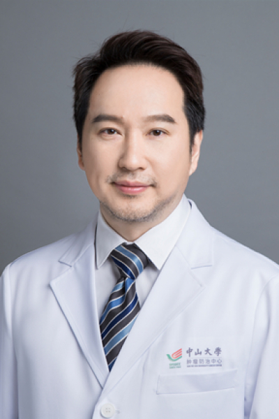

<!-- AUTO-GENERATED-BY: work/generate_obsidian_profiles.py -->

<!-- TEMPLATE: D:\workspace\信息收集整理\医生画像仓库\模板\医生画像模板.md -->

# 熊樱

## 基础信息

| 字段 | 内容 |
|---|---|
| 姓名 | 熊樱 |
| 医院 | 中山大学肿瘤防治中心 |
| 科室 | 妇科 |
| 职称/身份 | 主任医师 |
| 来源链接 | [官网原文](https://www.sysucc.org.cn/node/3696) |
| 采集日期 | 2026-08-10 |

## 简介/擅长

局部晚期妇科恶性肿瘤的根治性手术治疗以及良性和早期恶性肿瘤的微创手术治疗。

## 教育与进修经历

- 二、学习及工作经历： 1991年9月—1996年7月 中山医科大学临床医学系就读 2000年9月—2003年7月 中山大学就读硕士生 2003年9月—2004年1月 长春卫生部日语培训 2004年4月—2005年3月 获日本笹川医学奖学金资助，日本北海道大学妇科进修一年 1996年7月至今 中山大学肿瘤防治中心妇科工作，期间（2007年9月至今）中山大学肿瘤防治中心在职博士 加载更多 男，主任医师 主要学历： 1991年9月——1996年7月 广州中山医科大学临床医学系，医学学士。
- 2000年9月——2003年7月 中山大学，医学硕士学位 2003年9月——2004年1月 长春卫生部日语培训 2004年4月——2005年3月 获日本笹川医学奖学金资助，日本北海道大学妇科进修一年 2007年9月——目前 中山大学，在职博士 工作经历： 1996年7月——2001年12月 中山大学肿瘤防治中心妇科任住院医师 2001年12月——2008年12月 中山大学肿瘤防治中心妇科任主治医师 2009年1月——目前 中山大学肿瘤防治中心妇科任副主任医师 主要研究方向（突出亚方向）： 局部晚期妇科恶性肿瘤的根…

## 科研项目与成果

- 承担科研课题情况： 广东省科技计划项目 宫颈癌淋巴管生成及淋巴结微转移的研究 参与科研启动基金项目 广东省科技计划项目（2007B060401071）：宫颈癌中淋巴管生成及淋巴结微转移的研究。

## 论文与学术产出

- 文章及著作： 1、外阴Paget''''''''''''''''''''''''''''''''s病8例临床分析，癌症， 2004.02.05;

## 可包装亮点

- 主任医师 熊樱 职称：主任医师 专长 局部晚期妇科恶性肿瘤的根治性手术治疗以及良性和早期恶性肿瘤的微创手术治疗。
- 一、基本情况 职称：主任医师 专家门诊时间： 周一上午、周二下午 专业特长：局部晚期妇科恶性肿瘤的根治性手术治疗以及良性和早期恶性肿瘤的微创手术治疗。
- 二、学习及工作经历： 1991年9月—1996年7月 中山医科大学临床医学系就读 2000年9月—2003年7月 中山大学就读硕士生 2003年9月—2004年1月 长春卫生部日语培训 2004年4月—2005年3月 获日本笹川医学奖学金资助，日本北海道大学妇科进修一年 1996年7月至今 中山大学肿瘤防治中心妇科工作，期间（2007年9月至今）中山大学肿…

## 重点疾病/人群标签

- 慢性病：
- 肿瘤：肿瘤、癌、瘤、化疗、卵巢、疑难
- 生殖疾病：肿瘤、癌、瘤、化疗、卵巢、疑难
- 免疫/风湿：
- 术后恢复/康复：
- 疑难重症：肿瘤、癌、瘤、化疗、卵巢、疑难

## 证据摘录

> 只摘录官网公开信息中的短句或关键字段，不复制大段原文。

- 官网身份字段：主任医师
- 官网简介/擅长：局部晚期妇科恶性肿瘤的根治性手术治疗以及良性和早期恶性肿瘤的微创手术治疗。
- 官网亮眼经历线索：主任医师 熊樱 职称：主任医师 专长 局部晚期妇科恶性肿瘤的根治性手术治疗以及良性和早期恶性肿瘤的微创手术治疗。 一、基本情况 职称：主任医师 专家门诊时间： 周一上午、周二下午 专业特长：局部晚期妇科恶性肿瘤的根治性手术治疗以及良性和早期恶性肿瘤的微创手术治疗。 二、学习及工作经历： 1991年9月—1996年7月 中山医科大学临床医学系就读 2000年9月—2003年7月 中山大学就读硕士生 2003年9月—2004年1月 长春卫…
- 异常提示：亮眼经历含导航文本，已清洗
- 来源链接：https://www.sysucc.org.cn/node/3696

## BD 画像摘要

熊樱医生可作为肿瘤、生殖疾病、疑难重症方向的基础画像候选。后续 BD 使用应继续以官网来源和人工复核为准，不添加疗效承诺或无来源包装。

## 合规边界

- 仅使用医院官网、官方公众号、官方小程序等公开渠道。
- 不采集私人电话、私人微信、家庭住址、患者隐私或非公开排班信息。
- 不写“保证治愈”“疗效第一”“包治疑难杂症”等无法由官网证明的表述。
