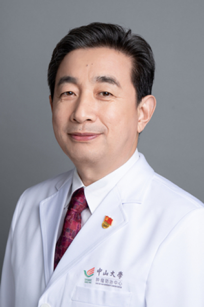

<!-- AUTO-GENERATED-BY: work/generate_obsidian_profiles.py -->

<!-- TEMPLATE: D:\workspace\信息收集整理\医生画像仓库\模板\医生画像模板.md -->

# 牟永告

## 基础信息

| 字段 | 内容 |
|---|---|
| 姓名 | 牟永告 |
| 医院 | 中山大学肿瘤防治中心 |
| 科室 | 神经外科 |
| 职称/身份 | 神经外科科主任 职称：一级主任医师、博士生导师、神经外科主诊教授、临床医学科学家、胶质瘤单病种首席专家 |
| 来源链接 | [官网原文](https://www.sysucc.org.cn/node/3708) |
| 采集日期 | 2026-08-10 |

## 简介/擅长

神经系统肿瘤的诊断及显微手术治疗；脑胶质瘤的综合治疗（手术、化疗、靶向及免疫治疗）；脑转移瘤的基础研究与临床。

## 教育与进修经历

- 二、学习及工作经历 1990年毕业于山东滨州医学院临床医疗系，中山大学硕士、博士。
- 2009年美国M.D.Anderson访问学者。
- 培养硕士、博士、博士后30余人。

## 科研项目与成果

- 主持国家自然科学基金、广东省重大科技计划等十余项科研项目，在Cancer cell，Nature Communications, Neuro-oncology, Advanced Science等杂志发表学术成果100余篇，主编人民卫生出版社《脑胶质瘤患者指导手册》、《脑胶质瘤规范诊疗病例荟萃》等著作，获中华人民共和国实用新型专利16项,转化2项。

## 论文与学术产出

- 主持国家自然科学基金、广东省重大科技计划等十余项科研项目，在Cancer cell，Nature Communications, Neuro-oncology, Advanced Science等杂志发表学术成果100余篇，主编人民卫生出版社《脑胶质瘤患者指导手册》、《脑胶质瘤规范诊疗病例荟萃》等著作，获中华人民共和国实用新型专利16项,转化2项。

## 可包装亮点

- 神经外科科主任 职称：一级主任医师、博士生导师、神经外科主诊教授、临床医学科学家、胶质瘤单病种首席专家 牟永告 职务：神经外科科主任 职称：一级主任医师、博士生导师、神经外科主诊教授、临床医学科学家、胶质瘤单病种首席专家 专长 神经系统肿瘤的诊断及显微手术治疗；
- 2009年美国M.D.Anderson访问学者。
- 主持国家自然科学基金、广东省重大科技计划等十余项科研项目，在Cancer cell，Nature Communications, Neuro-oncology, Advanced Science等杂志发表学术成果100余篇，主编人民卫生出版社《脑胶质瘤患者指导手册》、《脑胶质瘤规范诊疗病例荟萃》等著作，获中华人民共和国实用新型专利16项,转化2项。

## 重点疾病/人群标签

- 慢性病：
- 肿瘤：肿瘤、癌、瘤、化疗、靶向、免疫、罕见
- 生殖疾病：
- 免疫/风湿：肿瘤、癌、瘤、化疗、靶向、免疫、罕见
- 术后恢复/康复：
- 疑难重症：肿瘤、癌、瘤、化疗、靶向、免疫、罕见

## 证据摘录

> 只摘录官网公开信息中的短句或关键字段，不复制大段原文。

- 官网身份字段：神经外科科主任 职称：一级主任医师、博士生导师、神经外科主诊教授、临床医学科学家、胶质瘤单病种首席专家
- 官网简介/擅长：神经系统肿瘤的诊断及显微手术治疗；脑胶质瘤的综合治疗（手术、化疗、靶向及免疫治疗）；脑转移瘤的基础研究与临床。
- 官网亮眼经历线索：神经外科科主任 职称：一级主任医师、博士生导师、神经外科主诊教授、临床医学科学家、胶质瘤单病种首席专家 牟永告 职务：神经外科科主任 职称：一级主任医师、博士生导师、神经外科主诊教授、临床医学科学家、胶质瘤单病种首席专家 专长 神经系统肿瘤的诊断及显微手术治疗； 2009年美国M.D.Anderson访问学者。 主持国家自然科学基金、广东省重大科技计划等十余项科研项目，在Cancer cell，Nature Communication…
- 异常提示：亮眼经历含导航文本，已清洗
- 来源链接：https://www.sysucc.org.cn/node/3708

## BD 画像摘要

牟永告医生可作为肿瘤、免疫/风湿/感染、疑难重症方向的基础画像候选。后续 BD 使用应继续以官网来源和人工复核为准，不添加疗效承诺或无来源包装。

## 合规边界

- 仅使用医院官网、官方公众号、官方小程序等公开渠道。
- 不采集私人电话、私人微信、家庭住址、患者隐私或非公开排班信息。
- 不写“保证治愈”“疗效第一”“包治疑难杂症”等无法由官网证明的表述。
