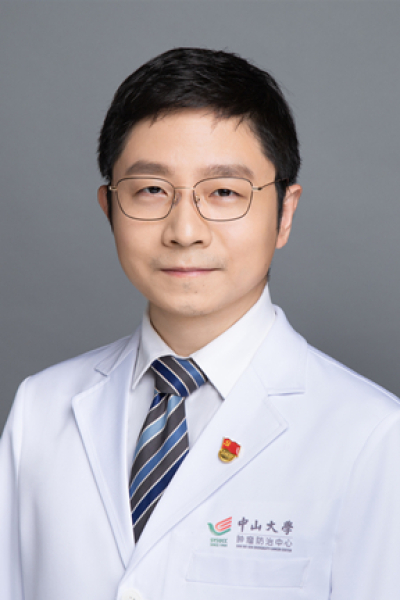

<!-- AUTO-GENERATED-BY: work/generate_obsidian_profiles.py -->

<!-- TEMPLATE: D:\workspace\信息收集整理\医生画像仓库\模板\医生画像模板.md -->

# 王华

## 基础信息

| 字段 | 内容 |
|---|---|
| 姓名 | 王华 |
| 医院 | 中山大学肿瘤防治中心 |
| 科室 | 血液肿瘤科 |
| 职称/身份 | 副主任医师、主诊教授、硕士导师、肿瘤学博士 |
| 来源链接 | [官网原文](https://www.sysucc.org.cn/node/3796) |
| 采集日期 | 2026-08-10 |

## 简介/擅长

特别擅长多发性骨髓瘤、淋巴瘤、慢性淋巴细胞白血病、各种急性白血病等血液系统肿瘤的化疗、靶向治疗、免疫治疗并主持多项骨髓瘤、淋巴瘤相关的临床研究

## 科研项目与成果

- 职称：副主任医师、主诊教授、硕士导师、肿瘤学博士 专长 特别擅长多发性骨髓瘤、淋巴瘤、慢性淋巴细胞白血病、各种急性白血病等血液系统肿瘤的化疗、靶向治疗、免疫治疗并主持多项骨髓瘤、淋巴瘤相关的临床研究 一、基本情况 王华教授长期从事多发性骨髓瘤、淋巴瘤等疾病的精准诊疗研究，目前具有近20年的临床经验，在多发性骨髓瘤、淋巴瘤等疾病的复发、治疗耐药及其机制和优化临床治疗方面具有创新性成果，所治疗病患的5年生存率可达国际领先水平。
- 主持国家自然基金等多项课题，编写《标准多发性骨髓瘤诊疗学》等专著4部，在国际权威杂志Molecular Cancer、Leukemia、BJC、JHO、Oncologist等发表学术论文40余篇。
- 周三上午，周五上午越秀，周二、周四上午黄埔 二、学术兼职 中国抗癌协会肿瘤与微生态专委会委员/青委副主委 中国人体健康科技促进会细胞治疗专委会常委 中国人体健康科技促进会浆细胞疾病专委会委员 广东省预防医学会血液肿瘤专委会常委 广东省医药教育协会血液病专委会常委 广州抗癌协会理事/肿瘤复发与转移专委会常委 三、主持科研项目 （1）国家自然基金青年项目（核糖体蛋白S3亚基上调前列腺素内过氧化物合成酶2促进急性白血病发展及其机制研，81700148，已结题） （2）广东省自然基金（整合素α6靶向纳米多肽的研发及其在急…

## 论文与学术产出

- 主持国家自然基金等多项课题，编写《标准多发性骨髓瘤诊疗学》等专著4部，在国际权威杂志Molecular Cancer、Leukemia、BJC、JHO、Oncologist等发表学术论文40余篇。

## 可包装亮点

- 副主任医师、主诊教授、硕士导师、肿瘤学博士 王华 职称：副主任医师、主诊教授、硕士导师、肿瘤学博士 专长 特别擅长多发性骨髓瘤、淋巴瘤、慢性淋巴细胞白血病、各种急性白血病等血液系统肿瘤的化疗、靶向治疗、免疫治疗并主持多项骨髓瘤、淋巴瘤相关的临床研究 一、基本情况 王华教授长期从事多发性骨髓瘤、淋巴瘤等疾病的精准诊疗研究，目前具有近20年的临床经验，在多发性…
- 在多发性骨髓瘤、淋巴瘤等疾病个体化治疗和预后判断领域进行了一系列的探索，研究结果被美国NCCN指南引用，在全世界推广应用。
- 多次到美国和欧洲访学交流，采用国际先进诊疗理念结合自身对于疾病独特的理解，对患者进行个体化的风险分层治疗取得令人满意的疗效。

## 重点疾病/人群标签

- 慢性病：慢性、肿瘤、癌、瘤、淋巴瘤、白血病、化疗、靶向、免疫、难治
- 肿瘤：慢性、肿瘤、癌、瘤、淋巴瘤、白血病、化疗、靶向、免疫、难治
- 生殖疾病：
- 免疫/风湿：慢性、肿瘤、癌、瘤、淋巴瘤、白血病、化疗、靶向、免疫、难治
- 术后恢复/康复：
- 疑难重症：慢性、肿瘤、癌、瘤、淋巴瘤、白血病、化疗、靶向、免疫、难治

## 证据摘录

> 只摘录官网公开信息中的短句或关键字段，不复制大段原文。

- 官网身份字段：副主任医师、主诊教授、硕士导师、肿瘤学博士
- 官网简介/擅长：特别擅长多发性骨髓瘤、淋巴瘤、慢性淋巴细胞白血病、各种急性白血病等血液系统肿瘤的化疗、靶向治疗、免疫治疗并主持多项骨髓瘤、淋巴瘤相关的临床研究
- 官网亮眼经历线索：副主任医师、主诊教授、硕士导师、肿瘤学博士 王华 职称：副主任医师、主诊教授、硕士导师、肿瘤学博士 专长 特别擅长多发性骨髓瘤、淋巴瘤、慢性淋巴细胞白血病、各种急性白血病等血液系统肿瘤的化疗、靶向治疗、免疫治疗并主持多项骨髓瘤、淋巴瘤相关的临床研究 一、基本情况 王华教授长期从事多发性骨髓瘤、淋巴瘤等疾病的精准诊疗研究，目前具有近20年的临床经验，在多发性骨髓瘤、淋巴瘤等疾病的复发、治疗耐药及其机制和优化临床治疗方面具有创新性成果，所…
- 异常提示：亮眼经历含导航文本，已清洗
- 来源链接：https://www.sysucc.org.cn/node/3796

## BD 画像摘要

王华医生可作为慢性病、肿瘤、免疫/风湿/感染、疑难重症方向的基础画像候选。后续 BD 使用应继续以官网来源和人工复核为准，不添加疗效承诺或无来源包装。

## 合规边界

- 仅使用医院官网、官方公众号、官方小程序等公开渠道。
- 不采集私人电话、私人微信、家庭住址、患者隐私或非公开排班信息。
- 不写“保证治愈”“疗效第一”“包治疑难杂症”等无法由官网证明的表述。
