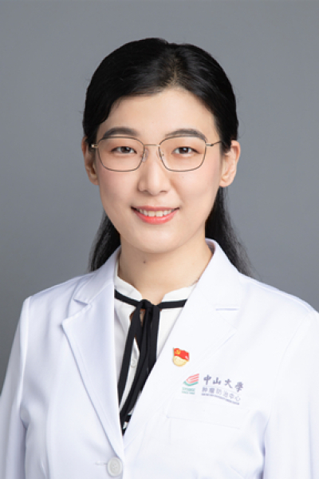

<!-- AUTO-GENERATED-BY: work/generate_obsidian_profiles.py -->

<!-- TEMPLATE: D:\workspace\信息收集整理\医生画像仓库\模板\医生画像模板.md -->

# 王宇

## 基础信息

| 字段 | 内容 |
|---|---|
| 姓名 | 王宇 |
| 医院 | 中山大学肿瘤防治中心 |
| 科室 | 内科 |
| 职称/身份 | 副主任医师，硕士生导师 |
| 来源链接 | [官网原文](https://www.sysucc.org.cn/node/1516) |
| 采集日期 | 2026-08-10 |

## 简介/擅长

淋巴瘤、鼻咽癌及头颈癌内科治疗（化疗、靶向治疗及免疫治疗）及相关新药临床研究 一．基本情况 职称：副主任医师，硕士生导师，临床医学博士 专业特长：淋巴瘤、鼻咽癌及头颈癌个体化治疗（化疗、靶向治疗、免疫治疗）及相关新药临床研究，尤其在高级别B细胞淋巴瘤、结外淋巴瘤、NK/T细胞淋巴瘤的诊治及全程治疗管理方面积累多年临床经验。

## 科研项目与成果

- 专科门诊时间：周四下午 云诊室：周一 ~ 周日 接诊既往治疗患者复诊（线上） 二．学习与工作经历： 2004-2012年：中山大学中山医学院临床医学（八年制）本硕博连读 2012-2014年：中山大学肿瘤防治中心 内科 住院医师 2015-2021年：中山大学肿瘤防治中心 内科 主治医师 2022年-至今：中山大学肿瘤防治中心 内科 副主任医师 三．主要科研及教学成果 主持国家自然科学基金，广东省医学科学技术基金等多项课题，并参与多项国自然及省部级基金。
- 作为Sub-I参与多项国际多中心及国内多中心临床研究，相关研究成果入选国际淋巴瘤大会口头报告，中国肿瘤内科大会口头报告，美国临床肿瘤学年会 ASCO壁报展示等。

## 论文与学术产出

- 以第一作者（共同第一作者）及通讯作者（共同通讯作者）身份在国际知名杂志发表高水平论文十余篇。

## 可包装亮点

- 副主任医师，硕士生导师 淋巴瘤、鼻咽癌及头颈癌内科治疗（化疗、靶向治疗及免疫治疗）及相关新药临床研究 一．基本情况 职称：副主任医师，硕士生导师，临床医学博士 专业特长：淋巴瘤、鼻咽癌及头颈癌个体化治疗（化疗、靶向治疗、免疫治疗）及相关新药临床研究，尤其在高级别B细胞淋巴瘤、结外淋巴瘤、NK/T细胞淋巴瘤的诊治及全程治疗管理方面积累多年临床经验。
- 王宇 职称：副主任医师，硕士生导师 专长 淋巴瘤、鼻咽癌及头颈癌内科治疗（化疗、靶向治疗及免疫治疗）及相关新药临床研究 一．基本情况 职称：副主任医师，硕士生导师，临床医学博士 专业特长：淋巴瘤、鼻咽癌及头颈癌个体化治疗（化疗、靶向治疗、免疫治疗）及相关新药临床研究，尤其在高级别B细胞淋巴瘤、结外淋巴瘤、NK/T细胞淋巴瘤的诊治及全程治疗管理方面积累多年临…

## 重点疾病/人群标签

- 慢性病：
- 肿瘤：肿瘤、癌、淋巴瘤、化疗、靶向、鼻咽癌、免疫
- 生殖疾病：
- 免疫/风湿：肿瘤、癌、淋巴瘤、化疗、靶向、鼻咽癌、免疫
- 术后恢复/康复：
- 疑难重症：

## 证据摘录

> 只摘录官网公开信息中的短句或关键字段，不复制大段原文。

- 官网身份字段：副主任医师，硕士生导师
- 官网简介/擅长：淋巴瘤、鼻咽癌及头颈癌内科治疗（化疗、靶向治疗及免疫治疗）及相关新药临床研究 一．基本情况 职称：副主任医师，硕士生导师，临床医学博士 专业特长：淋巴瘤、鼻咽癌及头颈癌个体化治疗（化疗、靶向治疗、免疫治疗）及相关新药临床研究，尤其在高级别B细胞淋巴瘤、结外淋巴瘤、NK/T细胞淋巴瘤的诊治及全程治疗管理方面积累多年临床经验。
- 官网亮眼经历线索：副主任医师，硕士生导师 淋巴瘤、鼻咽癌及头颈癌内科治疗（化疗、靶向治疗及免疫治疗）及相关新药临床研究 一．基本情况 职称：副主任医师，硕士生导师，临床医学博士 专业特长：淋巴瘤、鼻咽癌及头颈癌个体化治疗（化疗、靶向治疗、免疫治疗）及相关新药临床研究，尤其在高级别B细胞淋巴瘤、结外淋巴瘤、NK/T细胞淋巴瘤的诊治及全程治疗管理方面积累多年临床经验。 王宇 职称：副主任医师，硕士生导师 专长 淋巴瘤、鼻咽癌及头颈癌内科治疗（化疗、靶向治疗…
- 异常提示：亮眼经历含导航文本，已清洗
- 来源链接：https://www.sysucc.org.cn/node/1516

## BD 画像摘要

王宇医生可作为肿瘤、免疫/风湿/感染方向的基础画像候选。后续 BD 使用应继续以官网来源和人工复核为准，不添加疗效承诺或无来源包装。

## 合规边界

- 仅使用医院官网、官方公众号、官方小程序等公开渠道。
- 不采集私人电话、私人微信、家庭住址、患者隐私或非公开排班信息。
- 不写“保证治愈”“疗效第一”“包治疑难杂症”等无法由官网证明的表述。
