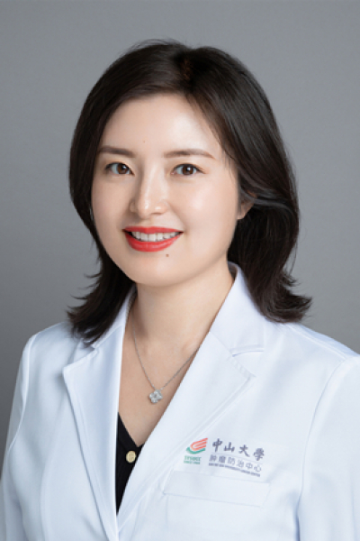

<!-- AUTO-GENERATED-BY: work/generate_obsidian_profiles.py -->

<!-- TEMPLATE: D:\workspace\信息收集整理\医生画像仓库\模板\医生画像模板.md -->

# 王峰

## 基础信息

| 字段 | 内容 |
|---|---|
| 姓名 | 王峰 |
| 医院 | 中山大学肿瘤防治中心 |
| 科室 | 内科 |
| 职称/身份 | 院长助理、内科主任 职称：教授、主任医师、研究员 |
| 来源链接 | [官网原文](https://www.sysucc.org.cn/node/1476) |
| 采集日期 | 2026-08-10 |

## 简介/擅长

消化系统肿瘤的内科治疗和研究

## 科研项目与成果

- 华南恶性肿瘤防治全国重点实验室PI，国家杰出青年科学基金获得者、国家级高层次人才。
- 长期致力于消化道肿瘤的精准化治疗和免疫治疗增效，主持国家自然科学基金国际（地区）合作与交流项目、面上项目在内的科研基金 14 项。
- 获得国家发明专利授权9项，荣获国家科技进步奖二等奖、教育部科技进步一等奖、中华医学会科技进步一等奖、教育部科技进步奖一等奖、中国医学科学院“2022年度重要医学进展”奖、广东青年五四奖章、第六届“科学探索奖”等省部级奖项。
- 二、学术兼职 1. 中国抗癌协会青年理事会副理事长 2. 中国临床肿瘤学会（CSCO）理事 3. 广东省抗癌协会大肠癌专业委员会副主任委员 4. 广东省抗癌协会多原发和不明原发肿瘤专业委员会副主任委员 5. 广东省抗癌协会肿瘤转移专业委员会常务委员 6. 广东省肿瘤性疾病医疗质量控制中心结直肠癌专家委员会常务委员 7. 广东省研究型医院学会理事等 三、主持科研项目 1. 国家自然科学基金委员会，国家杰出青年科学基金，82425048，逆转消化道肿瘤免疫治疗抵抗的临床转化研究 2. 国家自然科学基金委员会，国际(地…

## 论文与学术产出

- 以通讯或第一作者，在Cell, Nature Medicine（3篇）, Cancer Cell（2篇）, Journal of Clinical Oncology, JAMA Oncology, Annals of Oncology, The Lancet Gastroenterology and Hepatology 等杂志发表论文 60 篇，ESI高被引5篇。

## 可包装亮点

- 院长助理、内科主任 职称：教授、主任医师、研究员 王峰 职务：院长助理、内科主任 职称：教授、主任医师、研究员 专长 消化系统肿瘤的内科治疗和研究 一、个人简介 美国MD Anderson 肿瘤中心博士（PhD.）、中山大学临床医学博士（MD.）。
- 华南恶性肿瘤防治全国重点实验室PI，国家杰出青年科学基金获得者、国家级高层次人才。
- 中国抗癌协会青年理事会副理事长、中国临床肿瘤学会（CSCO）理事、广东省抗癌协会大肠癌专业委员会副主任委员等。

## 重点疾病/人群标签

- 慢性病：
- 肿瘤：肿瘤、癌、瘤、靶向、胃癌、肠癌、免疫
- 生殖疾病：
- 免疫/风湿：肿瘤、癌、瘤、靶向、胃癌、肠癌、免疫
- 术后恢复/康复：
- 疑难重症：

## 证据摘录

> 只摘录官网公开信息中的短句或关键字段，不复制大段原文。

- 官网身份字段：院长助理、内科主任 职称：教授、主任医师、研究员
- 官网简介/擅长：消化系统肿瘤的内科治疗和研究
- 官网亮眼经历线索：院长助理、内科主任 职称：教授、主任医师、研究员 王峰 职务：院长助理、内科主任 职称：教授、主任医师、研究员 专长 消化系统肿瘤的内科治疗和研究 一、个人简介 美国MD Anderson 肿瘤中心博士（PhD.）、中山大学临床医学博士（MD.）。 华南恶性肿瘤防治全国重点实验室PI，国家杰出青年科学基金获得者、国家级高层次人才。 中国抗癌协会青年理事会副理事长、中国临床肿瘤学会（CSCO）理事、广东省抗癌协会大肠癌专业委员会副主任委…
- 异常提示：亮眼经历含导航文本，已清洗
- 来源链接：https://www.sysucc.org.cn/node/1476

## BD 画像摘要

王峰医生可作为肿瘤、免疫/风湿/感染方向的基础画像候选。后续 BD 使用应继续以官网来源和人工复核为准，不添加疗效承诺或无来源包装。

## 合规边界

- 仅使用医院官网、官方公众号、官方小程序等公开渠道。
- 不采集私人电话、私人微信、家庭住址、患者隐私或非公开排班信息。
- 不写“保证治愈”“疗效第一”“包治疑难杂症”等无法由官网证明的表述。
