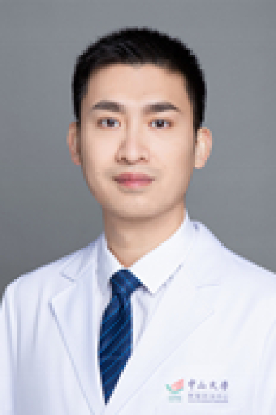

<!-- AUTO-GENERATED-BY: work/generate_obsidian_profiles.py -->

# 王建伟

## 基础信息

| 字段 | 内容 |
|---|---|
| 医院 | 中山大学肿瘤防治中心 |
| 姓名 | 王建伟 |
| 科室 | 超声科 |
| 职称/身份 | 医学博士，副主任医师，硕士生导师 |
| 重点优先级 | 高 |
| 来源类型 | 医院官网 |
| 来源链接 | [官网原文](https://www.sysucc.org.cn/node/3903) |
| 采集日期 | 2026-08-10 |
| 复核状态 | 待人工复核 |
| 异常提示 |  |

## 简介/擅长

1、甲状腺疑难结节的诊断、分类解读、微小癌的跟踪随访，早期转移性淋巴结的诊断等。2、甲状腺良性结节、低危微小癌、孤立性转移性淋巴结消融治疗。3、疑难部位的肿瘤穿刺活检。4、乳腺疾病、浅表病变的诊断及微创介入治疗。 职称： 医学博士，副主任医师，硕士生导师 教育及工作经历： 2009年本科毕业于中山大学中山医学院临床医学专业，并获博士学位。毕业后一直工作于中山大学附属肿瘤医院超声心电科。 科研项目： 主持国家自然科学基金1项，中山大学青年教师培育项目1项 近年来以第一/通讯作者在BMC cancer，British Journal of Radiology，Journal of Cellular and Molecular Medicine，Journal of Ultrasound等杂志上发表SCI论文数十篇。

## 详情正文摘录

职称：医学博士，副主任医师，硕士生导师 专长 1、甲状腺疑难结节的诊断、分类解读、微小癌的跟踪随访，早期转移性淋巴结的诊断等。2、甲状腺良性结节、低危微小癌、孤立性转移性淋巴结消融治疗。3、疑难部位的肿瘤穿刺活检。4、乳腺疾病、浅表病变的诊断及微创介入治疗。 职称： 医学博士，副主任医师，硕士生导师 教育及工作经历： 2009年本科毕业于中山大学中山医学院临床医学专业，并获博士学位。毕业后一直工作于中山大学附属肿瘤医院超声心电科。 科研项目： 主持国家自然科学基金1项，中山大学青年教师培育项目1项 近年来以第一/通讯作者在BMC cancer，British Journal of Radiology，Journal of Cellular and Molecular Medicine，Journal of Ultrasound等杂志上发表SCI论文数十篇。 社会任职： 中国超声医学工程学会腹部专委会青年委员 中国整形协会乳腺精准整复专委会青年委员 中国抗癌协会肿瘤影像专委会青年委员 广东省抗癌协会肿瘤影像专委会青年委员 广东省抗癌协会咽喉肿瘤专委会青年委员 广东省医学教育协会超声医学专委会委员 广东省基层医药学会微创介入专委会委员 加载更多 职称： 医学博士，副主任医师，硕士生导师 教育及工作经历： 2009年本科毕业于中山大学中山医学院临床医学专业，并获博士学位。毕业后一直工作于中山大学附属肿瘤医院超声心电科。 科研项目： 主持国家自然科学基金1项，中山大学青年教师培育项目1项 近年来以第一/通讯作者在BMC cancer，British Journal of Radiology，Journal of Cellular and Molecular Medicine，Journal of Ultrasound等杂志上发表SCI论文数十篇。 社会任职： 中国超声医学工程学会腹部专委会青年委员 中国整形协会乳腺精准整复专委会青年委员 中国抗癌协会肿瘤影像专委会青年委员 广东省抗癌协会肿瘤…

## 重点关注范围

- 肿瘤
- 疑难重症

## 重点疾病标签

- 肿瘤
- 癌
- 疑难

## 亮眼经历线索

- 医学博士，副主任医师，硕士生导师 1、甲状腺疑难结节的诊断、分类解读、微小癌的跟踪随访，早期转移性淋巴结的诊断等。
- 3、疑难部位的肿瘤穿刺活检。
- 职称： 医学博士，副主任医师，硕士生导师 教育及工作经历： 2009年本科毕业于中山大学中山医学院临床医学专业，并获博士学位。

## 异常提示

## 合规边界

- 本画像仅整理统一总底表中的医院官网公开字段。
- 不包含患者评价、排名、第三方来源内容或疗效承诺。
- 官网未展示的信息保持空白，后续如需补充须回到底表官方来源字段。
