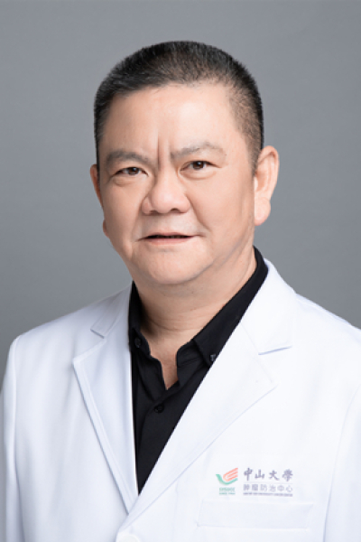

<!-- AUTO-GENERATED-BY: work/generate_obsidian_profiles.py -->

# 王思愚

## 基础信息

| 字段 | 内容 |
|---|---|
| 医院 | 中山大学肿瘤防治中心 |
| 姓名 | 王思愚 |
| 科室 | 胸科 |
| 职称/身份 | 教授、主任医师、研究生导师 |
| 重点优先级 | 高 |
| 来源类型 | 医院官网 |
| 来源链接 | [官网原文](https://www.sysucc.org.cn/node/3613) |
| 采集日期 | 2026-08-10 |
| 复核状态 | 待人工复核 |
| 异常提示 |  |

## 简介/擅长

胸部肿瘤的诊治，肺癌、乳腺癌多学科综合治疗 承担科研课题情况： 1.中山医大科研基金：树突状细胞介导淋巴细对非小细胞肺癌杀伤作用的研究 2.广东省科学重点公关项目基金：I、II期非小细胞肺癌术后辅助性树突状细胞介导的生物治 疗 3. 广东省科学重点公关项目基金:局部晚期非小细胞肺癌术后预防性脑放射 4. 国家科技厅项目分题：早期肺癌筛查方法研究 文章及著作： 论文情况： 1.绝经前乳腺癌手术时间与预后的关系。癌症，1998，17（1）: 50-51。 2.可手术乳腺癌病人月经生育史与预后关系。肿瘤，1999，19（2）: 75-77。 3.高龄食管癌、贲门癌患者食管切除术结果分析。癌症，1999，18（5）: 575-577。 4.老年非小细胞肺癌患者全肺切除术后生存和预后分析。中国肺癌杂志，2000，3（3）:195-197 5.新辅助化疗对ⅢA 非小细胞肺癌手术安全性的影晌。肿瘤，2000，20（5）346-348 6.Skip metastasis to the mediastinal lymph nodes in non-small cell lung cancer. Lung Cancer,2000, 29 ...

## 详情正文摘录

临床专家 面包屑 首页 / 临床科室 / 外科系列 / 胸科 / 临床专家 王思愚 职称：教授、主任医师、研究生导师 专长 胸部肿瘤外科的临床工作及临床研究，在肺癌、乳腺癌多学科综合治疗方面有较深入临床经验。 基本情况 职称：教授、主任医师、研究生导师 专家门诊时间： 周一上午；周四上午 专业特长：胸部肿瘤外科的临床工作及临床研究，在肺癌、乳腺癌多学科综合治疗方面有较深入临床经验。 教授，主任医师，硕士生导师。长期从事胸部肿瘤的诊治30年，在胸部肿瘤多学科综合治疗方面有较深入临床经验。兼任广东省胸部肿瘤防治研究会理事长，中国CSCO执行委员,《中国肺癌杂志》常务编委。 1988年毕业于中山医科大学医学系后开始在中山大学附属肿瘤医院胸科任职，并于1997年赴澳大利亚皇家Adelaide医院进修。 近年来在Lung Cancer、Journal of Thoracic Oncology， Annals of Thoracic Surgery 、Clinical Lung Cancer、The Breast Journal，Cancer, Annals of Surgical Oncology，Cancer, Annals of Oncology发表20多篇临床研究论文。在肺癌、乳腺癌多学科综合治疗方面有较深入的研究，承担多项国家、省级的科研课题，至今已在国内外学术杂志上发表论文80多篇，其中20多篇为III期非小细胞肺癌综合治疗方面的研究。近年来在国际学术会议上活跃，其中“完全切除的IIIA-N2期脑转移高危的NSCLC患者辅助化疗后预防性脑放射对比观察的III期临床研究”的成果于2014年美国临床肿瘤学会(ASCO)的50届年会上作为Poster Highlights部分展示，研究成果得到了国际同行的肯定；“IIIA-N2期非小细胞肺癌术后培美曲塞联合卡铂辅助化疗后续用对比不续用吉非替尼的II期临床研究”在2013年ASCO第49届年会上作为Poster Discussion部分展示；“晚期EGFR突变野生型和EGFR FISH阳性的肺腺癌厄洛替尼对比培美曲塞作为二线治…

## 重点关注范围

- 肿瘤
- 生殖疾病
- 术后恢复/康复
- 疑难重症

## 重点疾病标签

- 肿瘤
- 癌
- 化疗
- 肺癌
- 乳腺癌
- 月经
- 术后
- 多学科
- 高危

## 亮眼经历线索

- 教授、主任医师、研究生导师 胸部肿瘤的诊治，肺癌、乳腺癌多学科综合治疗 承担科研课题情况： 1.中山医大科研基金：树突状细胞介导淋巴细对非小细胞肺癌杀伤作用的研究 2.广东省科学重点公关项目基金：I、II期非小细胞肺癌术后辅助性树突状细胞介导的生物治 疗 3. 广东省科学重点公关项目基金:局部晚期非小细胞肺癌术后预防性脑放射 4. 国家科技厅项目分题：早期…
- 18．Induction chemotherapy with NVB and carboplatin for unresectable stage III-N2 non-small cell lung cancer:Results of phase II trail. Lung Cancer,2005, 49 (Supp2) :286. 19. Targe…

## 异常提示

## 合规边界

- 本画像仅整理统一总底表中的医院官网公开字段。
- 不包含患者评价、排名、第三方来源内容或疗效承诺。
- 官网未展示的信息保持空白，后续如需补充须回到底表官方来源字段。
