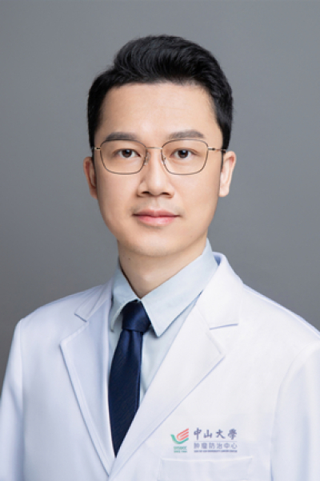

<!-- AUTO-GENERATED-BY: work/generate_obsidian_profiles.py -->

# 王梓贤

## 基础信息

| 字段 | 内容 |
|---|---|
| 医院 | 中山大学肿瘤防治中心 |
| 姓名 | 王梓贤 |
| 科室 | 内科 |
| 职称/身份 | 科秘书 职称：副主任医师、硕士研究生导师 |
| 重点优先级 | 高 |
| 来源类型 | 医院官网 |
| 来源链接 | [官网原文](https://www.sysucc.org.cn/node/1517) |
| 采集日期 | 2026-08-10 |
| 复核状态 | 待人工复核 |
| 异常提示 |  |

## 简介/擅长

结直肠癌、食管癌、胃癌等消化道肿瘤的化疗、靶向及免疫治疗 学术兼职： 中肿人工智能与大数据实验室 首席科学家 中国临床肿瘤学会结直肠癌数据管理专委会委员 广东省临床试验规范化专业委员会常务委员 广东省抗癌协会靶向与个体化治疗专委会青年委员

## 详情正文摘录

中山大学肿瘤学博士，硕士研究生导师。肿瘤内科副主任医师、科秘书。

## 重点关注范围

- 肿瘤
- 免疫/风湿/感染

## 重点疾病标签

- 肿瘤
- 癌
- 化疗
- 靶向
- 胃癌
- 肠癌
- 免疫

## 亮眼经历线索

- 科秘书 职称：副主任医师、硕士研究生导师 结直肠癌、食管癌、胃癌等消化道肿瘤的化疗、靶向及免疫治疗 学术兼职： 中肿人工智能与大数据实验室 首席科学家 中国临床肿瘤学会结直肠癌数据管理专委会委员 广东省临床试验规范化专业委员会常务委员 广东省抗癌协会靶向与个体化治疗专委会青年委员 肿瘤内科副主任医师、科秘书。

## 异常提示

## 合规边界

- 本画像仅整理统一总底表中的医院官网公开字段。
- 不包含患者评价、排名、第三方来源内容或疗效承诺。
- 官网未展示的信息保持空白，后续如需补充须回到底表官方来源字段。
