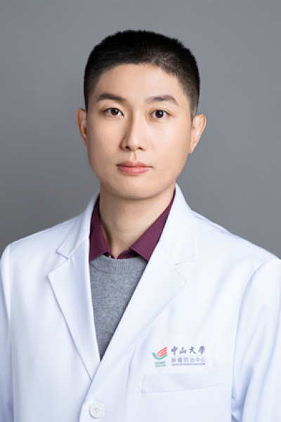

<!-- AUTO-GENERATED-BY: work/generate_obsidian_profiles.py -->

<!-- TEMPLATE: D:\workspace\信息收集整理\医生画像仓库\模板\医生画像模板.md -->

# 田小朋

## 基础信息

| 字段 | 内容 |
|---|---|
| 姓名 | 田小朋 |
| 医院 | 中山大学肿瘤防治中心 |
| 科室 | 内科 |
| 职称/身份 | 主任医师、研究员、博士生导师 |
| 来源链接 | [官网原文](https://www.sysucc.org.cn/node/1521) |
| 采集日期 | 2026-08-10 |

## 简介/擅长

淋巴瘤内科治疗，I/II期临床日间探索治疗，肿瘤支持治疗。

## 教育与进修经历

- 二、教育及工作经历 2014年在中山大学附属肿瘤医院获博士学位，后一直在中心工作至今 三、主持科研项目 1. 国家自然科学基金-优秀青年项目 2. 广东省自然科学基金-杰出青年项目 3. 国家自然科学基金面上项目（2项） 四、代表性论著 1. 田小朋（第一作者）First-line sintilimab with pegaspargase,gemcitabine,and oxaliplatin extranodal natunal killer/T cell lymphoma(SPIRIT):a multicen…

## 科研项目与成果

- 获得国自然优秀青年科学基金（2024）和广东省自然杰出青年基金（2024）等人才项目资助。
- 研究成果以第一/通讯作者身份发表于Blood, Lancet haematology , Leukemia等高影响力期刊，入选 CSCO 2024肿瘤学十大进展。
- 二、教育及工作经历 2014年在中山大学附属肿瘤医院获博士学位，后一直在中心工作至今 三、主持科研项目 1. 国家自然科学基金-优秀青年项目 2. 广东省自然科学基金-杰出青年项目 3. 国家自然科学基金面上项目（2项） 四、代表性论著 1. 田小朋（第一作者）First-line sintilimab with pegaspargase,gemcitabine,and oxaliplatin extranodal natunal killer/T cell lymphoma(SPIRIT):a multicen…

## 论文与学术产出

- 研究成果以第一/通讯作者身份发表于Blood, Lancet haematology , Leukemia等高影响力期刊，入选 CSCO 2024肿瘤学十大进展。

## 可包装亮点

- 主任医师、研究员、博士生导师 田小朋 职称：主任医师、研究员、博士生导师 专长 淋巴瘤内科治疗，I/II期临床日间探索治疗，肿瘤支持治疗。
- 一、基本情况 田小朋，医学博士，中山大学肿瘤防治中心内科主任医师、研究员、博士生导师。
- 获得国自然优秀青年科学基金（2024）和广东省自然杰出青年基金（2024）等人才项目资助。

## 重点疾病/人群标签

- 慢性病：
- 肿瘤：肿瘤、淋巴瘤
- 生殖疾病：
- 免疫/风湿：
- 术后恢复/康复：
- 疑难重症：

## 证据摘录

> 只摘录官网公开信息中的短句或关键字段，不复制大段原文。

- 官网身份字段：主任医师、研究员、博士生导师
- 官网简介/擅长：淋巴瘤内科治疗，I/II期临床日间探索治疗，肿瘤支持治疗。
- 官网亮眼经历线索：主任医师、研究员、博士生导师 田小朋 职称：主任医师、研究员、博士生导师 专长 淋巴瘤内科治疗，I/II期临床日间探索治疗，肿瘤支持治疗。 一、基本情况 田小朋，医学博士，中山大学肿瘤防治中心内科主任医师、研究员、博士生导师。 获得国自然优秀青年科学基金（2024）和广东省自然杰出青年基金（2024）等人才项目资助。
- 异常提示：亮眼经历含导航文本，已清洗
- 来源链接：https://www.sysucc.org.cn/node/1521

## BD 画像摘要

田小朋医生可作为肿瘤方向的基础画像候选。后续 BD 使用应继续以官网来源和人工复核为准，不添加疗效承诺或无来源包装。

## 合规边界

- 仅使用医院官网、官方公众号、官方小程序等公开渠道。
- 不采集私人电话、私人微信、家庭住址、患者隐私或非公开排班信息。
- 不写“保证治愈”“疗效第一”“包治疑难杂症”等无法由官网证明的表述。
