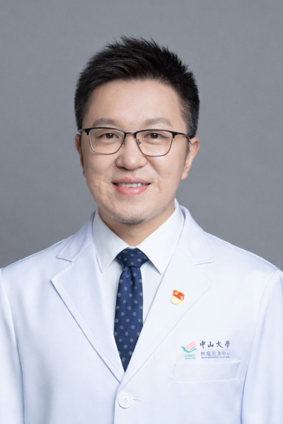

<!-- AUTO-GENERATED-BY: work/generate_obsidian_profiles.py -->

<!-- TEMPLATE: D:\workspace\信息收集整理\医生画像仓库\模板\医生画像模板.md -->

# 白龙

## 基础信息

| 字段 | 内容 |
|---|---|
| 姓名 | 白龙 |
| 医院 | 中山大学肿瘤防治中心 |
| 科室 | 综合科 |
| 职称/身份 | 副主任医师 |
| 来源链接 | [官网原文](https://www.sysucc.org.cn/node/3770) |
| 采集日期 | 2026-08-10 |

## 简介/擅长

消化道肿瘤（肠、胃、食管、肝胆、胰腺）、肺癌、鼻咽癌的内科治疗（化疗、靶向、免疫治疗）。

## 教育与进修经历

- 一、基本情况 副主任医师，医学博士，本科毕业于中山大学中山医学院，硕博阶段就读于中山大学肿瘤防治中心，从事肿瘤内科的学习与工作十余年。

## 可包装亮点

- 副主任医师 白龙 职称：副主任医师 专长 消化道肿瘤（肠、胃、食管、肝胆、胰腺）、肺癌、鼻咽癌的内科治疗（化疗、靶向、免疫治疗）。
- 一、基本情况 副主任医师，医学博士，本科毕业于中山大学中山医学院，硕博阶段就读于中山大学肿瘤防治中心，从事肿瘤内科的学习与工作十余年。
- 二、教育及工作经历 (1) 2013-06 至 2016-06, 中山大学, 肿瘤防治中心，肿瘤内科, 博士 (2) 2011-09 至 2013-06, 中山大学, 肿瘤防治中心，肿瘤内科, 硕士 (3) 2006-09 至 2011-06, 中山大学, 中山医学院，临床医学, 学士 三、学术兼职 广东省健康管理学会肿瘤防治专委会 常委 广东省抗癌协会肿…

## 重点疾病/人群标签

- 慢性病：
- 肿瘤：肿瘤、癌、化疗、靶向、鼻咽癌、肺癌、肠癌、免疫、多学科
- 生殖疾病：
- 免疫/风湿：肿瘤、癌、化疗、靶向、鼻咽癌、肺癌、肠癌、免疫、多学科
- 术后恢复/康复：
- 疑难重症：肿瘤、癌、化疗、靶向、鼻咽癌、肺癌、肠癌、免疫、多学科

## 证据摘录

> 只摘录官网公开信息中的短句或关键字段，不复制大段原文。

- 官网身份字段：副主任医师
- 官网简介/擅长：消化道肿瘤（肠、胃、食管、肝胆、胰腺）、肺癌、鼻咽癌的内科治疗（化疗、靶向、免疫治疗）。
- 官网亮眼经历线索：副主任医师 白龙 职称：副主任医师 专长 消化道肿瘤（肠、胃、食管、肝胆、胰腺）、肺癌、鼻咽癌的内科治疗（化疗、靶向、免疫治疗）。 一、基本情况 副主任医师，医学博士，本科毕业于中山大学中山医学院，硕博阶段就读于中山大学肿瘤防治中心，从事肿瘤内科的学习与工作十余年。 二、教育及工作经历 (1) 2013-06 至 2016-06, 中山大学, 肿瘤防治中心，肿瘤内科, 博士 (2) 2011-09 至 2013-06, 中山大学, 肿…
- 异常提示：亮眼经历含导航文本，已清洗
- 来源链接：https://www.sysucc.org.cn/node/3770

## BD 画像摘要

白龙医生可作为肿瘤、免疫/风湿/感染、疑难重症方向的基础画像候选。后续 BD 使用应继续以官网来源和人工复核为准，不添加疗效承诺或无来源包装。

## 合规边界

- 仅使用医院官网、官方公众号、官方小程序等公开渠道。
- 不采集私人电话、私人微信、家庭住址、患者隐私或非公开排班信息。
- 不写“保证治愈”“疗效第一”“包治疑难杂症”等无法由官网证明的表述。
