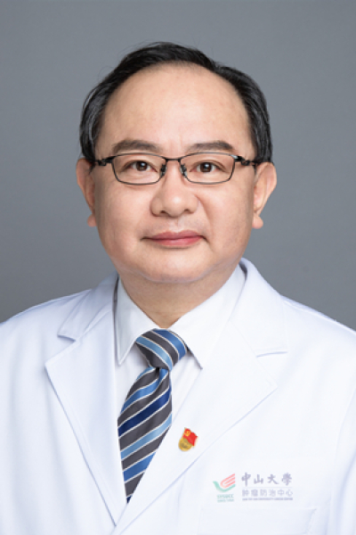

<!-- AUTO-GENERATED-BY: work/generate_obsidian_profiles.py -->

<!-- TEMPLATE: D:\workspace\信息收集整理\医生画像仓库\模板\医生画像模板.md -->

# 石明

## 基础信息

| 字段 | 内容 |
|---|---|
| 姓名 | 石明 |
| 医院 | 中山大学肿瘤防治中心 |
| 科室 | 肝脏外科 |
| 职称/身份 | 教授、主任医师、博士生导师、国家杰出青年科学基金获得者、广东省医学领军人才、“广东特支计划”科技创新领军人才 |
| 来源链接 | [官网原文](https://www.sysucc.org.cn/node/3635) |
| 采集日期 | 2026-08-10 |

## 简介/擅长

肝胆肿瘤手术、介入、靶向免疫治疗，尤擅长早期肝癌的微创手术治疗、中期肝癌的介入治疗、晚期肝癌的基因精准医疗

## 教育与进修经历

- 2005年于中山大学博士研究生毕业。
- 2008到2009年于德国Diakonie罗腾堡医院进修普外科和腹腔镜学习。

## 科研项目与成果

- 临床专家 面包屑 首页 / 临床科室 / 外科系列 / 肝脏外科 / 临床专家 石明 职称：教授、主任医师、博士生导师、国家杰出青年科学基金获得者、广东省医学领军人才、“广东特支计划”科技创新领军人才 专长 肝胆肿瘤手术、介入、靶向免疫治疗，尤擅长早期肝癌的微创手术治疗、中期肝癌的介入治疗、晚期肝癌的基因精准医疗 一、基本情况 职称： 教授、主任医师、博士生导师 、国家杰出青年科学基金获得者、广东省医学领军人才、“广东特支计划”科技创新领军人才 专业特长： 肝胆肿瘤手术、介入、靶向免疫治疗，尤擅长早期肝癌的微创手…
- 上述成果被多项中国和国际指南采纳，包括：《原发性肝癌诊疗规范（2019版）》、《CSCO原发性肝癌诊疗指南2020》、泛亚太地区肝癌ESMO管理指南（Ann Oncol, 2020）、2012年欧洲肝病协会肝癌处理指南（J hepatol，2012）、美国肝癌放射介入协会指南（J Vasc Interv Radiol，2012）。
- 加载更多 一、基本情况 职称： 教授、主任医师、博士生导师 、国家杰出青年科学基金获得者、广东省医学领军人才、“广东特支计划”科技创新领军人才 专业特长： 肝胆肿瘤手术、介入、靶向免疫治疗，尤擅长早期肝癌的微创手术治疗、中期肝癌的介入治疗、晚期肝癌的基因精准医疗 专家门诊时间： 越秀院区：周一上午，周三上午 黄埔院区：周二上午 二、学术兼职： 中国抗癌协会肝癌专业委员会委员 广东省抗癌协会肝癌专业委员会副主任委员 杂志《Journal of Hepatocellular Carcinoma》，编委 杂志《Chin…
- 上述成果被多项中国和国际指南采纳，包括：《原发性肝癌诊疗规范（2019版）》、《CSCO原发性肝癌诊疗指南2020》、泛亚太地区肝癌ESMO管理指南（Ann ...

## 论文与学术产出

- 以通讯作者在JAMA Oncol、J Natl Cancer Inst、Hepatology等杂志上发表多篇论著。

## 可包装亮点

- 教授、主任医师、博士生导师、国家杰出青年科学基金获得者、广东省医学领军人才、“广东特支计划”科技创新领军人才 肝胆肿瘤手术、介入、靶向免疫治疗，尤擅长早期肝癌的微创手术治疗、中期肝癌的介入治疗、晚期肝癌的基因精准医疗 石明 职称：教授、主任医师、博士生导师、国家杰出青年科学基金获得者、广东省医学领军人才、“广东特支计划”科技创新领军人才 专长 肝胆肿瘤手术…

## 重点疾病/人群标签

- 慢性病：
- 肿瘤：肿瘤、癌、化疗、靶向、肝癌、免疫、多学科
- 生殖疾病：
- 免疫/风湿：肿瘤、癌、化疗、靶向、肝癌、免疫、多学科
- 术后恢复/康复：
- 疑难重症：肿瘤、癌、化疗、靶向、肝癌、免疫、多学科

## 证据摘录

> 只摘录官网公开信息中的短句或关键字段，不复制大段原文。

- 官网身份字段：教授、主任医师、博士生导师、国家杰出青年科学基金获得者、广东省医学领军人才、“广东特支计划”科技创新领军人才
- 官网简介/擅长：肝胆肿瘤手术、介入、靶向免疫治疗，尤擅长早期肝癌的微创手术治疗、中期肝癌的介入治疗、晚期肝癌的基因精准医疗
- 官网亮眼经历线索：教授、主任医师、博士生导师、国家杰出青年科学基金获得者、广东省医学领军人才、“广东特支计划”科技创新领军人才 肝胆肿瘤手术、介入、靶向免疫治疗，尤擅长早期肝癌的微创手术治疗、中期肝癌的介入治疗、晚期肝癌的基因精准医疗 石明 职称：教授、主任医师、博士生导师、国家杰出青年科学基金获得者、广东省医学领军人才、“广东特支计划”科技创新领军人才 专长 肝胆肿瘤手术、介入、靶向免疫治疗，尤擅长早期肝癌的微创手术治疗、中期肝癌的介入治疗、晚期肝癌…
- 异常提示：亮眼经历含导航文本，已清洗
- 来源链接：https://www.sysucc.org.cn/node/3635

## BD 画像摘要

石明医生可作为肿瘤、免疫/风湿/感染、疑难重症方向的基础画像候选。后续 BD 使用应继续以官网来源和人工复核为准，不添加疗效承诺或无来源包装。

## 合规边界

- 仅使用医院官网、官方公众号、官方小程序等公开渠道。
- 不采集私人电话、私人微信、家庭住址、患者隐私或非公开排班信息。
- 不写“保证治愈”“疗效第一”“包治疑难杂症”等无法由官网证明的表述。
