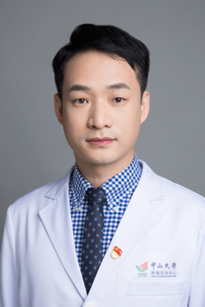

<!-- AUTO-GENERATED-BY: work/generate_obsidian_profiles.py -->

# 翁德胜

## 基础信息

| 字段 | 内容 |
|---|---|
| 医院 | 中山大学肿瘤防治中心 |
| 姓名 | 翁德胜 |
| 科室 | 生物治疗中心 |
| 职称/身份 | 科副主任 职称：主任医师、博士生导师 |
| 重点优先级 | 高 |
| 来源类型 | 医院官网 |
| 来源链接 | [官网原文](https://www.sysucc.org.cn/node/3785) |
| 采集日期 | 2026-08-10 |
| 复核状态 | 待人工复核 |
| 异常提示 |  |

## 简介/擅长

罕见肿瘤如神经内分泌肿瘤，肉瘤与黑色素瘤的内科治疗，实体瘤的免疫细胞治疗。 中山大学“百人计划”引进人才。2008年于中山大学获肿瘤学博士学位。2008年-2012年在美国波士顿大学医学院免疫治疗中心从事博士后研究。2012年5月回国加入中山大学肿瘤防治中心生物治疗中心工作。主要研究方向：实体瘤的免疫治疗；罕见肿瘤如神经内分泌肿瘤、肉瘤与黑色素瘤内科治疗。主持、参与多项国家级和省级重大专项、面上项目基金，以第一作者及通讯作者在高水平杂志发表论文30余篇。 教育经历： (1) 2005.09–2008.06, 中山大学, 肿瘤学, 博士 (2) 2001.09–2004.06, 第一军医大学, 病理学与病理生理学, 硕士 (3) 1993.09–1998.06, 第一军医大学, 临床医学, 学士, 科研与学术工作经历 (1) 2019.12-至今, 中山大学, 肿瘤防治中心,主任医师 (2) 2012.05-2019.11, 中山大学, 肿瘤防治中心, 副教授、副主任医师 (3) 2004.07-2005.08, 南方医科大学, 病理学系, 讲师 (4) 1998.07-2004.06, 第一军医大学, 病理学教研室, ...

## 详情正文摘录

职务：科副主任 职称：主任医师、博士生导师 专长 罕见肿瘤如神经内分泌肿瘤，肉瘤与黑色素瘤的内科治疗，实体瘤的免疫细胞治疗 职务： 科副主任 职称： 主任医师、博士生导师 擅长： 罕见肿瘤如神经内分泌肿瘤，肉瘤与黑色素瘤的内科治疗，实体瘤的免疫细胞治疗。 中山大学“百人计划”引进人才。2008年于中山大学获肿瘤学博士学位。2008年-2012年在美国波士顿大学医学院免疫治疗中心从事博士后研究。2012年5月回国加入中山大学肿瘤防治中心生物治疗中心工作。主要研究方向：实体瘤的免疫治疗；罕见肿瘤如神经内分泌肿瘤、肉瘤与黑色素瘤内科治疗。主持、参与多项国家级和省级重大专项、面上项目基金，以第一作者及通讯作者在高水平杂志发表论文30余篇。 教育经历： (1) 2005.09–2008.06, 中山大学, 肿瘤学, 博士 (2) 2001.09–2004.06, 第一军医大学, 病理学与病理生理学, 硕士 (3) 1993.09–1998.06, 第一军医大学, 临床医学, 学士, 科研与学术工作经历 (1) 2019.12-至今, 中山大学, 肿瘤防治中心,主任医师 (2) 2012.05-2019.11, 中山大学, 肿瘤防治中心, 副教授、副主任医师 (3) 2004.07-2005.08, 南方医科大学, 病理学系, 讲师 (4) 1998.07-2004.06, 第一军医大学, 病理学教研室, 助教 (5) 2008.10-2012.04, 美国波士顿大学, 博士后 加载更多 职务： 科副主任 职称： 主任医师、博士生导师 擅长： 罕见肿瘤如神经内分泌肿瘤，肉瘤与黑色素瘤的内科治疗，实体瘤的免疫细胞治疗。 中山大学“百人计划”引进人才。2008年于中山大学获肿瘤学博士学位。2008年-2012年在美国波士顿大学医学院免疫治疗中心从事博士后研究。2012年5月回国加入中山大学肿瘤防治中心生物治疗中心工作。主要研究方向：实体瘤的免疫治疗；罕见肿瘤如神经内分泌肿瘤、肉瘤与黑色素瘤内科…

## 重点关注范围

- 肿瘤
- 免疫/风湿/感染
- 疑难重症

## 重点疾病标签

- 肿瘤
- 癌
- 瘤
- 免疫
- 罕见

## 亮眼经历线索

- 科副主任 职称：主任医师、博士生导师 中山大学“百人计划”引进人才。
- 2008年-2012年在美国波士顿大学医学院免疫治疗中心从事博士后研究。
- 主持、参与多项国家级和省级重大专项、面上项目基金，以第一作者及通讯作者在高水平杂志发表论文30余篇。

## 异常提示

## 合规边界

- 本画像仅整理统一总底表中的医院官网公开字段。
- 不包含患者评价、排名、第三方来源内容或疗效承诺。
- 官网未展示的信息保持空白，后续如需补充须回到底表官方来源字段。
