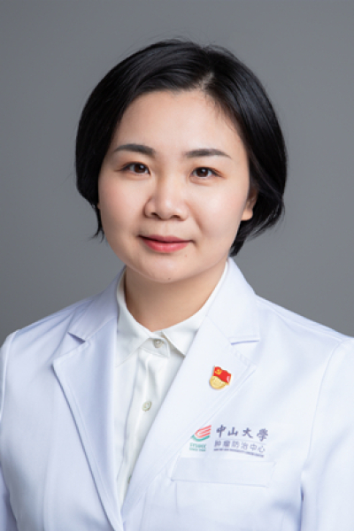

<!-- AUTO-GENERATED-BY: work/generate_obsidian_profiles.py -->

<!-- TEMPLATE: D:\workspace\信息收集整理\医生画像仓库\模板\医生画像模板.md -->

# 肖巍魏

## 基础信息

| 字段 | 内容 |
|---|---|
| 姓名 | 肖巍魏 |
| 医院 | 中山大学肿瘤防治中心 |
| 科室 | 放疗科 |
| 职称/身份 | 放疗科五区区长（黄埔院区），科秘书 职称：主任医师、博士生导师、医学博士 |
| 来源链接 | [官网原文](https://www.sysucc.org.cn/node/1682) |
| 采集日期 | 2026-08-10 |

## 简介/擅长

直肠癌、结肠癌、肛管癌、胰腺癌、胃癌、肝癌、胆囊癌、胆管癌、黑色素瘤等消化道肿瘤的综合治疗和放射治疗，包括适形调强放射治疗、立体定向放射治疗、TOMO治疗等。对低位直肠肛管癌保肛治疗、肛管鳞癌的综合治疗等经验丰富

## 教育与进修经历

- 对低位直肠肛管癌保肛治疗、肛管鳞癌的综合治疗等经验丰富 二、学习工作经历 2001-2008中山大学中山医学院七年制临床医学，获肿瘤学硕士学位 2008-2011中山大学附属肿瘤医院，获肿瘤学博士学位 2009-2010澳大利亚新南威尔士大学与中山大学联合培养（国家基金委公派） 2011-2012中山大学附属肿瘤医院放疗科住院医师 2012-2015中山大学附属肿瘤医院放疗科主治医师 2016-至今中山大学附属肿瘤医院放疗科副主任医师 三、个人简介 主要从事消化道肿瘤包括直肠癌、结肠癌、肛管癌、胰腺癌、胃癌、肝癌…

## 科研项目与成果

- 对低位直肠肛管癌保肛治疗、肛管鳞癌的综合治疗等经验丰富 二、学习工作经历 2001-2008中山大学中山医学院七年制临床医学，获肿瘤学硕士学位 2008-2011中山大学附属肿瘤医院，获肿瘤学博士学位 2009-2010澳大利亚新南威尔士大学与中山大学联合培养（国家基金委公派） 2011-2012中山大学附属肿瘤医院放疗科住院医师 2012-2015中山大学附属肿瘤医院放疗科主治医师 2016-至今中山大学附属肿瘤医院放疗科副主任医师 三、个人简介 主要从事消化道肿瘤包括直肠癌、结肠癌、肛管癌、胰腺癌、胃癌、肝癌…
- 科研方面，主持国家自然科学基金，广东省自然科学基金，中山大学青年教师培育项目，国家教育部高等学校博士点基金等多项基金，主持并参与中山大学5010项目、863计划等多项重大研究项目。

## 论文与学术产出

- 共发表高水平论文40余篇，部分研究结果被美国NCCN 2018版直肠癌指南引用。

## 可包装亮点

- 放疗科五区区长（黄埔院区），科秘书 职称：主任医师、博士生导师、医学博士 肖巍魏 职务：放疗科五区区长（黄埔院区），科秘书 职称：主任医师、博士生导师、医学博士 专长 直肠癌、结肠癌、肛管癌、胰腺癌、胃癌、肝癌、胆囊癌、胆管癌、黑色素瘤等消化道肿瘤的综合治疗和放射治疗，包括适形调强放射治疗、立体定向放射治疗、TOMO治疗等。
- 对低位直肠肛管癌保肛治疗、肛管鳞癌的综合治疗等经验丰富 一、基本情况 职称：中山大学肿瘤防治中心放疗科主任医师，博士生导师 职务：放疗科五区区长（黄埔院区），科秘书 专业特长：直肠癌、结肠癌、肛管癌、胰腺癌、胃癌、肝癌、胆囊癌、胆管癌、黑色素瘤等消化道肿瘤的综合治疗和放射治疗，包括适形调强放射治疗、立体定向放射治疗、TOMO治疗等。

## 重点疾病/人群标签

- 慢性病：
- 肿瘤：肿瘤、癌、瘤、放疗、鼻咽癌、肝癌、胃癌、肠癌、多学科、MDT
- 生殖疾病：
- 免疫/风湿：
- 术后恢复/康复：
- 疑难重症：肿瘤、癌、瘤、放疗、鼻咽癌、肝癌、胃癌、肠癌、多学科、MDT

## 证据摘录

> 只摘录官网公开信息中的短句或关键字段，不复制大段原文。

- 官网身份字段：放疗科五区区长（黄埔院区），科秘书 职称：主任医师、博士生导师、医学博士
- 官网简介/擅长：直肠癌、结肠癌、肛管癌、胰腺癌、胃癌、肝癌、胆囊癌、胆管癌、黑色素瘤等消化道肿瘤的综合治疗和放射治疗，包括适形调强放射治疗、立体定向放射治疗、TOMO治疗等。对低位直肠肛管癌保肛治疗、肛管鳞癌的综合治疗等经验丰富
- 官网亮眼经历线索：放疗科五区区长（黄埔院区），科秘书 职称：主任医师、博士生导师、医学博士 肖巍魏 职务：放疗科五区区长（黄埔院区），科秘书 职称：主任医师、博士生导师、医学博士 专长 直肠癌、结肠癌、肛管癌、胰腺癌、胃癌、肝癌、胆囊癌、胆管癌、黑色素瘤等消化道肿瘤的综合治疗和放射治疗，包括适形调强放射治疗、立体定向放射治疗、TOMO治疗等。 对低位直肠肛管癌保肛治疗、肛管鳞癌的综合治疗等经验丰富 一、基本情况 职称：中山大学肿瘤防治中心放疗科主任医师…
- 异常提示：亮眼经历含导航文本，已清洗
- 来源链接：https://www.sysucc.org.cn/node/1682

## BD 画像摘要

肖巍魏医生可作为肿瘤、疑难重症方向的基础画像候选。后续 BD 使用应继续以官网来源和人工复核为准，不添加疗效承诺或无来源包装。

## 合规边界

- 仅使用医院官网、官方公众号、官方小程序等公开渠道。
- 不采集私人电话、私人微信、家庭住址、患者隐私或非公开排班信息。
- 不写“保证治愈”“疗效第一”“包治疑难杂症”等无法由官网证明的表述。
