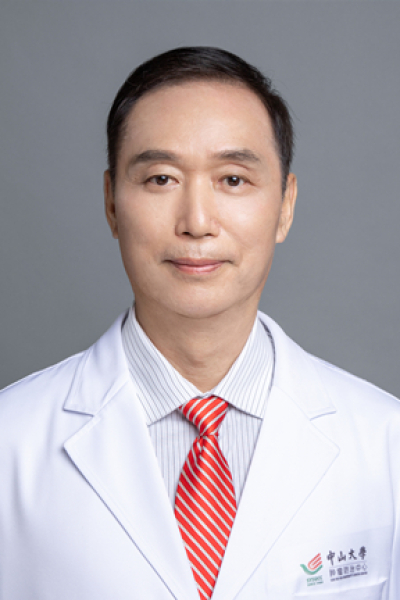

<!-- AUTO-GENERATED-BY: work/generate_obsidian_profiles.py -->

<!-- TEMPLATE: D:\workspace\信息收集整理\医生画像仓库\模板\医生画像模板.md -->

# 胡伟汉

## 基础信息

| 字段 | 内容 |
|---|---|
| 姓名 | 胡伟汉 |
| 医院 | 中山大学肿瘤防治中心 |
| 科室 | 放疗科 |
| 职称/身份 | 主任医师、教授 |
| 来源链接 | [官网原文](https://www.sysucc.org.cn/node/1668) |
| 采集日期 | 2026-08-10 |

## 简介/擅长

鼻咽、口咽、口腔、喉、下咽、鼻腔副鼻窦、脑转移瘤等头颈部恶性肿瘤的精准调强放射治疗和综合治疗

## 教育与进修经历

- 二、学习及工作经历： 1976年：毕业于中山医学院医疗系。
- 三、科研获奖项目： 1.《鼻咽癌个体化治疗研究与应用》2014年中华医学科技一等奖（第8完成人） 2.《鼻咽癌个体化治疗研究与应用》2015年广东省科技一等奖（第8完成人） 3.《鼻咽癌个体化治疗研究与应用》2015年教育部科技进步一等奖（第8完成人） 4.《鼻咽癌诊疗关键策略研究与应用》2016年国家科技进步二等奖（第8完成人） 加载更多 1976年毕业于中山医科大学医疗系。

## 科研项目与成果

- 三、科研获奖项目： 1.《鼻咽癌个体化治疗研究与应用》2014年中华医学科技一等奖（第8完成人） 2.《鼻咽癌个体化治疗研究与应用》2015年广东省科技一等奖（第8完成人） 3.《鼻咽癌个体化治疗研究与应用》2015年教育部科技进步一等奖（第8完成人） 4.《鼻咽癌诊疗关键策略研究与应用》2016年国家科技进步二等奖（第8完成人） 加载更多 1976年毕业于中山医科大学医疗系。
- 局部晚期鼻咽癌与头颈肿瘤放化疗联合生物治疗、靶向药物治疗、免疫治疗的临床研究等，在国内外发表学术论著八十篇，曾经承担多项科研项目。
- 教学工作经验： 培养临床研究生十多名，曾经被中山医科大学两次评为"优秀班主任、学生导师"，2007年兼任中山大学长学制全程导师，主持并指导多项中山大学学生暑期和业余科研项目。
- 科研获奖项目： 1.《鼻咽癌放射治疗对视路功能损伤的研究》中山医科大学96年度中青年科学论文二等奖. 2.《Study of 45 Cases of Nasopharygeal Carcinoma with Dermatomyotitis》中山医科大学97度医疗成果三等奖. 3. 参与完成《鼻咽癌个体化治疗研究与应用》,团队获2014年中华医学科技一等奖. 4. 参与完成《鼻咽癌个体化治疗研究与应用》,团队获2015年广东省科技一等奖. 5.参与完成《鼻咽癌个体化治疗研究与应用》,团队获2015年教育部科技进步一…

## 论文与学术产出

- 局部晚期鼻咽癌与头颈肿瘤放化疗联合生物治疗、靶向药物治疗、免疫治疗的临床研究等，在国内外发表学术论著八十篇，曾经承担多项科研项目。
- 科研获奖项目： 1.《鼻咽癌放射治疗对视路功能损伤的研究》中山医科大学96年度中青年科学论文二等奖. 2.《Study of 45 Cases of Nasopharygeal Carcinoma with Dermatomyotitis》中山医科大学97度医疗成果三等奖. 3. 参与完成《鼻咽癌个体化治疗研究与应用》,团队获2014年中华医学科技一等奖. 4. 参与完成《鼻咽癌个体化治疗研究与应用》,团队获2015年广东省科技一等奖. 5.参与完成《鼻咽癌个体化治疗研究与应用》,团队获2015年教育部科技进步一…

## 可包装亮点

- 主任医师、教授 鼻咽、口咽、口腔、喉、下咽、鼻腔副鼻窦、脑转移瘤等头颈部恶性肿瘤的精准调强放射治疗和综合治疗 胡伟汉 职称：主任医师、教授 专长 鼻咽、口咽、口腔、喉、下咽、鼻腔副鼻窦、脑转移瘤等头颈部恶性肿瘤的精准调强放射治疗和综合治疗 一、基本情况 职称：主任医师、教授 专家门诊时间：周一下午、周四上午 专家特长及主攻方向：鼻咽、口咽、口腔、喉、下咽…
- 1976年至今：中山大学附属肿瘤医院放疗科工作，历任住院医师、主治医师、讲师、副主任医师、副教授、主任医师、教授。

## 重点疾病/人群标签

- 慢性病：
- 肿瘤：肿瘤、癌、瘤、淋巴瘤、放疗、化疗、靶向、鼻咽癌、免疫、感染、免疫功能、康复
- 生殖疾病：
- 免疫/风湿：肿瘤、癌、瘤、淋巴瘤、放疗、化疗、靶向、鼻咽癌、免疫、感染、免疫功能、康复
- 术后恢复/康复：肿瘤、癌、瘤、淋巴瘤、放疗、化疗、靶向、鼻咽癌、免疫、感染、免疫功能、康复
- 疑难重症：

## 证据摘录

> 只摘录官网公开信息中的短句或关键字段，不复制大段原文。

- 官网身份字段：主任医师、教授
- 官网简介/擅长：鼻咽、口咽、口腔、喉、下咽、鼻腔副鼻窦、脑转移瘤等头颈部恶性肿瘤的精准调强放射治疗和综合治疗
- 官网亮眼经历线索：主任医师、教授 鼻咽、口咽、口腔、喉、下咽、鼻腔副鼻窦、脑转移瘤等头颈部恶性肿瘤的精准调强放射治疗和综合治疗 胡伟汉 职称：主任医师、教授 专长 鼻咽、口咽、口腔、喉、下咽、鼻腔副鼻窦、脑转移瘤等头颈部恶性肿瘤的精准调强放射治疗和综合治疗 一、基本情况 职称：主任医师、教授 专家门诊时间：周一下午、周四上午 专家特长及主攻方向：鼻咽、口咽、口腔、喉、下咽、鼻腔副鼻窦、脑转移瘤等头颈部恶性肿瘤的精准调强放射治疗和综合治疗与研究。 197…
- 异常提示：亮眼经历含导航文本，已清洗
- 来源链接：https://www.sysucc.org.cn/node/1668

## BD 画像摘要

胡伟汉医生可作为肿瘤、免疫/风湿/感染、术后恢复/康复方向的基础画像候选。后续 BD 使用应继续以官网来源和人工复核为准，不添加疗效承诺或无来源包装。

## 合规边界

- 仅使用医院官网、官方公众号、官方小程序等公开渠道。
- 不采集私人电话、私人微信、家庭住址、患者隐私或非公开排班信息。
- 不写“保证治愈”“疗效第一”“包治疑难杂症”等无法由官网证明的表述。
