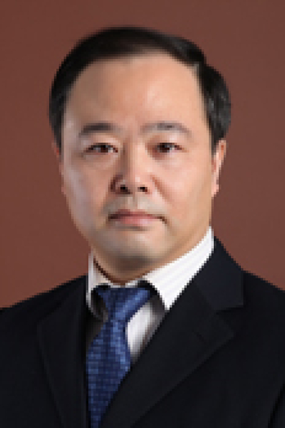

<!-- AUTO-GENERATED-BY: work/generate_obsidian_profiles.py -->

# 胡祎

## 基础信息

| 字段 | 内容 |
|---|---|
| 医院 | 中山大学肿瘤防治中心 |
| 姓名 | 胡祎 |
| 科室 | 胸科 |
| 职称/身份 | 主任医师，硕士研究生导师，肿瘤学博士 |
| 重点优先级 | 高 |
| 来源类型 | 医院官网 |
| 来源链接 | [官网原文](https://www.sysucc.org.cn/node/3621) |
| 采集日期 | 2026-08-10 |
| 复核状态 | 待人工复核 |
| 异常提示 |  |

## 简介/擅长

1. 食管癌的综合治疗的临床研究及相关基础研究 2. 食管癌的临床分期及分子分期 3. 早期食管癌微创治疗（食管粘膜切除等） 4. 肺癌的分期、外科治疗、以手术为主的综合治疗 五、文章及著作：近三年发表代表性论文（第一作者或通讯作者） 1. Positive transforming growth factor-β activated kinase-1 expression has an unfavorable impact on survival in T3N1-3M0 esophageal squamous cell carcinomas. Ann Thorac Surg，95(1):285-90，2013. 2. Prognostic Relevance of Id-1 Expression in PatientsWith Resectable Esophageal Squamous CellCarcinoma. Ann Thorac Surg，93:1682–9，2012. 3. Subcarinal Node Metastasis in Thoracic Esophageal Squamous Cell Ca...

## 详情正文摘录

临床专家 面包屑 首页 / 临床科室 / 外科系列 / 胸科 / 临床专家 胡祎 职称：主任医师，硕士研究生导师，肿瘤学博士 专长 擅长胸部肿瘤微创手术及综合治疗。包括肺癌、食管癌、纵隔肿瘤、胸膜肿瘤（含胸腔积液）等外科治疗，其中肺部小结节诊疗、肺癌微创手术、食管癌手术等的手术疗效、术后并发症等居国内领先水平。开展了食管癌ICG淋巴地图、ICG标记肺癌肺段切除、内科胸腔镜、早期食管癌ESD等新技术。 一、基本情况 职称：主任医师，硕士研究生导师，肿瘤学博士 专家门诊时间： 周二下午 专业特长：擅长胸部肿瘤微创手术及综合治疗。包括肺癌、食管癌、纵隔肿瘤、胸膜肿瘤（含胸腔积液）等外科治疗，其中肺部小结节诊疗、肺癌微创手术、食管癌手术等的手术疗效、术后并发症等居国内领先水平。开展了食管癌ICG淋巴地图、ICG标记肺癌肺段切除、内科胸腔镜、早期食管癌ESD等新技术。 二、学习及工作经历： 1990年—1995年：中山医科大学就读 1995年—2001年：安阳肿瘤医院工作 2001年—2004年：中山医科大学硕士研究生 2004年至今：中山大学肿瘤医院工作；期间攻读在职博士生 加载更多 一、基本情况 职称：主任医师，硕士研究生导师，肿瘤学博士 专家门诊时间： 周二下午 专业特长：擅长胸部肿瘤微创手术及综合治疗。包括肺癌、食管癌、纵隔肿瘤、胸膜肿瘤（含胸腔积液）等外科治疗，其中肺部小结节诊疗、肺癌微创手术、食管癌手术等的手术疗效、术后并发症等居国内领先水平。开展了食管癌ICG淋巴地图、ICG标记肺癌肺段切除、内科胸腔镜、早期食管癌ESD等新技术。 二、学习及工作经历 ： 1990年—1995年：中山医科大学就读 1995年—2001年：安阳肿瘤医院工作 2001年—2004年：中山医科大学硕士研究生 2004年至今：中山大学肿瘤医院工作；期间攻读在职博士生 三、学术兼职 ： 1. 内镜与微创专业技术全国考评委员会、中国医师协会内镜医师分会胸外科内镜与微创专业委员会委员 2. 中华医学会会员 3. 中国医师学会胸外科医师分会会员 4. 广东省医学会肿瘤学分会会员 四、主要研究方向…

## 重点关注范围

- 肿瘤
- 术后恢复/康复

## 重点疾病标签

- 肿瘤
- 癌
- 肺癌
- 术后

## 亮眼经历线索

- 主任医师，硕士研究生导师，肿瘤学博士 1. 食管癌的综合治疗的临床研究及相关基础研究 2. 食管癌的临床分期及分子分期 3. 早期食管癌微创治疗（食管粘膜切除等） 4. 肺癌的分期、外科治疗、以手术为主的综合治疗 五、文章及著作：近三年发表代表性论文（第一作者或通讯作者） 1. Positive transforming growth factor-β a…

## 异常提示

## 合规边界

- 本画像仅整理统一总底表中的医院官网公开字段。
- 不包含患者评价、排名、第三方来源内容或疗效承诺。
- 官网未展示的信息保持空白，后续如需补充须回到底表官方来源字段。
