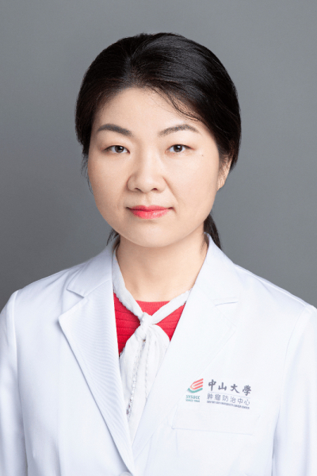

<!-- AUTO-GENERATED-BY: work/generate_obsidian_profiles.py -->

<!-- TEMPLATE: D:\workspace\信息收集整理\医生画像仓库\模板\医生画像模板.md -->

# 胡莹莹

## 基础信息

| 字段 | 内容 |
|---|---|
| 姓名 | 胡莹莹 |
| 医院 | 中山大学肿瘤防治中心 |
| 科室 | 核医学科 |
| 职称/身份 | 核医学科副主任 职称：副主任医师 |
| 来源链接 | [官网原文](https://www.sysucc.org.cn/node/8175) |
| 采集日期 | 2026-08-10 |

## 简介/擅长

肿瘤放射性核素治疗，PET/CT、PET/MR 、SPECT诊断。

## 教育与进修经历

- 二、教育及工作经历 2007年硕士研究生毕业于中山大学影像医学与核医学专业，在核医学科工作至今；
- 2016年获中山大学临床医学博士学位。

## 科研项目与成果

- 三、学术兼职 中国抗癌协会第三届肿瘤核医学专业委员会委员 广东省抗癌协会肿瘤核医学专业委员会第一届委员会委员 广东省医师协会核医学医师分会第三届委员会委员 广东省医院协会第一届核医学科管理专业委员会委员 中华医学会核医学分会第十二届委员会试验学组成员 中国医师协会核医学分会第五届委员会临床诊疗一体化学组成员 四、主持科研项目 广东省医学科学技术研究基金, 18F-FDG PET/CT用于儿童非霍奇金淋巴瘤疗效评价的假阳性分析。

## 可包装亮点

- 核医学科副主任 职称：副主任医师 胡莹莹 职务：核医学科副主任 职称：副主任医师 专长 肿瘤放射性核素治疗，PET/CT、PET/MR 、SPECT诊断。
- 一、基本情况 核医学副主任医师，擅长肿瘤PET/CT诊断。
- 三、学术兼职 中国抗癌协会第三届肿瘤核医学专业委员会委员 广东省抗癌协会肿瘤核医学专业委员会第一届委员会委员 广东省医师协会核医学医师分会第三届委员会委员 广东省医院协会第一届核医学科管理专业委员会委员 中华医学会核医学分会第十二届委员会试验学组成员 中国医师协会核医学分会第五届委员会临床诊疗一体化学组成员 四、主持科研项目 广东省医学科学技术研究基金,…

## 重点疾病/人群标签

- 慢性病：
- 肿瘤：肿瘤、癌、淋巴瘤
- 生殖疾病：
- 免疫/风湿：
- 术后恢复/康复：
- 疑难重症：

## 证据摘录

> 只摘录官网公开信息中的短句或关键字段，不复制大段原文。

- 官网身份字段：核医学科副主任 职称：副主任医师
- 官网简介/擅长：肿瘤放射性核素治疗，PET/CT、PET/MR 、SPECT诊断。
- 官网亮眼经历线索：核医学科副主任 职称：副主任医师 胡莹莹 职务：核医学科副主任 职称：副主任医师 专长 肿瘤放射性核素治疗，PET/CT、PET/MR 、SPECT诊断。 一、基本情况 核医学副主任医师，擅长肿瘤PET/CT诊断。 三、学术兼职 中国抗癌协会第三届肿瘤核医学专业委员会委员 广东省抗癌协会肿瘤核医学专业委员会第一届委员会委员 广东省医师协会核医学医师分会第三届委员会委员 广东省医院协会第一届核医学科管理专业委员会委员 中华医学会核医学分…
- 异常提示：亮眼经历含导航文本，已清洗
- 来源链接：https://www.sysucc.org.cn/node/8175

## BD 画像摘要

胡莹莹医生可作为肿瘤方向的基础画像候选。后续 BD 使用应继续以官网来源和人工复核为准，不添加疗效承诺或无来源包装。

## 合规边界

- 仅使用医院官网、官方公众号、官方小程序等公开渠道。
- 不采集私人电话、私人微信、家庭住址、患者隐私或非公开排班信息。
- 不写“保证治愈”“疗效第一”“包治疑难杂症”等无法由官网证明的表述。
