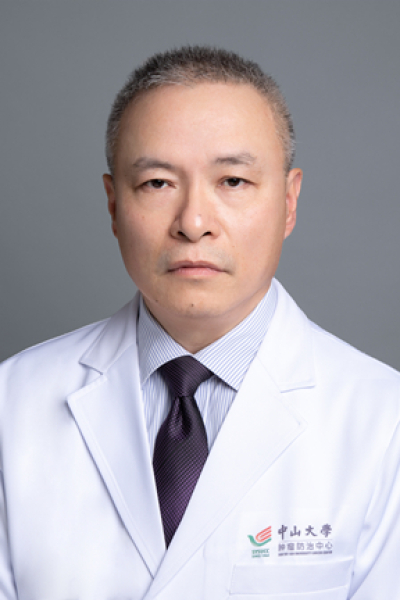

<!-- AUTO-GENERATED-BY: work/generate_obsidian_profiles.py -->

# 苏勇

## 基础信息

| 字段 | 内容 |
|---|---|
| 医院 | 中山大学肿瘤防治中心 |
| 姓名 | 苏勇 |
| 科室 | 放疗科 |
| 职称/身份 | 医学博士、主任医师，博士生导师 |
| 重点优先级 | 高 |
| 来源类型 | 医院官网 |
| 来源链接 | [官网原文](https://www.sysucc.org.cn/node/1669) |
| 采集日期 | 2026-08-10 |
| 复核状态 | 待人工复核 |
| 异常提示 |  |

## 简介/擅长

鼻咽等头颈肿瘤放疗及综合治疗 专家

## 详情正文摘录

1988年毕业于中山医科大学临床医疗专业，毕业后一直在中山大学肿瘤防治中心从事鼻咽等头颈肿瘤的临床、教学与研究工作。其中，1988年至1999年在鼻咽癌科、头颈科工作，1999年至今在放射治疗科工作，2010年聘任鼻咽、头颈肿瘤岗主诊教授，2012年聘任主任医师，2017年聘任博士生导师。迄今主持和参与了多项国自然、省、市及中山大学科研项目研究。 工作以来发表论文论著数十篇，参与多本恶性肿瘤放疗及鼻咽癌专著的编写。2003率先发现了PET-CT对鼻咽癌局部侵犯和咽后淋巴结转移的检出率劣于MRI，未能检出直径0.5-1.0cm以下病灶和并发坏死的咽后淋巴结转移，为PET-CT在鼻咽癌临床的合理应用提供了依据；2003率先开启了肿瘤局限于一侧鼻咽的鼻咽癌调强放疗靶区勾画方法研究，并获2006第二届广东省肿瘤放射治疗论坛大赛奖；2006年起率先开展了鼻咽及头颈肿瘤诱导化疗后调强放疗靶区设定和勾画方法的研究；2008年发现本专业权威教科书一直以来关于下咽癌局部肿瘤侵犯和咽后淋巴结转移规律的一些不合理观点，并对下咽癌放疗靶区范围设定和勾画方法开展研究并提出了改良建议；2011年撰写了我科头颈肿瘤调强放疗靶区勾画方法的初步规范，并率先开展了参照外科临床手术切缘指引要求进行鼻咽、头颈肿瘤个体化放疗靶区设计和勾画方法的研究；2011年率先发现了鼻咽癌原发肿瘤体积与患者远处转移和预后明显相关，并开展融入原发肿瘤体积相关因素的鼻咽癌预后和分期模型研究；2013年起，针对国内外一般均采用一次性调强放疗计划的现状，率先开展了分段自适应调强放射治疗的研究及晚期肿瘤超分割调强放射治疗的研究，在进一步提高鼻咽、头颈肿瘤疗效的同时，进一步减少了患者近、远期放疗反应及放疗损伤后遗症，提高了患者生存质量。 近年以第1作者或通讯作者发表的论著： 1. Zhou X, Wu Z, Qiu Z, et al. Efficacy and Failure Patterns Following Target Volume and Dose Reduction After Neoadjuvant Therapy in…

## 重点关注范围

- 肿瘤
- 术后恢复/康复

## 重点疾病标签

- 肿瘤
- 癌
- 放疗
- 化疗
- 鼻咽癌
- 术后

## 亮眼经历线索

- 医学博士、主任医师，博士生导师 其中，1988年至1999年在鼻咽癌科、头颈科工作，1999年至今在放射治疗科工作，2010年聘任鼻咽、头颈肿瘤岗主诊教授，2012年聘任主任医师，2017年聘任博士生导师。
- 工作以来发表论文论著数十篇，参与多本恶性肿瘤放疗及鼻咽癌专著的编写。
- 2003率先发现了PET-CT对鼻咽癌局部侵犯和咽后淋巴结转移的检出率劣于MRI，未能检出直径0.5-1.0cm以下病灶和并发坏死的咽后淋巴结转移，为PET-CT在鼻咽癌临床的合理应用提供了依据；

## 异常提示

## 合规边界

- 本画像仅整理统一总底表中的医院官网公开字段。
- 不包含患者评价、排名、第三方来源内容或疗效承诺。
- 官网未展示的信息保持空白，后续如需补充须回到底表官方来源字段。
