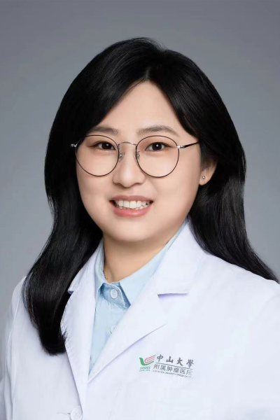

<!-- AUTO-GENERATED-BY: work/generate_obsidian_profiles.py -->

<!-- TEMPLATE: D:\workspace\信息收集整理\医生画像仓库\模板\医生画像模板.md -->

# 范腾

## 基础信息

| 字段 | 内容 |
|---|---|
| 姓名 | 范腾 |
| 医院 | 中山大学肿瘤防治中心 |
| 科室 | 中医科 |
| 职称/身份 | 中山大学肿瘤防治中心中西医结合研究中心秘书 职称：中西医结合博士 、中山大学临床医学博士后、副主任医师 |
| 来源链接 | [官网原文](https://www.sysucc.org.cn/node/8022) |
| 采集日期 | 2026-08-10 |

## 简介/擅长

肿瘤的中医及中西医结合治疗。

## 教育与进修经历

- 职务：中山大学肿瘤防治中心中西医结合研究中心秘书 职称：中西医结合博士 、中山大学临床医学博士后、副主任医师 专长 肿瘤的中医及中西医结合治疗。
- 一、基本情况 中西医结合临床博士，中山大学肿瘤防治中心临床博士后，辛辛那提儿童医院访问学者。
- 出诊时间： 周三下午（黄埔院区）、周五下午（越秀院区） 二、教育及工作经历 2020-2024中山大学肿瘤防治中心 2018-2019 美国辛辛那提儿童医院访问学者 2017-2020 中国中医科学院西苑医院博士 三、学术兼职 广东省中西医结合学会肿瘤专业委员会青年委员 国医名师学术经验传承工作委会委员 中国抗癌学会中西医整合白血病委员会委员 中国医药教育协会工作委会委员 四、主持科研项目 主持省部级及以上课题4项，重要参与国家级及省部级课题3项，参与编写指南2项，出版专著2部。

## 科研项目与成果

- 出诊时间： 周三下午（黄埔院区）、周五下午（越秀院区） 二、教育及工作经历 2020-2024中山大学肿瘤防治中心 2018-2019 美国辛辛那提儿童医院访问学者 2017-2020 中国中医科学院西苑医院博士 三、学术兼职 广东省中西医结合学会肿瘤专业委员会青年委员 国医名师学术经验传承工作委会委员 中国抗癌学会中西医整合白血病委员会委员 中国医药教育协会工作委会委员 四、主持科研项目 主持省部级及以上课题4项，重要参与国家级及省部级课题3项，参与编写指南2项，出版专著2部。

## 论文与学术产出

- 五、代表性论著 以第一或通讯作者发表论文十几余篇，其中高水平论文10篇。

## 可包装亮点

- 中山大学肿瘤防治中心中西医结合研究中心秘书 职称：中西医结合博士 、中山大学临床医学博士后、副主任医师 范腾 职务：中山大学肿瘤防治中心中西医结合研究中心秘书 职称：中西医结合博士 、中山大学临床医学博士后、副主任医师 专长 肿瘤的中医及中西医结合治疗。
- 一、基本情况 中西医结合临床博士，中山大学肿瘤防治中心临床博士后，辛辛那提儿童医院访问学者。
- 出诊时间： 周三下午（黄埔院区）、周五下午（越秀院区） 二、教育及工作经历 2020-2024中山大学肿瘤防治中心 2018-2019 美国辛辛那提儿童医院访问学者 2017-2020 中国中医科学院西苑医院博士 三、学术兼职 广东省中西医结合学会肿瘤专业委员会青年委员 国医名师学术经验传承工作委会委员 中国抗癌学会中西医整合白血病委员会委员 中国医药教育…

## 重点疾病/人群标签

- 慢性病：
- 肿瘤：肿瘤、癌、白血病、化疗、康复
- 生殖疾病：
- 免疫/风湿：
- 术后恢复/康复：肿瘤、癌、白血病、化疗、康复
- 疑难重症：

## 证据摘录

> 只摘录官网公开信息中的短句或关键字段，不复制大段原文。

- 官网身份字段：中山大学肿瘤防治中心中西医结合研究中心秘书 职称：中西医结合博士 、中山大学临床医学博士后、副主任医师
- 官网简介/擅长：肿瘤的中医及中西医结合治疗。
- 官网亮眼经历线索：中山大学肿瘤防治中心中西医结合研究中心秘书 职称：中西医结合博士 、中山大学临床医学博士后、副主任医师 范腾 职务：中山大学肿瘤防治中心中西医结合研究中心秘书 职称：中西医结合博士 、中山大学临床医学博士后、副主任医师 专长 肿瘤的中医及中西医结合治疗。 一、基本情况 中西医结合临床博士，中山大学肿瘤防治中心临床博士后，辛辛那提儿童医院访问学者。 出诊时间： 周三下午（黄埔院区）、周五下午（越秀院区） 二、教育及工作经历 2020-2…
- 异常提示：亮眼经历含导航文本，已清洗
- 来源链接：https://www.sysucc.org.cn/node/8022

## BD 画像摘要

范腾医生可作为肿瘤、术后恢复/康复方向的基础画像候选。后续 BD 使用应继续以官网来源和人工复核为准，不添加疗效承诺或无来源包装。

## 合规边界

- 仅使用医院官网、官方公众号、官方小程序等公开渠道。
- 不采集私人电话、私人微信、家庭住址、患者隐私或非公开排班信息。
- 不写“保证治愈”“疗效第一”“包治疑难杂症”等无法由官网证明的表述。
