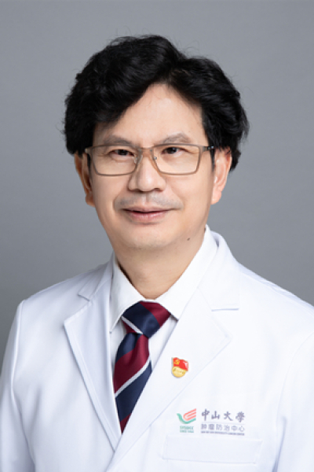

<!-- AUTO-GENERATED-BY: work/generate_obsidian_profiles.py -->

<!-- TEMPLATE: D:\workspace\信息收集整理\医生画像仓库\模板\医生画像模板.md -->

# 莫浩元

## 基础信息

| 字段 | 内容 |
|---|---|
| 姓名 | 莫浩元 |
| 医院 | 中山大学肿瘤防治中心 |
| 科室 | 鼻咽科 |
| 职称/身份 | 主任医师、硕士生导师 |
| 来源链接 | [官网原文](https://www.sysucc.org.cn/node/1529) |
| 采集日期 | 2026-08-10 |

## 简介/擅长

鼻咽癌放射治疗、化疗和免疫治疗。

## 科研项目与成果

- 二、教育及工作经历 1981年—1987年：中山医科大学六年制医疗系就读 1987年至今：中山大学附属肿瘤医院鼻咽科工作 三、主持科研项目 1. 广东省科技厅科技计划项目，鼻咽癌调强适形放射治疗后听力下降的危险因素及治疗研究 2. 国家自然科学基金项目， 癌细胞分泌exosome改变CTL细胞功能导致鼻咽癌免疫逃逸的机制研究 3. 广州市科技局科技计划项目，辐射及DDP／5FU作用通路基因SNPs对局部区域晚期鼻咽癌化疗敏感性及预后影响的研究 4. 广东省自然科学基金，Foxp3基因异构体表达与鼻咽癌免疫调控的机…

## 可包装亮点

- 主任医师、硕士生导师 莫浩元 职称：主任医师、硕士生导师 专长 鼻咽癌放射治疗、化疗和免疫治疗。
- 一、基本情况 职称： 主任医师、硕士生导师 专家门诊时间： 周一、周四上午 专业特长： 鼻咽癌放射治疗、化疗和免疫治疗。
- 二、教育及工作经历 1981年—1987年：中山医科大学六年制医疗系就读 1987年至今：中山大学附属肿瘤医院鼻咽科工作 三、主持科研项目 1. 广东省科技厅科技计划项目，鼻咽癌调强适形放射治疗后听力下降的危险因素及治疗研究 2. 国家自然科学基金项目， 癌细胞分泌exosome改变CTL细胞功能导致鼻咽癌免疫逃逸的机制研究 3. 广州市科技局科技计划项目…

## 重点疾病/人群标签

- 慢性病：
- 肿瘤：肿瘤、癌、放疗、化疗、鼻咽癌、免疫、高危
- 生殖疾病：
- 免疫/风湿：肿瘤、癌、放疗、化疗、鼻咽癌、免疫、高危
- 术后恢复/康复：
- 疑难重症：肿瘤、癌、放疗、化疗、鼻咽癌、免疫、高危

## 证据摘录

> 只摘录官网公开信息中的短句或关键字段，不复制大段原文。

- 官网身份字段：主任医师、硕士生导师
- 官网简介/擅长：鼻咽癌放射治疗、化疗和免疫治疗。
- 官网亮眼经历线索：主任医师、硕士生导师 莫浩元 职称：主任医师、硕士生导师 专长 鼻咽癌放射治疗、化疗和免疫治疗。 一、基本情况 职称： 主任医师、硕士生导师 专家门诊时间： 周一、周四上午 专业特长： 鼻咽癌放射治疗、化疗和免疫治疗。 二、教育及工作经历 1981年—1987年：中山医科大学六年制医疗系就读 1987年至今：中山大学附属肿瘤医院鼻咽科工作 三、主持科研项目 1. 广东省科技厅科技计划项目，鼻咽癌调强适形放射治疗后听力下降的危险因素及治…
- 异常提示：亮眼经历含导航文本，已清洗
- 来源链接：https://www.sysucc.org.cn/node/1529

## BD 画像摘要

莫浩元医生可作为肿瘤、免疫/风湿/感染、疑难重症方向的基础画像候选。后续 BD 使用应继续以官网来源和人工复核为准，不添加疗效承诺或无来源包装。

## 合规边界

- 仅使用医院官网、官方公众号、官方小程序等公开渠道。
- 不采集私人电话、私人微信、家庭住址、患者隐私或非公开排班信息。
- 不写“保证治愈”“疗效第一”“包治疑难杂症”等无法由官网证明的表述。
