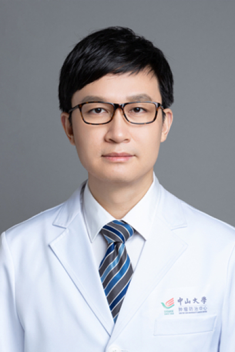

<!-- AUTO-GENERATED-BY: work/generate_obsidian_profiles.py -->

# 蔡修宇

## 基础信息

| 字段 | 内容 |
|---|---|
| 医院 | 中山大学肿瘤防治中心 |
| 姓名 | 蔡修宇 |
| 科室 | 综合科 |
| 职称/身份 | 广东省保健协会肿瘤专业委员会秘书长 职称：主任医师，肿瘤学博士，博士生导师 |
| 重点优先级 | 高 |
| 来源类型 | 医院官网 |
| 来源链接 | [官网原文](https://www.sysucc.org.cn/node/3766) |
| 采集日期 | 2026-08-10 |
| 复核状态 | 待人工复核 |
| 异常提示 |  |

## 简介/擅长

肿瘤综合治疗（免疫、细胞生物、靶向化疗），复杂疑难肿瘤MDT多学科诊断治疗 学会任职: 广州市抗癌协会肿瘤复发与转移委员会 主任委员 广东省保健协会免疫治疗分会 主任委员 广东省胸部疾病学会免疫治疗专业委员会 候任主任委员 广州市抗癌协会转化医学专业委员会 副主任委员 广州市中青年肿瘤医师论坛 主席 广东省抗癌协会化疗专业委员会青年委员会 常委 中国临床肿瘤学会青年委员会（CSCO Young） 常委 中国临床肿瘤学会（CSCO）免疫治疗专家委员会 委员 中国临床肿瘤学会（CSCO）患者教育专家委员会 委员 中国临床肿瘤学会（CSCO）肿瘤心脏病学专家委员会 委员 中国抗癌协会（CACA）肿瘤标志专业委员会 委员 中国抗癌协会（CACA）肿瘤临床化疗专业委员会 委员 中国抗癌协会（CACA）肿瘤靶向治疗专业委员会 委员 中华医学会心血管病学分会肿瘤心脏病学学组 委员 JCO中文版 审稿人 学术兼职： 2016《NCCN Clinical Practice Guidelines in Oncology》主译 2018NCCN肺癌/头颈部指南/SITC ASCO NCCN免疫治疗毒性处理指南 主译 《中国临床肿瘤学年度研究...

## 详情正文摘录

临床专家 面包屑 首页 / 临床科室 / 内科系列 / 综合科 / 临床专家 蔡修宇 职务：广东省保健协会肿瘤专业委员会秘书长 职称：主任医师，肿瘤学博士，博士生导师 专长 肿瘤综合治疗（免疫、细胞生物、靶向化疗），复杂疑难肿瘤MDT多学科诊断治疗 职称： 主任医师，肿瘤学博士，博士生导师 专长： 肿瘤综合治疗（免疫、细胞生物、靶向化疗），复杂疑难肿瘤MDT多学科诊断治疗 学会任职: 广州市抗癌协会肿瘤复发与转移委员会 主任委员 广东省保健协会免疫治疗分会 主任委员 广东省胸部疾病学会免疫治疗专业委员会 候任主任委员 广州市抗癌协会转化医学专业委员会 副主任委员 广州市中青年肿瘤医师论坛 主席 广东省抗癌协会化疗专业委员会青年委员会 常委 中国临床肿瘤学会青年委员会（CSCO Young） 常委 中国临床肿瘤学会（CSCO）免疫治疗专家委员会 委员 中国临床肿瘤学会（CSCO）患者教育专家委员会 委员 中国临床肿瘤学会（CSCO）肿瘤心脏病学专家委员会 委员 中国抗癌协会（CACA）肿瘤标志专业委员会 委员 中国抗癌协会（CACA）肿瘤临床化疗专业委员会 委员 中国抗癌协会（CACA）肿瘤靶向治疗专业委员会 委员 中华医学会心血管病学分会肿瘤心脏病学学组 委员 JCO中文版 审稿人 学术兼职： 2016《NCCN Clinical Practice Guidelines in Oncology》主译 2018NCCN肺癌/头颈部指南/SITC ASCO NCCN免疫治疗毒性处理指南 主译 《中国临床肿瘤学年度研究进展》头颈肿瘤组 组长 CSCO等多次国际国内大会担任同声传译 杂志发表： 以第一/共一/通讯作者在BMJ/Nat Commun/EJC/ IJC等期刊发表多篇论文 第一作者论文被2014NCCN指南收录为2B类证据 获得奖项： CSCO首届全国35岁以下最具潜力青年肿瘤医生 中国肿瘤临床实践指南演讲大赛全国冠军 中国抗癌协会青年理事会青年医师辩论赛一等奖及最佳辩手 中国抗癌协会全国中青年医师演讲大赛（英文）华南赛区冠军 中山大学中青年教师本科生/研究生授课大…

## 重点关注范围

- 肿瘤
- 免疫/风湿/感染
- 疑难重症

## 重点疾病标签

- 肿瘤
- 癌
- 化疗
- 靶向
- 肺癌
- 免疫
- 疑难
- 复杂
- 多学科
- MDT

## 亮眼经历线索

- 广东省保健协会肿瘤专业委员会秘书长 职称：主任医师，肿瘤学博士，博士生导师 肿瘤综合治疗（免疫、细胞生物、靶向化疗），复杂疑难肿瘤MDT多学科诊断治疗 学会任职: 广州市抗癌协会肿瘤复发与转移委员会 主任委员 广东省保健协会免疫治疗分会 主任委员 广东省胸部疾病学会免疫治疗专业委员会 候任主任委员 广州市抗癌协会转化医学专业委员会 副主任委员 广州市中青年…

## 异常提示

## 合规边界

- 本画像仅整理统一总底表中的医院官网公开字段。
- 不包含患者评价、排名、第三方来源内容或疗效承诺。
- 官网未展示的信息保持空白，后续如需补充须回到底表官方来源字段。
