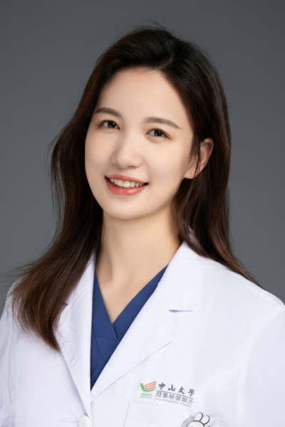

<!-- AUTO-GENERATED-BY: work/generate_obsidian_profiles.py -->

<!-- TEMPLATE: D:\workspace\信息收集整理\医生画像仓库\模板\医生画像模板.md -->

# 蔡光瑶

## 基础信息

| 字段 | 内容 |
|---|---|
| 姓名 | 蔡光瑶 |
| 医院 | 中山大学肿瘤防治中心 |
| 科室 | 妇科 |
| 职称/身份 | 副主任医师，医学博士 |
| 来源链接 | [官网原文](https://www.sysucc.org.cn/node/11090) |
| 采集日期 | 2026-08-10 |

## 简介/擅长

子宫内膜癌、宫颈癌、卵巢癌等妇科肿瘤的手术治疗及系统治疗（化疗、靶向及免疫治疗）。

## 教育与进修经历

- 一、教育及工作经历 2012年-2020年 华中科技大学同济医学院附属同济医院 临床医学八年制 本博连读 2018年 德国萨尔大学（Saarland University）交换 2020年8月-2023年6月 中山大学肿瘤防治中心 博士后/助理研究员 2020年7月-2024年12月 中山大学肿瘤防治中心 妇科 住院医师 2024年12月-2025年12月 中山大学肿瘤防治中心 妇科 主治医师 2025年12月至今 中山大学肿瘤防治中心 妇科 副主任医师 二、学术兼职 广东省医学教育协会妇科肿瘤学专业委员会委员…

## 可包装亮点

- 副主任医师，医学博士 蔡光瑶 职称：副主任医师，医学博士 专长 子宫内膜癌、宫颈癌、卵巢癌等妇科肿瘤的手术治疗及系统治疗（化疗、靶向及免疫治疗）。
- 一、教育及工作经历 2012年-2020年 华中科技大学同济医学院附属同济医院 临床医学八年制 本博连读 2018年 德国萨尔大学（Saarland University）交换 2020年8月-2023年6月 中山大学肿瘤防治中心 博士后/助理研究员 2020年7月-2024年12月 中山大学肿瘤防治中心 妇科 住院医师 2024年12月-2025年12月…

## 重点疾病/人群标签

- 慢性病：
- 肿瘤：肿瘤、癌、化疗、靶向、卵巢、免疫
- 生殖疾病：肿瘤、癌、化疗、靶向、卵巢、免疫
- 免疫/风湿：肿瘤、癌、化疗、靶向、卵巢、免疫
- 术后恢复/康复：
- 疑难重症：

## 证据摘录

> 只摘录官网公开信息中的短句或关键字段，不复制大段原文。

- 官网身份字段：副主任医师，医学博士
- 官网简介/擅长：子宫内膜癌、宫颈癌、卵巢癌等妇科肿瘤的手术治疗及系统治疗（化疗、靶向及免疫治疗）。
- 官网亮眼经历线索：副主任医师，医学博士 蔡光瑶 职称：副主任医师，医学博士 专长 子宫内膜癌、宫颈癌、卵巢癌等妇科肿瘤的手术治疗及系统治疗（化疗、靶向及免疫治疗）。 一、教育及工作经历 2012年-2020年 华中科技大学同济医学院附属同济医院 临床医学八年制 本博连读 2018年 德国萨尔大学（Saarland University）交换 2020年8月-2023年6月 中山大学肿瘤防治中心 博士后/助理研究员 2020年7月-2024年12月 中山…
- 异常提示：亮眼经历含导航文本，已清洗
- 来源链接：https://www.sysucc.org.cn/node/11090

## BD 画像摘要

蔡光瑶医生可作为肿瘤、生殖疾病、免疫/风湿/感染方向的基础画像候选。后续 BD 使用应继续以官网来源和人工复核为准，不添加疗效承诺或无来源包装。

## 合规边界

- 仅使用医院官网、官方公众号、官方小程序等公开渠道。
- 不采集私人电话、私人微信、家庭住址、患者隐私或非公开排班信息。
- 不写“保证治愈”“疗效第一”“包治疑难杂症”等无法由官网证明的表述。
