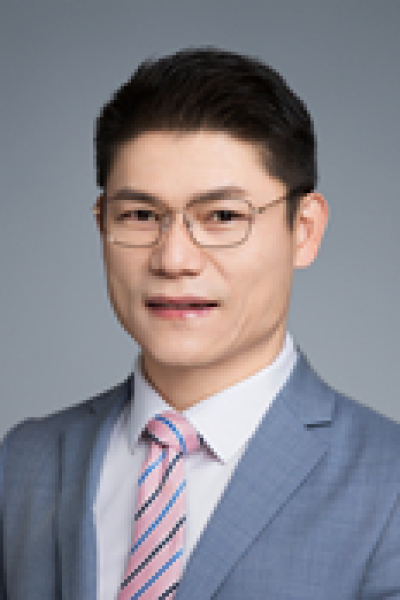

<!-- AUTO-GENERATED-BY: work/generate_obsidian_profiles.py -->

# 蔡木炎

## 基础信息

| 字段 | 内容 |
|---|---|
| 医院 | 中山大学肿瘤防治中心 |
| 姓名 | 蔡木炎 |
| 科室 | 病理科 |
| 职称/身份 | 病理科副主任 职称：医学博士，主任医师，博士研究生导师 |
| 重点优先级 | 高 |
| 来源类型 | 医院官网 |
| 来源链接 | [官网原文](https://www.sysucc.org.cn/node/3867) |
| 采集日期 | 2026-08-10 |
| 复核状态 | 待人工复核 |
| 异常提示 |  |

## 简介/擅长

消化系统肿瘤、淋巴瘤病理诊断与肿瘤DNA损伤复研究 职务： 病理科副主任 职称： 医学博士，主任医师，博士研究生导师 2005年中山大学临床医学系本科毕业后留在肿瘤医院工作至今，2014年获中山大学医学博士，2016年至2019年在哈佛大学医学院进行博士后培训。 中国CSCO胃癌专业委员会委员，中国CSCO青年委员会常务委员，中国抗癌协会肿瘤转移专业委员会青年委员，广东省医学会病理分会青委会副主任委员，广东省抗癌协会病理青年专委会常务委员。主要从事消化系统肿瘤、淋巴瘤病理诊断与肿瘤DNA损伤复研究，执笔国家权威CSCO胃癌、肠癌指南的撰写；研究成果为世界卫生组织肿瘤学蓝皮书所引用，以第一或通讯作者在GUT、J Hep、Nature Communications、Protein & Cell、Cell Rep等SCI杂志发表论文30余篇，主持包括国家自然科学基金面上项目等10项，2020年中国“杰出青年病理医师”奖获得者，广东省自然科学杰出青年基金获得者，广东省杰出青年医学人才，入选广东省广东高校优秀青年人才创新计划、中山大学优秀青年教师培养重点培育计划。 教育经历 （1）2012.9—2014.12 中山大学，肿瘤防治...

## 详情正文摘录

临床专家 面包屑 首页 / 临床科室 / 平台科室 / 病理科 / 临床专家 蔡木炎 职务：病理科副主任 职称：医学博士，主任医师，博士研究生导师 专长 消化系统肿瘤、淋巴瘤病理诊断与肿瘤DNA损伤复研究 职务： 病理科副主任 职称： 医学博士，主任医师，博士研究生导师 2005年中山大学临床医学系本科毕业后留在肿瘤医院工作至今，2014年获中山大学医学博士，2016年至2019年在哈佛大学医学院进行博士后培训。 中国CSCO胃癌专业委员会委员，中国CSCO青年委员会常务委员，中国抗癌协会肿瘤转移专业委员会青年委员，广东省医学会病理分会青委会副主任委员，广东省抗癌协会病理青年专委会常务委员。主要从事消化系统肿瘤、淋巴瘤病理诊断与肿瘤DNA损伤复研究，执笔国家权威CSCO胃癌、肠癌指南的撰写；研究成果为世界卫生组织肿瘤学蓝皮书所引用，以第一或通讯作者在GUT、J Hep、Nature Communications、Protein & Cell、Cell Rep等SCI杂志发表论文30余篇，主持包括国家自然科学基金面上项目等10项，2020年中国“杰出青年病理医师”奖获得者，广东省自然科学杰出青年基金获得者，广东省杰出青年医学人才，入选广东省广东高校优秀青年人才创新计划、中山大学优秀青年教师培养重点培育计划。 教育经历 （1）2012.9—2014.12 中山大学，肿瘤防治中心，医学博士 （2）2008.9—2012.12 中山大学，中山医学院病理系，硕士； （3）2000.9—2005.6 中山大学，中山医学院临床医学系，学士； 工作经历 （1）2021.12-现在 中山大学，肿瘤防治中心病理科，主任医师 （2）2016.12-2021.12 中山大学，肿瘤防治中心病理科，副主任医师 （3）2012.1—2016.12 中山大学，肿瘤防治中心病理科，主治医师； （4）2005.7—2011.12 中山大学，肿瘤防治中心病理科，住院医师。 研究经历 （1）2016.10-2019.07 哈佛医学院 Dana-Farber Cancer Institute, 博士后 （2）…

## 重点关注范围

- 肿瘤

## 重点疾病标签

- 肿瘤
- 癌
- 淋巴瘤
- 胃癌
- 肠癌

## 亮眼经历线索

- 病理科副主任 职称：医学博士，主任医师，博士研究生导师 消化系统肿瘤、淋巴瘤病理诊断与肿瘤DNA损伤复研究 职务： 病理科副主任 职称： 医学博士，主任医师，博士研究生导师 2005年中山大学临床医学系本科毕业后留在肿瘤医院工作至今，2014年获中山大学医学博士，2016年至2019年在哈佛大学医学院进行博士后培训。
- 中国CSCO胃癌专业委员会委员，中国CSCO青年委员会常务委员，中国抗癌协会肿瘤转移专业委员会青年委员，广东省医学会病理分会青委会副主任委员，广东省抗癌协会病理青年专委会常务委员。
- 主要从事消化系统肿瘤、淋巴瘤病理诊断与肿瘤DNA损伤复研究，执笔国家权威CSCO胃癌、肠癌指南的撰写；

## 异常提示

## 合规边界

- 本画像仅整理统一总底表中的医院官网公开字段。
- 不包含患者评价、排名、第三方来源内容或疗效承诺。
- 官网未展示的信息保持空白，后续如需补充须回到底表官方来源字段。
