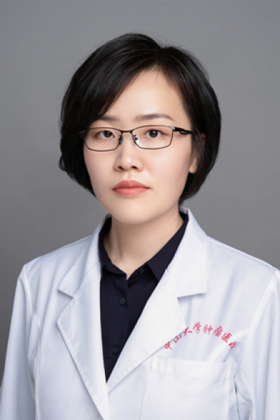

<!-- AUTO-GENERATED-BY: work/generate_obsidian_profiles.py -->

# 薛聪

## 基础信息

| 字段 | 内容 |
|---|---|
| 医院 | 中山大学肿瘤防治中心 |
| 姓名 | 薛聪 |
| 科室 | 内科 |
| 职称/身份 | 副主任医师、硕士生导师 |
| 重点优先级 | 高 |
| 来源类型 | 医院官网 |
| 来源链接 | [官网原文](https://www.sysucc.org.cn/node/1507) |
| 采集日期 | 2026-08-10 |
| 复核状态 | 待人工复核 |
| 异常提示 |  |

## 简介/擅长

乳腺癌、不明原发肿瘤的内科治疗。 2003级中山大学临床医学七年制硕士，博士毕业于中山大学肿瘤学专业，并留任中山大学肿瘤防治中心内科工作。熟练掌握乳腺癌的研究与临床工作，尤其在乳腺癌内分泌治疗方面具有显著特长。目前担任中国医药卫生事业发展基金会乳腺肿瘤学组秘书、中国抗癌协会肿瘤内分泌专业委员会委员、广东省抗癌协会多原发和不明原发肿瘤专业委员会秘书、广东省医疗行业协会乳腺肿瘤内科管理分会常委、广东省老年保健协会乳腺癌整合治疗专委会常委等职务。以第一作者或通讯作者（包括共同）在《Annals of Oncology》《npj Breast Cancer》《Cancer》《Breast》等国际知名杂志发表SCI论文20余篇。主持国家自然科学基金青年基金1项，并参与多项国家及省部级科研课题，同时参与多项国际及国内多中心临床研究。

## 详情正文摘录

临床专家 面包屑 首页 / 临床科室 / 内科系列 / 内科 / 临床专家 薛聪 职称：副主任医师、硕士生导师 专长 乳腺癌、不明原发肿瘤的内科治疗。 2003级中山大学临床医学七年制硕士，博士毕业于中山大学肿瘤学专业，并留任中山大学肿瘤防治中心内科工作。熟练掌握乳腺癌的研究与临床工作，尤其在乳腺癌内分泌治疗方面具有显著特长。目前担任中国医药卫生事业发展基金会乳腺肿瘤学组秘书、中国抗癌协会肿瘤内分泌专业委员会委员、广东省抗癌协会多原发和不明原发肿瘤专业委员会秘书、广东省医疗行业协会乳腺肿瘤内科管理分会常委、广东省老年保健协会乳腺癌整合治疗专委会常委等职务。以第一作者或通讯作者（包括共同）在《Annals of Oncology》《npj Breast Cancer》《Cancer》《Breast》等国际知名杂志发表SCI论文20余篇。主持国家自然科学基金青年基金1项，并参与多项国家及省部级科研课题，同时参与多项国际及国内多中心临床研究。 更新时间：2025.03.07

## 重点关注范围

- 肿瘤

## 重点疾病标签

- 肿瘤
- 癌
- 乳腺癌

## 亮眼经历线索

- 副主任医师、硕士生导师 目前担任中国医药卫生事业发展基金会乳腺肿瘤学组秘书、中国抗癌协会肿瘤内分泌专业委员会委员、广东省抗癌协会多原发和不明原发肿瘤专业委员会秘书、广东省医疗行业协会乳腺肿瘤内科管理分会常委、广东省老年保健协会乳腺癌整合治疗专委会常委等职务。
- 以第一作者或通讯作者（包括共同）在《Annals of Oncology》《npj Breast Cancer》《Cancer》《Breast》等国际知名杂志发表SCI论文20余篇。
- 主持国家自然科学基金青年基金1项，并参与多项国家及省部级科研课题，同时参与多项国际及国内多中心临床研究。

## 异常提示

## 合规边界

- 本画像仅整理统一总底表中的医院官网公开字段。
- 不包含患者评价、排名、第三方来源内容或疗效承诺。
- 官网未展示的信息保持空白，后续如需补充须回到底表官方来源字段。
