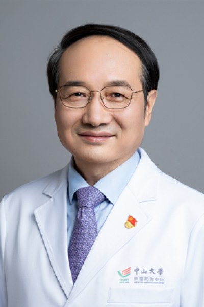

<!-- AUTO-GENERATED-BY: work/generate_obsidian_profiles.py -->

# 袁中玉

## 基础信息

| 字段 | 内容 |
|---|---|
| 医院 | 中山大学肿瘤防治中心 |
| 姓名 | 袁中玉 |
| 科室 | 内科 |
| 职称/身份 | 教授、主任医师、医学博士、博士生导师 |
| 重点优先级 | 高 |
| 来源类型 | 医院官网 |
| 来源链接 | [官网原文](https://www.sysucc.org.cn/node/1484) |
| 采集日期 | 2026-08-10 |
| 复核状态 | 待人工复核 |
| 异常提示 |  |

## 简介/擅长

乳腺癌的综合治疗（内分泌治疗、靶向治疗、化学治疗），尤其专注于三阴乳腺癌的治疗和研究。

## 详情正文摘录

袁中玉，中山大学肿瘤医院内科，教授，主任医师，博士生导师。2003年毕业于中山大学，获肿瘤学博士学位。现在主要从事乳腺癌的化疗、内分泌治疗及靶向治疗，尤其专注于三阴乳腺癌的临床和科研。作为主要研究者主持了多项一、二及三期的临床研究；承担国家自然科学基金重点项目、面上项目、广东省自然科学基金多项，发表高水平论文30余篇。重点研究方向：乳腺癌转移的分子机制；乳腺癌治疗耐药性产生的机制及应对策略；具有实践意义的临床研究。 加载更多 职称： 教授、主任医师、医学博士、博士生导师

## 重点关注范围

- 肿瘤

## 重点疾病标签

- 肿瘤
- 化疗
- 靶向
- 乳腺癌

## 亮眼经历线索

- 教授、主任医师、医学博士、博士生导师 袁中玉，中山大学肿瘤医院内科，教授，主任医师，博士生导师。
- 承担国家自然科学基金重点项目、面上项目、广东省自然科学基金多项，发表高水平论文30余篇。
- 加载更多 职称： 教授、主任医师、医学博士、博士生导师

## 异常提示

## 合规边界

- 本画像仅整理统一总底表中的医院官网公开字段。
- 不包含患者评价、排名、第三方来源内容或疗效承诺。
- 官网未展示的信息保持空白，后续如需补充须回到底表官方来源字段。
