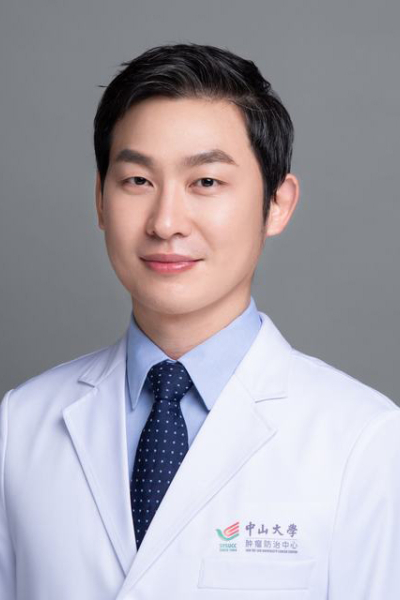

<!-- AUTO-GENERATED-BY: work/generate_obsidian_profiles.py -->

<!-- TEMPLATE: D:\workspace\信息收集整理\医生画像仓库\模板\医生画像模板.md -->

# 袁庶强

## 基础信息

| 字段 | 内容 |
|---|---|
| 姓名 | 袁庶强 |
| 医院 | 中山大学肿瘤防治中心 |
| 科室 | 胃外科 |
| 职称/身份 | 教授、医学博士、主任医师、博士生导师、临床医学科学家 |
| 来源链接 | [官网原文](https://www.sysucc.org.cn/node/3660) |
| 采集日期 | 2026-08-10 |

## 简介/擅长

胃肠肿瘤的外科及围术期免疫治疗，尤其机器人/腹腔镜微创及保胃功能手术。

## 科研项目与成果

- 主持科研基金7项，其中国自然基金2项、四大慢病重大专项子课题1项。

## 论文与学术产出

- 作为第一或通讯作者在Nature Medicine、STTT、Molecular Cancer、Cancer Communications、Cell Rep Med、Clin Transl Med、JNCI、Eur J Cancer等杂志发表论文50余篇。

## 可包装亮点

- 教授、医学博士、主任医师、博士生导师、临床医学科学家 袁庶强 职称：教授、医学博士、主任医师、博士生导师、临床医学科学家 专长 胃肠肿瘤的外科及围术期免疫治疗，尤其机器人/腹腔镜微创及保胃功能手术。
- 一、基本情况 中山大学附属肿瘤医院胃外科主任医师、教授、博士生导师、临床医学科学家。
- 2011年获中山大学及美国MD Anderson肿瘤中心联合培养博士。

## 重点疾病/人群标签

- 慢性病：代谢、肿瘤、癌、化疗、靶向、胃癌、免疫、康复、疑难、多学科、MDT
- 肿瘤：代谢、肿瘤、癌、化疗、靶向、胃癌、免疫、康复、疑难、多学科、MDT
- 生殖疾病：
- 免疫/风湿：代谢、肿瘤、癌、化疗、靶向、胃癌、免疫、康复、疑难、多学科、MDT
- 术后恢复/康复：代谢、肿瘤、癌、化疗、靶向、胃癌、免疫、康复、疑难、多学科、MDT
- 疑难重症：代谢、肿瘤、癌、化疗、靶向、胃癌、免疫、康复、疑难、多学科、MDT

## 证据摘录

> 只摘录官网公开信息中的短句或关键字段，不复制大段原文。

- 官网身份字段：教授、医学博士、主任医师、博士生导师、临床医学科学家
- 官网简介/擅长：胃肠肿瘤的外科及围术期免疫治疗，尤其机器人/腹腔镜微创及保胃功能手术。
- 官网亮眼经历线索：教授、医学博士、主任医师、博士生导师、临床医学科学家 袁庶强 职称：教授、医学博士、主任医师、博士生导师、临床医学科学家 专长 胃肠肿瘤的外科及围术期免疫治疗，尤其机器人/腹腔镜微创及保胃功能手术。 一、基本情况 中山大学附属肿瘤医院胃外科主任医师、教授、博士生导师、临床医学科学家。 2011年获中山大学及美国MD Anderson肿瘤中心联合培养博士。
- 异常提示：亮眼经历含导航文本，已清洗
- 来源链接：https://www.sysucc.org.cn/node/3660

## BD 画像摘要

袁庶强医生可作为慢性病、肿瘤、免疫/风湿/感染、术后恢复/康复、疑难重症方向的基础画像候选。后续 BD 使用应继续以官网来源和人工复核为准，不添加疗效承诺或无来源包装。

## 合规边界

- 仅使用医院官网、官方公众号、官方小程序等公开渠道。
- 不采集私人电话、私人微信、家庭住址、患者隐私或非公开排班信息。
- 不写“保证治愈”“疗效第一”“包治疑难杂症”等无法由官网证明的表述。
