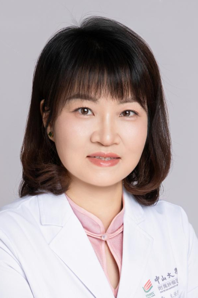

<!-- AUTO-GENERATED-BY: work/generate_obsidian_profiles.py -->

<!-- TEMPLATE: D:\workspace\信息收集整理\医生画像仓库\模板\医生画像模板.md -->

# 裴小青

## 基础信息

| 字段 | 内容 |
|---|---|
| 姓名 | 裴小青 |
| 医院 | 中山大学肿瘤防治中心 |
| 科室 | 超声科 |
| 职称/身份 | 主任医师 |
| 来源链接 | [官网原文](https://www.sysucc.org.cn/node/3896) |
| 采集日期 | 2026-08-10 |

## 简介/擅长

乳腺、甲状腺、腹部及妇科疾病的超声诊断及肿瘤的微创介入诊疗。

## 教育与进修经历

- 一、基本情况 超声介入门诊出诊时间：周五上午 二、教育及工作经历 2007-2010年 中山大学博士研究生2011-2012年 英国国王学院圣托马斯医院访问学者根据时间顺序排列 三、学术兼职 广东省超声医学工程学会副会长 中国超声医学工程学会腹部专委会常务委员 广东省保健协会乳腺肿瘤防治与康复分会副主任委员 广东省临床医学学会超声医学专业委员会常务委员 广东省精准医学应用学会癌症早筛早诊分会常务委员 广东省抗癌协会超声医学专委会委员 广东省临床医学学会肿瘤学专业委员会委员 广东省健康管理协会超声分会常务委员 广东…

## 可包装亮点

- 主任医师 裴小青 职称：主任医师 专长 乳腺、甲状腺、腹部及妇科疾病的超声诊断及肿瘤的微创介入诊疗。
- 一、基本情况 超声介入门诊出诊时间：周五上午 二、教育及工作经历 2007-2010年 中山大学博士研究生2011-2012年 英国国王学院圣托马斯医院访问学者根据时间顺序排列 三、学术兼职 广东省超声医学工程学会副会长 中国超声医学工程学会腹部专委会常务委员 广东省保健协会乳腺肿瘤防治与康复分会副主任委员 广东省临床医学学会超声医学专业委员会常务委员 广…

## 重点疾病/人群标签

- 慢性病：
- 肿瘤：肿瘤、癌、肝癌、生殖、康复
- 生殖疾病：肿瘤、癌、肝癌、生殖、康复
- 免疫/风湿：
- 术后恢复/康复：肿瘤、癌、肝癌、生殖、康复
- 疑难重症：

## 证据摘录

> 只摘录官网公开信息中的短句或关键字段，不复制大段原文。

- 官网身份字段：主任医师
- 官网简介/擅长：乳腺、甲状腺、腹部及妇科疾病的超声诊断及肿瘤的微创介入诊疗。
- 官网亮眼经历线索：主任医师 裴小青 职称：主任医师 专长 乳腺、甲状腺、腹部及妇科疾病的超声诊断及肿瘤的微创介入诊疗。 一、基本情况 超声介入门诊出诊时间：周五上午 二、教育及工作经历 2007-2010年 中山大学博士研究生2011-2012年 英国国王学院圣托马斯医院访问学者根据时间顺序排列 三、学术兼职 广东省超声医学工程学会副会长 中国超声医学工程学会腹部专委会常务委员 广东省保健协会乳腺肿瘤防治与康复分会副主任委员 广东省临床医学学会超声医学…
- 异常提示：亮眼经历含导航文本，已清洗
- 来源链接：https://www.sysucc.org.cn/node/3896

## BD 画像摘要

裴小青医生可作为肿瘤、生殖疾病、术后恢复/康复方向的基础画像候选。后续 BD 使用应继续以官网来源和人工复核为准，不添加疗效承诺或无来源包装。

## 合规边界

- 仅使用医院官网、官方公众号、官方小程序等公开渠道。
- 不采集私人电话、私人微信、家庭住址、患者隐私或非公开排班信息。
- 不写“保证治愈”“疗效第一”“包治疑难杂症”等无法由官网证明的表述。
