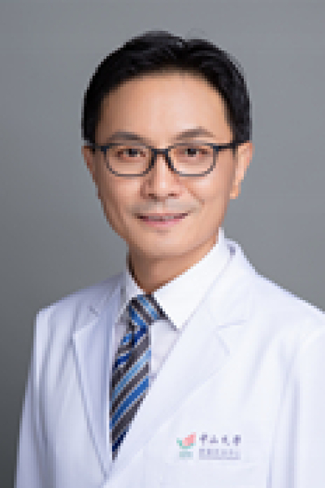

<!-- AUTO-GENERATED-BY: work/generate_obsidian_profiles.py -->

# 谢丹

## 基础信息

| 字段 | 内容 |
|---|---|
| 医院 | 中山大学肿瘤防治中心 |
| 姓名 | 谢丹 |
| 科室 | 病理科 |
| 职称/身份 | 病理科副主任;肿瘤分子标志物和诊疗实验室主任 职称：教授、珠江学者特聘教授、博士生导师 |
| 重点优先级 | 高 |
| 来源类型 | 医院官网 |
| 来源链接 | [官网原文](https://www.sysucc.org.cn/node/1541) |
| 采集日期 | 2026-08-10 |
| 复核状态 | 待人工复核 |
| 异常提示 |  |

## 简介/擅长

1. 恶性肿瘤侵袭转移分子机制 2. 肿瘤标志物和早期诊断 3. 肿瘤分子分型和基因治疗 联系电话：020-87343193; Email: xiedan@sysucc.org.cn 【教育背景】 2001.08-2004.07 香港大学-医学院，临床肿瘤学系博士学位 1993.09-1996.07 中山大学-中山医学院，病理学系硕士学位 1986.09-1991.07 中南大学-湘雅医学院，临床医学系本科 【工作经历】 2007.12-至今 中山大学肿瘤防治中心，教授，博士生导师，华南恶性肿瘤防治全国重点实验室，课题组长（PI） 2005.05-2007.12 中山大学肿瘤防治中心，副教授，博士生导师（2006.10） 2004.08-2005.05 中山大学中山医学院，副教授，硕士生导师 1999.09-2001.07 香港大学医学院，研究助理（Research associate） 1996.07-1999.09 中山大学中山医学院，助教、讲师 【主要学术兼职】 国家自然科学基金委-肿瘤学科组，二审专家 中国抗癌协会癌转移学会-青年委员会，副主任委员 广东省抗癌协会癌转移学会，副主任委员 中华医学会肿瘤学分会-青...

## 详情正文摘录

职务：病理科副主任;肿瘤分子标志物和诊疗实验室主任 职称：教授、珠江学者特聘教授、博士生导师 专长 肿瘤侵袭转移机制；肿瘤诊断与治疗分子标志物研究 国家“杰出青年基金项目获得者”，科技部 “中青年领军人才”，广东省“珠江学者特聘教授”，教育部“新世纪优秀人才”，广东省“千百十人才”，中华医学会“中华肿瘤明日之星”。 主要运用分子肿瘤学和实验病理学等相关技术，进行多种人类实体肿瘤恶性分子表型的调控与蛋白修饰及肿瘤侵袭转移和分子诊断标记物的研究。近20年来，先后主持国家和部省级等科研课题20余项；在肿瘤学领域的相关主流学术（高水平收录）杂志上共发表高水平论著159篇，其中通讯/共同通讯作者论著76篇，第一/共同第一作者论著15篇，累计影响因子（IF）900多分, 许多论著发表在Lancet Oncol, Gut, Cancer Res, Oncogene, Clin Cancer Res, Plos Genetics, J Phathol, Ann Oncol等高影响力的肿瘤学主流杂志上；共申报肿瘤诊断标志物相关的专利5项。 招生学科 ：1） 肿瘤学（临床学科），2）病理学（基础医学），3）分子医学 （基础学科） 研究方向： 1. 恶性肿瘤侵袭转移分子机制 2. 肿瘤标志物和早期诊断 3. 肿瘤分子分型和基因治疗 联系电话：020-87343193; Email: xiedan@sysucc.org.cn 【教育背景】 2001.08-2004.07 香港大学-医学院，临床肿瘤学系博士学位 1993.09-1996.07 中山大学-中山医学院，病理学系硕士学位 1986.09-1991.07 中南大学-湘雅医学院，临床医学系本科 【工作经历】 2007.12-至今 中山大学肿瘤防治中心，教授，博士生导师，华南恶性肿瘤防治全国重点实验室，课题组长（PI） 2005.05-2007.12 中山大学肿瘤防治中心，副教授，博士生导师（2006.10） 2004.08-2005.05…

## 重点关注范围

- 肿瘤

## 重点疾病标签

- 肿瘤
- 癌

## 亮眼经历线索

- 肿瘤分子标志物和诊疗实验室主任 职称：教授、珠江学者特聘教授、博士生导师 Email: xiedan@sysucc.org.cn 【教育背景】 2001.08-2004.07 香港大学-医学院，临床肿瘤学系博士学位 1993.09-1996.07 中山大学-中山医学院，病理学系硕士学位 1986.09-1991.07 中南大学-湘雅医学院，临床医学系本科…

## 异常提示

## 合规边界

- 本画像仅整理统一总底表中的医院官网公开字段。
- 不包含患者评价、排名、第三方来源内容或疗效承诺。
- 官网未展示的信息保持空白，后续如需补充须回到底表官方来源字段。
