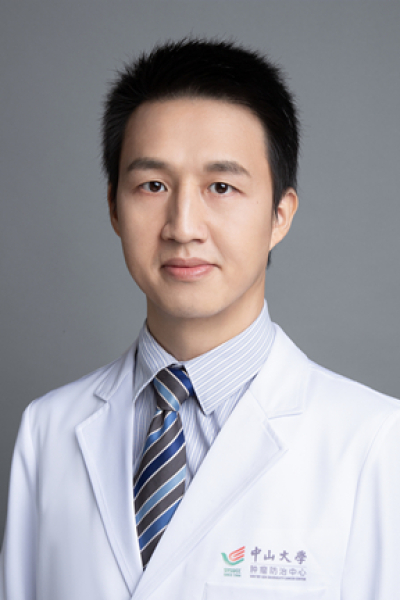

<!-- AUTO-GENERATED-BY: work/generate_obsidian_profiles.py -->

# 谢新华

## 基础信息

| 字段 | 内容 |
|---|---|
| 医院 | 中山大学肿瘤防治中心 |
| 姓名 | 谢新华 |
| 科室 | 乳腺科 |
| 职称/身份 | 乳腺科副主任 职称：主任医师，硕士生导师 |
| 重点优先级 | 高 |
| 来源类型 | 医院官网 |
| 来源链接 | [官网原文](https://www.sysucc.org.cn/node/3744) |
| 采集日期 | 2026-08-10 |
| 复核状态 | 待人工复核 |
| 异常提示 |  |

## 简介/擅长

乳腺癌的早期诊断、保乳和改良根治术；乳腺肿瘤的微创和腔镜手术治疗；乳房整形修复和再造术等。早诊患者的治愈率可高达90%。 一、一般情况 谢新华，肿瘤学博士，主任医师，科室行政副主任，硕士生导师。从事乳腺癌临床工作十余年，为“中山大学肿瘤防治中心优秀青年人才培育计划”获得者。现任广东省精准医学乳腺癌分会常委，广东省抗癌协会乳腺癌专业委员会委员，广东省医疗行业协会乳腺专科管理分会委员。主持国家自然科学基金2项，广东省科技计划项目基金1项，参与国家自然科学基金数项。共发表第一作者/通讯作者SCI论著十余篇。 二、医学专长 临床手术技能：乳腺肿瘤的微创和腔镜手术治疗；乳腺癌改良根治术、保乳术及前哨淋巴结活检术等；乳腺癌术后重建与整形修复。 科学研究方向：乳腺癌转移和免疫调控的相关机制研究。 三、

## 详情正文摘录

临床专家 面包屑 首页 / 临床科室 / 外科系列 / 乳腺科 / 临床专家 谢新华 职务：乳腺科副主任 职称：主任医师，硕士生导师 专长 乳腺癌的早期诊断、保乳和改良根治术；乳腺肿瘤的微创和腔镜手术治疗；乳房整形修复和再造术等。早诊患者的治愈率可高达90%。 职务：乳腺科副主任 职称：主任医师，硕士生导师 专长：乳腺癌的早期诊断、保乳和改良根治术；乳腺肿瘤的微创和腔镜手术治疗；乳房整形修复和再造术等。早诊患者的治愈率可高达90%。 一、一般情况 谢新华，肿瘤学博士，主任医师，科室行政副主任，硕士生导师。从事乳腺癌临床工作十余年，为“中山大学肿瘤防治中心优秀青年人才培育计划”获得者。现任广东省精准医学乳腺癌分会常委，广东省抗癌协会乳腺癌专业委员会委员，广东省医疗行业协会乳腺专科管理分会委员。主持国家自然科学基金2项，广东省科技计划项目基金1项，参与国家自然科学基金数项。共发表第一作者/通讯作者SCI论著十余篇。 二、医学专长 临床手术技能：乳腺肿瘤的微创和腔镜手术治疗；乳腺癌改良根治术、保乳术及前哨淋巴结活检术等；乳腺癌术后重建与整形修复。 科学研究方向：乳腺癌转移和免疫调控的相关机制研究。 三、门诊时间 周一上午（黄埔院区）、周二上午（越秀院区）、周四上午（越秀院区） 四、主持的科研基金 1. 国家自然科学基金面上项目，81974444，2020/01-2023/12，51万，主持； 2. 国家自然科学基金青年项目，81302318，2013.1-2016.12，23万，主持； 3. 广东省科技计划项目， 2017A020215163，2017/01-2019/12, 10万，主持。 加载更多 职务：乳腺科副主任 职称：主任医师，硕士生导师 专长：乳腺癌的早期诊断、保乳和改良根治术；乳腺肿瘤的微创和腔镜手术治疗；乳房整形修复和再造术等。早诊患者的治愈率可高达90%。 一、一般情况 谢新华，肿瘤学博士，主任医师，科室行政副主任，硕士生导师。从事乳腺癌临床工作十余年，为“中山大学肿瘤防治中心优秀青年人才培育计划”获得者。现任广东省精准医学乳腺癌分会常委，广东省抗癌协会乳…

## 重点关注范围

- 肿瘤
- 免疫/风湿/感染
- 术后恢复/康复

## 重点疾病标签

- 肿瘤
- 癌
- 乳腺癌
- 免疫
- 术后

## 亮眼经历线索

- 乳腺科副主任 职称：主任医师，硕士生导师 一、一般情况 谢新华，肿瘤学博士，主任医师，科室行政副主任，硕士生导师。
- 从事乳腺癌临床工作十余年，为“中山大学肿瘤防治中心优秀青年人才培育计划”获得者。
- 现任广东省精准医学乳腺癌分会常委，广东省抗癌协会乳腺癌专业委员会委员，广东省医疗行业协会乳腺专科管理分会委员。

## 异常提示

## 合规边界

- 本画像仅整理统一总底表中的医院官网公开字段。
- 不包含患者评价、排名、第三方来源内容或疗效承诺。
- 官网未展示的信息保持空白，后续如需补充须回到底表官方来源字段。
