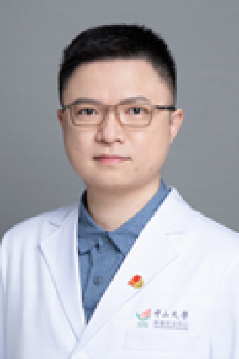

<!-- AUTO-GENERATED-BY: work/generate_obsidian_profiles.py -->

# 贺龙君

## 基础信息

| 字段 | 内容 |
|---|---|
| 医院 | 中山大学肿瘤防治中心 |
| 姓名 | 贺龙君 |
| 科室 | 内镜科 |
| 职称/身份 | 内镜科副主任 职称：副主任医师、硕士生导师 |
| 重点优先级 | 高 |
| 来源类型 | 医院官网 |
| 来源链接 | [官网原文](https://www.sysucc.org.cn/node/3914) |
| 采集日期 | 2026-08-10 |
| 复核状态 | 待人工复核 |
| 异常提示 |  |

## 简介/擅长

消化道肿瘤早诊早治；晚期肿瘤姑息治疗 主要从事肿瘤内镜诊断及治疗，在超声内镜（EUS）诊断及EUS 引导下介入诊治（EUS-FNA及EBUS-TBNA）具有丰富经验。擅长消化道肿瘤内镜下早诊早治及晚期肿瘤姑息性治疗（包括胰胆管支架植入术，食管及肠道支架置入术，经皮胃造瘘术，呼吸道肿瘤冷冻消融术，EUS 引导下腹腔神经丛阻滞术等），并在人工智能辅助内镜诊断消化系统肿瘤研究方面取得卓越成绩。 主持国家自然科学基金面上项目1项，参与多项广东省科技项目、广州市民生科技攻关计划项目、香港亚洲癌症基金会项目等多项科研课题。目前任广东省抗癌协会胆胰专业委员会委员、广东省抗癌协会肿瘤内镜专业委员会青年委员。 加载更多 职务：内镜科副主任 职称：副主任医师、硕士生导师 专长：消化道肿瘤早诊早治；晚期肿瘤姑息治疗 主要从事肿瘤内镜诊断及治疗，在超声内镜（EUS）诊断及EUS 引导下介入诊治（EUS-FNA及EBUS-TBNA）具有丰富经验。擅长消化道肿瘤内镜下早诊早治及晚期肿瘤姑息性治疗（包括胰胆管支架植入术，食管及肠道支架置入术，经皮胃造瘘术，呼吸道肿瘤冷冻消融术，EUS 引导下腹腔神经丛阻滞术等），并在人工智能辅助内镜诊断消化系统肿瘤...

## 详情正文摘录

职务：内镜科副主任 职称：副主任医师、硕士生导师 专长 消化道肿瘤早诊早治；晚期肿瘤姑息治疗 职务：内镜科副主任 职称：副主任医师、硕士生导师 专长：消化道肿瘤早诊早治；晚期肿瘤姑息治疗 主要从事肿瘤内镜诊断及治疗，在超声内镜（EUS）诊断及EUS 引导下介入诊治（EUS-FNA及EBUS-TBNA）具有丰富经验。擅长消化道肿瘤内镜下早诊早治及晚期肿瘤姑息性治疗（包括胰胆管支架植入术，食管及肠道支架置入术，经皮胃造瘘术，呼吸道肿瘤冷冻消融术，EUS 引导下腹腔神经丛阻滞术等），并在人工智能辅助内镜诊断消化系统肿瘤研究方面取得卓越成绩。 主持国家自然科学基金面上项目1项，参与多项广东省科技项目、广州市民生科技攻关计划项目、香港亚洲癌症基金会项目等多项科研课题。目前任广东省抗癌协会胆胰专业委员会委员、广东省抗癌协会肿瘤内镜专业委员会青年委员。 加载更多 职务：内镜科副主任 职称：副主任医师、硕士生导师 专长：消化道肿瘤早诊早治；晚期肿瘤姑息治疗 主要从事肿瘤内镜诊断及治疗，在超声内镜（EUS）诊断及EUS 引导下介入诊治（EUS-FNA及EBUS-TBNA）具有丰富经验。擅长消化道肿瘤内镜下早诊早治及晚期肿瘤姑息性治疗（包括胰胆管支架植入术，食管及肠道支架置入术，经皮胃造瘘术，呼吸道肿瘤冷冻消融术，EUS 引导下腹腔神经丛阻滞术等），并在人工智能辅助内镜诊断消化系统肿瘤研究方面取得卓越成绩。 主持国家自然科学基金面上项目1项，参与多项广东省科技项目、广州市民生科技攻关计划项目、香港亚洲癌症基金会项目等多项科研课题。目前任广东省抗癌协会胆胰专业委员会委员、广东省抗癌协会肿瘤内镜专业委员会青年委员。 更新日期：2023年8月2日

## 重点关注范围

- 肿瘤
- 术后恢复/康复

## 重点疾病标签

- 肿瘤
- 癌
- 姑息

## 亮眼经历线索

- 内镜科副主任 职称：副主任医师、硕士生导师 主持国家自然科学基金面上项目1项，参与多项广东省科技项目、广州市民生科技攻关计划项目、香港亚洲癌症基金会项目等多项科研课题。
- 目前任广东省抗癌协会胆胰专业委员会委员、广东省抗癌协会肿瘤内镜专业委员会青年委员。
- 加载更多 职务：内镜科副主任 职称：副主任医师、硕士生导师 专长：消化道肿瘤早诊早治；

## 异常提示

## 合规边界

- 本画像仅整理统一总底表中的医院官网公开字段。
- 不包含患者评价、排名、第三方来源内容或疗效承诺。
- 官网未展示的信息保持空白，后续如需补充须回到底表官方来源字段。
