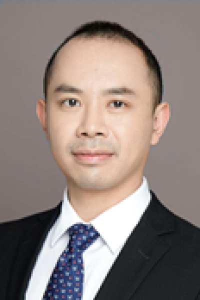

<!-- AUTO-GENERATED-BY: work/generate_obsidian_profiles.py -->

<!-- TEMPLATE: D:\workspace\信息收集整理\医生画像仓库\模板\医生画像模板.md -->

# 赖仁纯

## 基础信息

| 字段 | 内容 |
|---|---|
| 姓名 | 赖仁纯 |
| 医院 | 中山大学肿瘤防治中心 |
| 科室 | 手术麻醉科 |
| 职称/身份 | 科副主任 职称：主任医师 |
| 来源链接 | [官网原文](https://www.sysucc.org.cn/node/3821) |
| 采集日期 | 2026-08-10 |

## 简介/擅长

围术期危重病人处理，急性疼痛处理 中山大学博士，肿瘤防治中心麻醉科主任医师，硕士生导师。

## 教育与进修经历

- 社会任职：广东省麻醉学会青年委员，广东省抗癌协会肿瘤麻醉与镇痛专业委员会青年委员 美国弗吉尼亚大学医学院，访问学者 加载更多 中山大学肿瘤防治中心麻醉科，主任医师，硕士生导师 社会任职： 广东省麻醉学会青年委员 广东省抗癌协会肿瘤麻醉与镇痛专业委员会青年委员 科研与学术工作经历 2013/01-至今，中山大学，肿瘤防治中心，副主任医师 2013/09-2015/08，美国弗吉尼亚大学医学院，访问学者 主持科研项目（课题） 1.中山大学肿瘤防治中心出国人员启动基金，七氟醚对胶质瘤细胞侵袭力的影响及其可能机制的研究…

## 科研项目与成果

- 社会任职：广东省麻醉学会青年委员，广东省抗癌协会肿瘤麻醉与镇痛专业委员会青年委员 美国弗吉尼亚大学医学院，访问学者 加载更多 中山大学肿瘤防治中心麻醉科，主任医师，硕士生导师 社会任职： 广东省麻醉学会青年委员 广东省抗癌协会肿瘤麻醉与镇痛专业委员会青年委员 科研与学术工作经历 2013/01-至今，中山大学，肿瘤防治中心，副主任医师 2013/09-2015/08，美国弗吉尼亚大学医学院，访问学者 主持科研项目（课题） 1.中山大学肿瘤防治中心出国人员启动基金，七氟醚对胶质瘤细胞侵袭力的影响及其可能机制的研究…

## 可包装亮点

- 科副主任 职称：主任医师 围术期危重病人处理，急性疼痛处理 中山大学博士，肿瘤防治中心麻醉科主任医师，硕士生导师。
- 赖仁纯 职务：科副主任 职称：主任医师 专长 围术期危重病人处理，急性疼痛处理 主任医师 麻醉门诊，周二、五下午 专长：围术期危重病人处理，急性疼痛处理 中山大学博士，肿瘤防治中心麻醉科主任医师，硕士生导师。
- 社会任职：广东省麻醉学会青年委员，广东省抗癌协会肿瘤麻醉与镇痛专业委员会青年委员 美国弗吉尼亚大学医学院，访问学者 中山大学肿瘤防治中心麻醉科，主任医师，硕士生导师 社会任职： 广东省麻醉学会青年委员 广东省抗癌协会肿瘤麻醉与镇痛专业委员会青年委员 科研与学术工作经历 2013/01-至今，中山大学，肿瘤防治中心，副主任医师 2013/09-2015/08…

## 重点疾病/人群标签

- 慢性病：
- 肿瘤：肿瘤、癌、瘤、化疗、疼痛、危重
- 生殖疾病：
- 免疫/风湿：
- 术后恢复/康复：肿瘤、癌、瘤、化疗、疼痛、危重
- 疑难重症：肿瘤、癌、瘤、化疗、疼痛、危重

## 证据摘录

> 只摘录官网公开信息中的短句或关键字段，不复制大段原文。

- 官网身份字段：科副主任 职称：主任医师
- 官网简介/擅长：围术期危重病人处理，急性疼痛处理 中山大学博士，肿瘤防治中心麻醉科主任医师，硕士生导师。
- 官网亮眼经历线索：科副主任 职称：主任医师 围术期危重病人处理，急性疼痛处理 中山大学博士，肿瘤防治中心麻醉科主任医师，硕士生导师。 赖仁纯 职务：科副主任 职称：主任医师 专长 围术期危重病人处理，急性疼痛处理 主任医师 麻醉门诊，周二、五下午 专长：围术期危重病人处理，急性疼痛处理 中山大学博士，肿瘤防治中心麻醉科主任医师，硕士生导师。 社会任职：广东省麻醉学会青年委员，广东省抗癌协会肿瘤麻醉与镇痛专业委员会青年委员 美国弗吉尼亚大学医学院，访问学…
- 异常提示：亮眼经历含导航文本，已清洗
- 来源链接：https://www.sysucc.org.cn/node/3821

## BD 画像摘要

赖仁纯医生可作为肿瘤、术后恢复/康复、疑难重症方向的基础画像候选。后续 BD 使用应继续以官网来源和人工复核为准，不添加疗效承诺或无来源包装。

## 合规边界

- 仅使用医院官网、官方公众号、官方小程序等公开渠道。
- 不采集私人电话、私人微信、家庭住址、患者隐私或非公开排班信息。
- 不写“保证治愈”“疗效第一”“包治疑难杂症”等无法由官网证明的表述。
