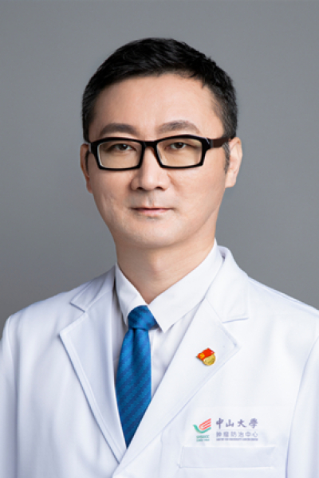

<!-- AUTO-GENERATED-BY: work/generate_obsidian_profiles.py -->

<!-- TEMPLATE: D:\workspace\信息收集整理\医生画像仓库\模板\医生画像模板.md -->

# 赛克

## 基础信息

| 字段 | 内容 |
|---|---|
| 姓名 | 赛克 |
| 医院 | 中山大学肿瘤防治中心 |
| 科室 | 神经外科 |
| 职称/身份 | 神经外科副主任、党支部书记 职称：主任医师、主诊教授、博士生导师 |
| 来源链接 | [官网原文](https://www.sysucc.org.cn/node/3710) |
| 采集日期 | 2026-08-10 |

## 简介/擅长

胶质瘤、脑膜瘤、转移瘤的精细神经外科手术；电生理检测下听神经瘤、脑功能区肿瘤手术；电生理检测下听神经瘤、脑功能区肿瘤手术；胶质瘤、转移瘤的综合治疗。

## 教育与进修经历

- 二、教育及工作经历 2004年七年制本硕研究生毕业，2006年就读中山大学肿瘤学博士，2009年于美国MD安德森癌症中心神经肿瘤科完成博士后训练。

## 科研项目与成果

- 一直从事胶质瘤相关基础与科学研究，2025年获评中山大学附属肿瘤医院临床科学家，主持完成相关国家重点科研项目分题、国家自然科学基金、广东省自然科学基金近10项，发表科研论文30余篇。

## 论文与学术产出

- 一直从事胶质瘤相关基础与科学研究，2025年获评中山大学附属肿瘤医院临床科学家，主持完成相关国家重点科研项目分题、国家自然科学基金、广东省自然科学基金近10项，发表科研论文30余篇。

## 可包装亮点

- 神经外科副主任、党支部书记 职称：主任医师、主诊教授、博士生导师 赛克 职务：神经外科副主任、党支部书记 职称：主任医师、主诊教授、博士生导师 专长 胶质瘤、脑膜瘤、转移瘤的精细神经外科手术；
- 二、教育及工作经历 2004年七年制本硕研究生毕业，2006年就读中山大学肿瘤学博士，2009年于美国MD安德森癌症中心神经肿瘤科完成博士后训练。
- 多次荣获“南粤好医生”、“实力中青年医生”等称号。

## 重点疾病/人群标签

- 慢性病：
- 肿瘤：肿瘤、癌、瘤、术后、MDT
- 生殖疾病：
- 免疫/风湿：
- 术后恢复/康复：肿瘤、癌、瘤、术后、MDT
- 疑难重症：肿瘤、癌、瘤、术后、MDT

## 证据摘录

> 只摘录官网公开信息中的短句或关键字段，不复制大段原文。

- 官网身份字段：神经外科副主任、党支部书记 职称：主任医师、主诊教授、博士生导师
- 官网简介/擅长：胶质瘤、脑膜瘤、转移瘤的精细神经外科手术；电生理检测下听神经瘤、脑功能区肿瘤手术；电生理检测下听神经瘤、脑功能区肿瘤手术；胶质瘤、转移瘤的综合治疗。
- 官网亮眼经历线索：神经外科副主任、党支部书记 职称：主任医师、主诊教授、博士生导师 赛克 职务：神经外科副主任、党支部书记 职称：主任医师、主诊教授、博士生导师 专长 胶质瘤、脑膜瘤、转移瘤的精细神经外科手术； 二、教育及工作经历 2004年七年制本硕研究生毕业，2006年就读中山大学肿瘤学博士，2009年于美国MD安德森癌症中心神经肿瘤科完成博士后训练。 多次荣获“南粤好医生”、“实力中青年医生”等称号。
- 异常提示：亮眼经历含导航文本，已清洗
- 来源链接：https://www.sysucc.org.cn/node/3710

## BD 画像摘要

赛克医生可作为肿瘤、术后恢复/康复、疑难重症方向的基础画像候选。后续 BD 使用应继续以官网来源和人工复核为准，不添加疗效承诺或无来源包装。

## 合规边界

- 仅使用医院官网、官方公众号、官方小程序等公开渠道。
- 不采集私人电话、私人微信、家庭住址、患者隐私或非公开排班信息。
- 不写“保证治愈”“疗效第一”“包治疑难杂症”等无法由官网证明的表述。
