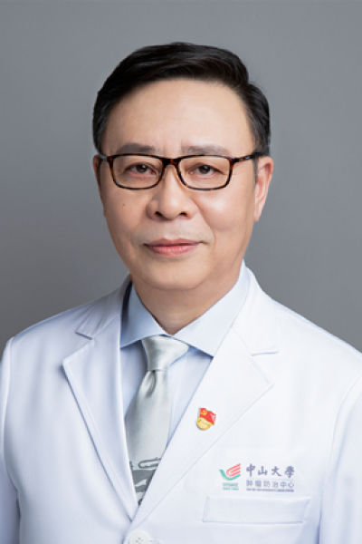

<!-- AUTO-GENERATED-BY: work/generate_obsidian_profiles.py -->

<!-- TEMPLATE: D:\workspace\信息收集整理\医生画像仓库\模板\医生画像模板.md -->

# 赵充

## 基础信息

| 字段 | 内容 |
|---|---|
| 姓名 | 赵充 |
| 医院 | 中山大学肿瘤防治中心 |
| 科室 | 鼻咽科 |
| 职称/身份 | 主任医师、硕士生导师 |
| 来源链接 | [官网原文](https://www.sysucc.org.cn/node/1526) |
| 采集日期 | 2026-08-10 |

## 简介/擅长

头颈肿瘤尤其是鼻咽癌的调强适形放射治疗及综合治疗

## 教育与进修经历

- 1998年-1999年，香港中文大学威尔斯亲王医院进修；

## 科研项目与成果

- 三、 学术兼职 中国抗癌协会放射治疗专业委员会委员 中国抗癌协会肿瘤营养与支持治疗专业委员会肿瘤放疗学组副组长 中国鼻咽癌临床分期工作委员会秘书 浙江省放射肿瘤学重点实验室学术委员会委员 中南大学湘雅医学院附属肿瘤医院/湖南省肿瘤医院“鼻咽癌研究室”客座教授 广东省抗癌协会第四届理事会理事 广东省抗癌协会放疗专业委员会主任委员 广东省医学会肿瘤学分会第六届委员会鼻咽癌学组副组长 《中华放射医学与防护杂志》编委 《中华医学杂志》、《中华放射肿瘤学杂志》、《中华临床医师杂志》审稿人 《Cancer》、《Interna…

## 可包装亮点

- 主任医师、硕士生导师 赵充 职称：主任医师、硕士生导师 专长 头颈肿瘤尤其是鼻咽癌的调强适形放射治疗及综合治疗 一、 基本情况 职称：主任医师、硕士生导师 专家门诊时间：周三上午、周四上午 专业特长：头颈肿瘤尤其是鼻咽癌的调强适形放射治疗及综合治疗 主攻方向：从事放射治疗的基础与临床研究近30年，主要研究方向为头颈肿瘤和鼻咽癌的诊断、放射治疗和综合治疗；
- 1998年-1999年，香港中文大学威尔斯亲王医院进修；
- 2001年-2009年，中山大学肿瘤医院放射治疗科副主任医师；

## 重点疾病/人群标签

- 慢性病：
- 肿瘤：肿瘤、癌、放疗、化疗、鼻咽癌、营养
- 生殖疾病：
- 免疫/风湿：
- 术后恢复/康复：肿瘤、癌、放疗、化疗、鼻咽癌、营养
- 疑难重症：

## 证据摘录

> 只摘录官网公开信息中的短句或关键字段，不复制大段原文。

- 官网身份字段：主任医师、硕士生导师
- 官网简介/擅长：头颈肿瘤尤其是鼻咽癌的调强适形放射治疗及综合治疗
- 官网亮眼经历线索：主任医师、硕士生导师 赵充 职称：主任医师、硕士生导师 专长 头颈肿瘤尤其是鼻咽癌的调强适形放射治疗及综合治疗 一、 基本情况 职称：主任医师、硕士生导师 专家门诊时间：周三上午、周四上午 专业特长：头颈肿瘤尤其是鼻咽癌的调强适形放射治疗及综合治疗 主攻方向：从事放射治疗的基础与临床研究近30年，主要研究方向为头颈肿瘤和鼻咽癌的诊断、放射治疗和综合治疗； 1998年-1999年，香港中文大学威尔斯亲王医院进修； 2001年-2009年…
- 异常提示：亮眼经历含导航文本，已清洗
- 来源链接：https://www.sysucc.org.cn/node/1526

## BD 画像摘要

赵充医生可作为肿瘤、术后恢复/康复方向的基础画像候选。后续 BD 使用应继续以官网来源和人工复核为准，不添加疗效承诺或无来源包装。

## 合规边界

- 仅使用医院官网、官方公众号、官方小程序等公开渠道。
- 不采集私人电话、私人微信、家庭住址、患者隐私或非公开排班信息。
- 不写“保证治愈”“疗效第一”“包治疑难杂症”等无法由官网证明的表述。
