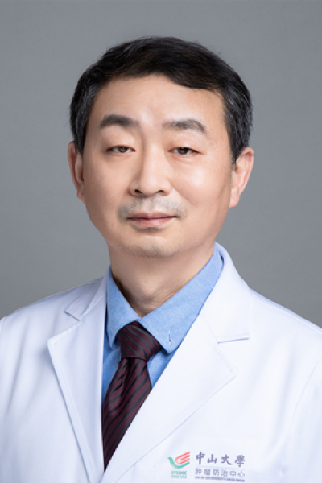

<!-- AUTO-GENERATED-BY: work/generate_obsidian_profiles.py -->

# 赵擎宇

## 基础信息

| 字段 | 内容 |
|---|---|
| 医院 | 中山大学肿瘤防治中心 |
| 姓名 | 赵擎宇 |
| 科室 | 重症医学科 |
| 职称/身份 | 主任医师、硕士导师 |
| 重点优先级 | 高 |
| 来源类型 | 医院官网 |
| 来源链接 | [官网原文](https://www.sysucc.org.cn/node/3808) |
| 采集日期 | 2026-08-10 |
| 复核状态 | 待人工复核 |
| 异常提示 |  |

## 简介/擅长

重症感染和脓毒症救治策略与院感防控技术 1982-1988年中山医科大学临床医学系 1988年北京卫生部附属中日友好医院重症医学科 1996-2000年公派赴德国Heidelberg大学医学院重症医学临床研修并攻读博士学位MD-CCM 2000年中山大学至今，中大肿瘤防治中心主诊教授、主任医师、硕士导师，负责感染防控与重症救治医、教、研工作 2008-2009年在美国德州大学MD Anderson癌症中心访问教授，学术和科研交流 从事重症医学医教研工作30年，兼职负责医院感染管理工作12年，学术重点为重症感染和脓毒症救治策略与院感防控技术等。 任省中西医结合重症医学常委、省病生学会重症医学专业委员会常委兼秘书、国家医院协会感染专委会委员、广东省医院协会院感专委会副主任委员、省医疗安全协会院感专业委员会副主任委员、省预防医学会常委、省细胞生物学会生物免疫治疗专业委员会委员兼秘书等多个医学会或专家组的成员，以及《中华医院感染学杂志》、《中华实验外科学杂志》、《Austin J Emerg Crit Med》、《Intensive Care Med》、《实用医学杂志》、《感染控制与消毒》特约编审或常务编委等等。曾获各级别科研...

## 详情正文摘录

临床专家 面包屑 首页 / 临床科室 / 平台科室 / 重症医学科 / 临床专家 赵擎宇 职称：主任医师、硕士导师 专长 重症感染和脓毒症救治策略与院感防控技术 1982-1988年中山医科大学临床医学系 1988年北京卫生部附属中日友好医院重症医学科 1996-2000年公派赴德国Heidelberg大学医学院重症医学临床研修并攻读博士学位MD-CCM 2000年中山大学至今，中大肿瘤防治中心主诊教授、主任医师、硕士导师，负责感染防控与重症救治医、教、研工作 2008-2009年在美国德州大学MD Anderson癌症中心访问教授，学术和科研交流 从事重症医学医教研工作30年，兼职负责医院感染管理工作12年，学术重点为重症感染和脓毒症救治策略与院感防控技术等。 任省中西医结合重症医学常委、省病生学会重症医学专业委员会常委兼秘书、国家医院协会感染专委会委员、广东省医院协会院感专委会副主任委员、省医疗安全协会院感专业委员会副主任委员、省预防医学会常委、省细胞生物学会生物免疫治疗专业委员会委员兼秘书等多个医学会或专家组的成员，以及《中华医院感染学杂志》、《中华实验外科学杂志》、《Austin J Emerg Crit Med》、《Intensive Care Med》、《实用医学杂志》、《感染控制与消毒》特约编审或常务编委等等。曾获各级别科研基金10余项，获卫计委重点科室院感染控制与感管理项目专项基金3项（千万）。举办国家级感染防控会议七届、感染信息化管理会议八届。发表国内外论文60余篇（国内核心40余篇， 20余篇）。 加载更多 1982-1988年中山医科大学临床医学系 1988年北京卫生部附属中日友好医院重症医学科 1996-2000年公派赴德国Heidelberg大学医学院重症医学临床研修并攻读博士学位MD-CCM 2000年中山大学至今，中大肿瘤防治中心主诊教授、主任医师、硕士导师，负责感染防控与重症救治医、教、研工作 2008-2009年在美国德州大学MD Anderson癌症中心访问教授，学术和科研交流 从事重症医学医教研工作30年，兼职负责医院感染管理工作…

## 重点关注范围

- 肿瘤
- 免疫/风湿/感染
- 疑难重症

## 重点疾病标签

- 肿瘤
- 癌
- 免疫
- 感染
- 重症

## 亮眼经历线索

- 主任医师、硕士导师 重症感染和脓毒症救治策略与院感防控技术 1982-1988年中山医科大学临床医学系 1988年北京卫生部附属中日友好医院重症医学科 1996-2000年公派赴德国Heidelberg大学医学院重症医学临床研修并攻读博士学位MD-CCM 2000年中山大学至今，中大肿瘤防治中心主诊教授、主任医师、硕士导师，负责感染防控与重症救治医、教、研…
- 任省中西医结合重症医学常委、省病生学会重症医学专业委员会常委兼秘书、国家医院协会感染专委会委员、广东省医院协会院感专委会副主任委员、省医疗安全协会院感专业委员会副主任委员、省预防医学会常委、省细胞生物学会生物免疫治疗专业委员会委员兼秘书等多个医学会或专家组的成员，...

## 异常提示

## 合规边界

- 本画像仅整理统一总底表中的医院官网公开字段。
- 不包含患者评价、排名、第三方来源内容或疗效承诺。
- 官网未展示的信息保持空白，后续如需补充须回到底表官方来源字段。
