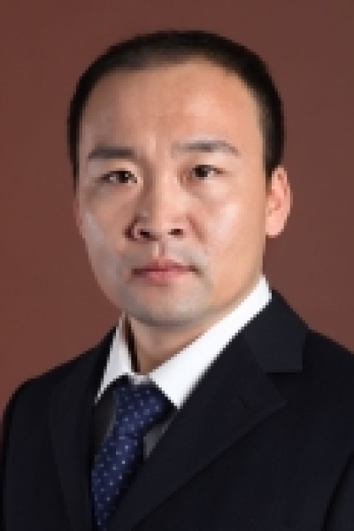

<!-- AUTO-GENERATED-BY: work/generate_obsidian_profiles.py -->

<!-- TEMPLATE: D:\workspace\信息收集整理\医生画像仓库\模板\医生画像模板.md -->

# 赵磊

## 基础信息

| 字段 | 内容 |
|---|---|
| 姓名 | 赵磊 |
| 医院 | 中山大学肿瘤防治中心 |
| 科室 | 放疗科 |
| 职称/身份 | 主任医师 |
| 来源链接 | [官网原文](https://www.sysucc.org.cn/node/1717) |
| 采集日期 | 2026-08-10 |

## 简介/擅长

食管癌同期放化疗、胸腺肿瘤的放射治疗、肺癌放化综合治疗、肝癌立体定向放射治疗 职称： 主任医师 专家

## 科研项目与成果

- 周五下午 主要研究方向 食管癌同期放化疗 胸腺肿瘤的放射治疗 肺癌放化综合治疗 肝癌立体定向放射治疗 工作及社会兼职 世界食管疾病协会（ISDE）会员 中国抗癌协会会员 广东省预防医学会肿瘤防治专业委员会常委 广东省肝脏病学会综合治疗专业委员会委员 教育经历 2009.9–2012.7, 中山大学, 肿瘤学, 博士 2001.9–2004.7, 青岛大学, 病原生物学, 硕士 1996.9–2001.7, 青岛大学, 临床医学, 学士 科研与学术工作经历 2018.12 获中山大学博士研究生导师资格 2017.4…

## 可包装亮点

- 主任医师 食管癌同期放化疗、胸腺肿瘤的放射治疗、肺癌放化综合治疗、肝癌立体定向放射治疗 职称： 主任医师 专家 赵磊 职称：主任医师 专长 食管癌同期放化疗、胸腺肿瘤的放射治疗、肺癌放化综合治疗、肝癌立体定向放射治疗 职称： 主任医师 专家门诊时间： 周三上午；
- 周五下午 主要研究方向 食管癌同期放化疗 胸腺肿瘤的放射治疗 肺癌放化综合治疗 肝癌立体定向放射治疗 工作及社会兼职 世界食管疾病协会（ISDE）会员 中国抗癌协会会员 广东省预防医学会肿瘤防治专业委员会常委 广东省肝脏病学会综合治疗专业委员会委员 教育经历 2009.9–2012.7, 中山大学, 肿瘤学, 博士 2001.9–2004.7, 青岛大学,…

## 重点疾病/人群标签

- 慢性病：
- 肿瘤：肿瘤、癌、放疗、化疗、肺癌、肝癌
- 生殖疾病：
- 免疫/风湿：
- 术后恢复/康复：
- 疑难重症：

## 证据摘录

> 只摘录官网公开信息中的短句或关键字段，不复制大段原文。

- 官网身份字段：主任医师
- 官网简介/擅长：食管癌同期放化疗、胸腺肿瘤的放射治疗、肺癌放化综合治疗、肝癌立体定向放射治疗 职称： 主任医师 专家
- 官网亮眼经历线索：主任医师 食管癌同期放化疗、胸腺肿瘤的放射治疗、肺癌放化综合治疗、肝癌立体定向放射治疗 职称： 主任医师 专家 赵磊 职称：主任医师 专长 食管癌同期放化疗、胸腺肿瘤的放射治疗、肺癌放化综合治疗、肝癌立体定向放射治疗 职称： 主任医师 专家门诊时间： 周三上午； 周五下午 主要研究方向 食管癌同期放化疗 胸腺肿瘤的放射治疗 肺癌放化综合治疗 肝癌立体定向放射治疗 工作及社会兼职 世界食管疾病协会（ISDE）会员 中国抗癌协会会员 广东…
- 异常提示：亮眼经历含导航文本，已清洗
- 来源链接：https://www.sysucc.org.cn/node/1717

## BD 画像摘要

赵磊医生可作为肿瘤方向的基础画像候选。后续 BD 使用应继续以官网来源和人工复核为准，不添加疗效承诺或无来源包装。

## 合规边界

- 仅使用医院官网、官方公众号、官方小程序等公开渠道。
- 不采集私人电话、私人微信、家庭住址、患者隐私或非公开排班信息。
- 不写“保证治愈”“疗效第一”“包治疑难杂症”等无法由官网证明的表述。
