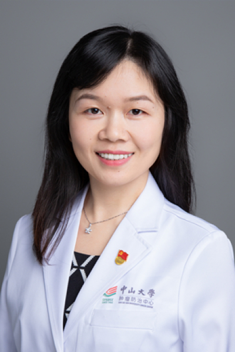

<!-- AUTO-GENERATED-BY: work/generate_obsidian_profiles.py -->

# 路素英

## 基础信息

| 字段 | 内容 |
|---|---|
| 医院 | 中山大学肿瘤防治中心 |
| 姓名 | 路素英 |
| 科室 | 儿童肿瘤科 |
| 职称/身份 | 副主任医师、肿瘤学博士、硕士研究生导师 |
| 重点优先级 | 高 |
| 来源类型 | 医院官网 |
| 来源链接 | [官网原文](https://www.sysucc.org.cn/node/3803) |
| 采集日期 | 2026-08-10 |
| 复核状态 | 待人工复核 |
| 异常提示 |  |

## 简介/擅长

专注于儿童、青少年恶性肿瘤的化疗、靶向、免疫等综合治疗。主攻方向：各类肉瘤、淋巴瘤、中枢神经系统肿瘤、神经母细胞瘤等的化疗、靶向、免疫等综合治疗。

## 详情正文摘录

1. 专业特长：长期专注于儿童青少年肿瘤的综合治疗（化疗、靶向和免疫治疗）、临床研究及基础转化研究。

## 重点关注范围

- 肿瘤
- 免疫/风湿/感染

## 重点疾病标签

- 肿瘤
- 瘤
- 淋巴瘤
- 化疗
- 靶向
- 免疫

## 亮眼经历线索

- 副主任医师、肿瘤学博士、硕士研究生导师

## 异常提示

## 合规边界

- 本画像仅整理统一总底表中的医院官网公开字段。
- 不包含患者评价、排名、第三方来源内容或疗效承诺。
- 官网未展示的信息保持空白，后续如需补充须回到底表官方来源字段。
