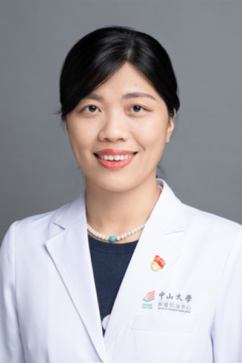

<!-- AUTO-GENERATED-BY: work/generate_obsidian_profiles.py -->

<!-- TEMPLATE: D:\workspace\信息收集整理\医生画像仓库\模板\医生画像模板.md -->

# 邱妙珍

## 基础信息

| 字段 | 内容 |
|---|---|
| 姓名 | 邱妙珍 |
| 医院 | 中山大学肿瘤防治中心 |
| 科室 | 内科 |
| 职称/身份 | 教授、主任医师 |
| 来源链接 | [官网原文](https://www.sysucc.org.cn/node/1502) |
| 采集日期 | 2026-08-10 |

## 简介/擅长

消化道肿瘤（食管癌，胃癌，肠癌，胰腺癌，胆管细胞癌等，不包括原发性肝癌）的化学治疗、消化道肿瘤的靶向治疗和消化道肿瘤的免疫治疗，新药临床研究。遗传性胃癌的筛查和咨询。

## 教育与进修经历

- 美国约翰霍普金斯大学博士后，在BMJ、Nature Medicine、JAMA Oncol、Signal Transduct Target Ther等杂志发表第一/通讯作者SCI论文90余篇，H-index 48 主要研究方向： 消化道肿瘤（食管癌，胃癌，肠癌，胰腺癌，胆管细胞癌等，不包括原发性肝癌）的化学治疗、消化道肿瘤的靶向治疗和消化道肿瘤的免疫治疗，新药临床研究。

## 科研项目与成果

- 职称： 教授、主任医师 基本介绍： 华南恶性肿瘤防治全国重点实验室PI，四大慢病科技重大专项项目负责人，教育部国家高层次青年人才，广东省自然科学杰出青年基金获得者，荣获国家科技进步二等奖和省部级科技进步一等奖等奖项5项，入选2024/2025全球前2%顶尖科学家“年度科学影响力排行榜”，ESMO Merit Award获得者，美中抗癌协会 & 亚州癌症研究基金获得者，人民好医生（胃癌领域）金山茶花.杰出贡献奖，主持科技重大专项、国自然面上等国家级和省部级基金12项，CSCO胃癌专家委员会委员、CSCO胃癌指南撰写…

## 论文与学术产出

- 美国约翰霍普金斯大学博士后，在BMJ、Nature Medicine、JAMA Oncol、Signal Transduct Target Ther等杂志发表第一/通讯作者SCI论文90余篇，H-index 48 主要研究方向： 消化道肿瘤（食管癌，胃癌，肠癌，胰腺癌，胆管细胞癌等，不包括原发性肝癌）的化学治疗、消化道肿瘤的靶向治疗和消化道肿瘤的免疫治疗，新药临床研究。

## 可包装亮点

- 教授、主任医师 邱妙珍 职称：教授、主任医师 专长 消化道肿瘤（食管癌，胃癌，肠癌，胰腺癌，胆管细胞癌等，不包括原发性肝癌）的化学治疗、消化道肿瘤的靶向治疗和消化道肿瘤的免疫治疗，新药临床研究。
- 职称： 教授、主任医师 基本介绍： 华南恶性肿瘤防治全国重点实验室PI，四大慢病科技重大专项项目负责人，教育部国家高层次青年人才，广东省自然科学杰出青年基金获得者，荣获国家科技进步二等奖和省部级科技进步一等奖等奖项5项，入选2024/2025全球前2%顶尖科学家“年度科学影响力排行榜”，ESMO Merit Award获得者，美中抗癌协会 & 亚州癌症研究…
- 美国约翰霍普金斯大学博士后，在BMJ...

## 重点疾病/人群标签

- 慢性病：
- 肿瘤：肿瘤、癌、靶向、肝癌、胃癌、肠癌、免疫
- 生殖疾病：
- 免疫/风湿：肿瘤、癌、靶向、肝癌、胃癌、肠癌、免疫
- 术后恢复/康复：
- 疑难重症：

## 证据摘录

> 只摘录官网公开信息中的短句或关键字段，不复制大段原文。

- 官网身份字段：教授、主任医师
- 官网简介/擅长：消化道肿瘤（食管癌，胃癌，肠癌，胰腺癌，胆管细胞癌等，不包括原发性肝癌）的化学治疗、消化道肿瘤的靶向治疗和消化道肿瘤的免疫治疗，新药临床研究。遗传性胃癌的筛查和咨询。
- 官网亮眼经历线索：教授、主任医师 邱妙珍 职称：教授、主任医师 专长 消化道肿瘤（食管癌，胃癌，肠癌，胰腺癌，胆管细胞癌等，不包括原发性肝癌）的化学治疗、消化道肿瘤的靶向治疗和消化道肿瘤的免疫治疗，新药临床研究。 职称： 教授、主任医师 基本介绍： 华南恶性肿瘤防治全国重点实验室PI，四大慢病科技重大专项项目负责人，教育部国家高层次青年人才，广东省自然科学杰出青年基金获得者，荣获国家科技进步二等奖和省部级科技进步一等奖等奖项5项，入选2024/2025…
- 异常提示：亮眼经历含导航文本，已清洗
- 来源链接：https://www.sysucc.org.cn/node/1502

## BD 画像摘要

邱妙珍医生可作为肿瘤、免疫/风湿/感染方向的基础画像候选。后续 BD 使用应继续以官网来源和人工复核为准，不添加疗效承诺或无来源包装。

## 合规边界

- 仅使用医院官网、官方公众号、官方小程序等公开渠道。
- 不采集私人电话、私人微信、家庭住址、患者隐私或非公开排班信息。
- 不写“保证治愈”“疗效第一”“包治疑难杂症”等无法由官网证明的表述。
