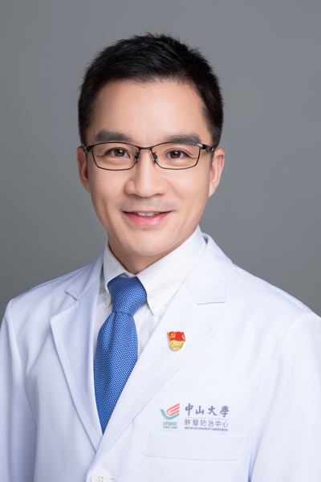

<!-- AUTO-GENERATED-BY: work/generate_obsidian_profiles.py -->

<!-- TEMPLATE: D:\workspace\信息收集整理\医生画像仓库\模板\医生画像模板.md -->

# 邱海波

## 基础信息

| 字段 | 内容 |
|---|---|
| 姓名 | 邱海波 |
| 医院 | 中山大学肿瘤防治中心 |
| 科室 | 胃外科 |
| 职称/身份 | 胃外科党支部组织委员 职称：医学博士，主任医师，博士生导师 |
| 来源链接 | [官网原文](https://www.sysucc.org.cn/node/3661) |
| 采集日期 | 2026-08-10 |

## 简介/擅长

胃癌、胃肠间质瘤

## 教育与进修经历

- 临床专家 面包屑 首页 / 临床科室 / 外科系列 / 胃外科 / 临床专家 邱海波 职务：胃外科党支部组织委员 职称：医学博士，主任医师，博士生导师 专长 胃癌、胃肠间质瘤 一、基本情况 中山大学肿瘤医院胃外科主诊教授、主任医师、博士生导师，曾作为联合培养博士生留学于哈佛医学院。

## 科研项目与成果

- 主持国家自然基金、广东省自然科学基金等科研项目，以第一/通讯作者在Cancer Commun, Cancer Res, JECCR等杂志发表了SCI论文40余篇。
- 广东省自然科学基金，面上项目 ，SALL1基因突变导致胃癌早发及腹膜转移的现象与机制 ，2022/01-2024/12，主持。
- 国家自然科学基金面上项目 ，81372474、《抑制PREX2逆转胃肠道间质瘤对酪氨酸激酶抑制剂耐药的研究》、2014/01-2017/12，第二参与人。
- 国家自然青年科学基金项目 ，81602143，TACC3介导肝癌射频消融治疗后转移复发的机制与干预策略，2017/01-2019/12，第二参与人。

## 论文与学术产出

- 主持国家自然基金、广东省自然科学基金等科研项目，以第一/通讯作者在Cancer Commun, Cancer Res, JECCR等杂志发表了SCI论文40余篇。

## 可包装亮点

- 胃外科党支部组织委员 职称：医学博士，主任医师，博士生导师 邱海波 职务：胃外科党支部组织委员 职称：医学博士，主任医师，博士生导师 专长 胃癌、胃肠间质瘤 一、基本情况 中山大学肿瘤医院胃外科主诊教授、主任医师、博士生导师，曾作为联合培养博士生留学于哈佛医学院。
- 擅长胃肠肿瘤外科治疗，尤其是腹腔镜、机器人微创手术，曾多次在全国胃癌手术视频大赛获奖。
- 主持国家自然基金、广东省自然科学基金等科研项目，以第一/通讯作者在Cancer Commun, Cancer Res, JECCR等杂志发表了SCI论文40余篇。

## 重点疾病/人群标签

- 慢性病：
- 肿瘤：肿瘤、癌、瘤、肝癌、胃癌
- 生殖疾病：
- 免疫/风湿：
- 术后恢复/康复：
- 疑难重症：

## 证据摘录

> 只摘录官网公开信息中的短句或关键字段，不复制大段原文。

- 官网身份字段：胃外科党支部组织委员 职称：医学博士，主任医师，博士生导师
- 官网简介/擅长：胃癌、胃肠间质瘤
- 官网亮眼经历线索：胃外科党支部组织委员 职称：医学博士，主任医师，博士生导师 邱海波 职务：胃外科党支部组织委员 职称：医学博士，主任医师，博士生导师 专长 胃癌、胃肠间质瘤 一、基本情况 中山大学肿瘤医院胃外科主诊教授、主任医师、博士生导师，曾作为联合培养博士生留学于哈佛医学院。 擅长胃肠肿瘤外科治疗，尤其是腹腔镜、机器人微创手术，曾多次在全国胃癌手术视频大赛获奖。 主持国家自然基金、广东省自然科学基金等科研项目，以第一/通讯作者在Cancer Co…
- 异常提示：亮眼经历含导航文本，已清洗
- 来源链接：https://www.sysucc.org.cn/node/3661

## BD 画像摘要

邱海波医生可作为肿瘤方向的基础画像候选。后续 BD 使用应继续以官网来源和人工复核为准，不添加疗效承诺或无来源包装。

## 合规边界

- 仅使用医院官网、官方公众号、官方小程序等公开渠道。
- 不采集私人电话、私人微信、家庭住址、患者隐私或非公开排班信息。
- 不写“保证治愈”“疗效第一”“包治疑难杂症”等无法由官网证明的表述。
