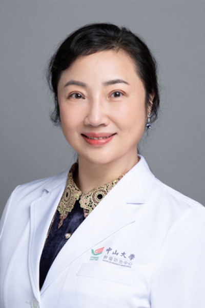

<!-- AUTO-GENERATED-BY: work/generate_obsidian_profiles.py -->

# 郑敏

## 基础信息

| 字段 | 内容 |
|---|---|
| 医院 | 中山大学肿瘤防治中心 |
| 姓名 | 郑敏 |
| 科室 | 妇科 |
| 职称/身份 | 教授、主任医师、博士生导师 |
| 重点优先级 | 高 |
| 来源类型 | 医院官网 |
| 来源链接 | [官网原文](https://www.sysucc.org.cn/node/3694) |
| 采集日期 | 2026-08-10 |
| 复核状态 | 待人工复核 |
| 异常提示 |  |

## 简介/擅长

擅长各种妇科肿瘤临床诊治；处理复杂疑难病例。胜任各种妇科肿瘤手术 受教育经历： 2000/03 - 2003/05：瑞士苏黎世大学和伯尔尼大学医学院，获双医学博士学位 1999/09 – 2000/03：中山大学肿瘤防治中心在职硕士 1980/09 - 1985/07：南华大学医学院，全日制大学本科毕业 工作经历： 2011/12 –现在：中山大学肿瘤防治中心妇科教授、博士导师、主任医生 2004/12 - 2011/12：中山大学肿瘤防治中心妇科副主任医师 1997/12 - 2004/12：中山大学肿瘤防治中心妇科主治医师 1992/05 - 1997/12：先后赴瑞士巴塞尔大学、美国波多黎各大学和美国佛罗里达大学作为访问学者从事科研工作。 1988/04 - 1992/05：中山大学肿瘤防治中心妇科医师 1985/07 - 1988/03：南华大学医学院第一附属医院妇产科医师 主要研究方向（突出亚方向）： 1．卵巢恶性肿瘤发生发展作用机制及临床意义的研究 2．宫颈癌发生发展相关癌基因的研究 近年来主要发表论著 1. Huang L, Zheng M*, Zhou QM, Zhang MY, Jia WH, Yun...

## 详情正文摘录

临床专家 面包屑 首页 / 临床科室 / 外科系列 / 妇科 / 临床专家 郑敏 职称：教授、主任医师、博士生导师 专长 擅长各种妇科肿瘤临床诊治 一、基本情况 专家门诊时间： 周二上午；周三上午 专业特长：妇科肿瘤诊断和治疗（手术治疗和化学治疗）的临床工作及肿瘤发病机制及治疗相关基因的研究。特别擅长对宫颈癌、卵巢肿瘤、子宫内膜癌、子宫肉瘤、外阴癌、滋养叶细胞肿瘤、宫颈癌前病变、子宫肌瘤等的手术治疗（开腹和腹腔镜手术）和化学治疗。 二、学习及工作经历： 1980年-1985年：南华大学医学院就读 1985年-1988年：南华大学医学院附一院妇科工作 1988年-1992年：中山大学附属肿瘤医院妇科工作 1992年-1997年：作为访问学者分别于瑞士巴塞尔大学、美国波多黎各大学、佛罗里达大学从事科学研究工作 1997年-2000年：中山大学附属肿瘤医院妇科工作，期间就读在职硕士 2000年-2003年：于瑞士苏黎士大学和伯尔尼大学攻读博士并取得双博士学位 2003年至今：中山大学附属肿瘤医院妇科工作 加载更多 专长： 擅长各种妇科肿瘤临床诊治；处理复杂疑难病例。胜任各种妇科肿瘤手术 受教育经历： 2000/03 - 2003/05：瑞士苏黎世大学和伯尔尼大学医学院，获双医学博士学位 1999/09 – 2000/03：中山大学肿瘤防治中心在职硕士 1980/09 - 1985/07：南华大学医学院，全日制大学本科毕业 工作经历： 2011/12 –现在：中山大学肿瘤防治中心妇科教授、博士导师、主任医生 2004/12 - 2011/12：中山大学肿瘤防治中心妇科副主任医师 1997/12 - 2004/12：中山大学肿瘤防治中心妇科主治医师 1992/05 - 1997/12：先后赴瑞士巴塞尔大学、美国波多黎各大学和美国佛罗里达大学作为访问学者从事科研工作。 1988/04 - 1992/05：中山大学肿瘤防治中心妇科医师 1985/07 - 1988/03：南华大学医学院第一附属医院妇产科医师 主要研究方向（突出亚方向）： 1．卵巢恶性肿瘤发生发展作用机制及临床意义的…

## 重点关注范围

- 肿瘤
- 生殖疾病
- 疑难重症

## 重点疾病标签

- 肿瘤
- 癌
- 瘤
- 生殖
- 卵巢
- 疑难
- 复杂

## 亮眼经历线索

- 教授、主任医师、博士生导师 处理复杂疑难病例。
- 胜任各种妇科肿瘤手术 受教育经历： 2000/03 - 2003/05：瑞士苏黎世大学和伯尔尼大学医学院，获双医学博士学位 1999/09 – 2000/03：中山大学肿瘤防治中心在职硕士 1980/09 - 1985/07：南华大学医学院，全日制大学本科毕业 工作经历： 2011/12 –现在：中山大学肿瘤防治中心妇科教授、博士导师、主任医生 2004/…
- 1988/04 - 1992/05：中山大学肿瘤防治中心妇科医师 1985/07 - 1988/03：南华大学医学院第一附属医院妇产科医师 主要研究方向（突出亚方向）： 1．卵...

## 异常提示

## 合规边界

- 本画像仅整理统一总底表中的医院官网公开字段。
- 不包含患者评价、排名、第三方来源内容或疗效承诺。
- 官网未展示的信息保持空白，后续如需补充须回到底表官方来源字段。
